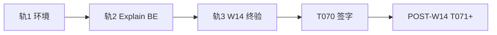

# 浮生 · 开发自检与收官方案（2026-07-12）

| 字段 | 内容 |
|------|------|
| **版本** | dev-audit-1.0 |
| **日期** | 2026-07-12 |
| **范围** | EXECUTION-PRIORITY T001–T070 + BAZI-ZIWEI-POLISH BZ001–BZ088 |
| **结论** | **前端主路径 ☑ · 引擎/Explain 后端轨 🔴 · W14 终验 ☐** |

---

## 一、执行摘要

| 维度 | 状态 | 完成度（估） |
|------|------|-------------|
| 文档体系 | ✅ 可开工 | ~95% |
| 设计真源 M1 | ✅ | 100% |
| 前端 F2–F5（T015–T055） | ✅ 代码落地 | ~90% |
| 报告六卷 F4 | 🟡 T039/T048 待接 BE | ~85% |
| 八字紫微打磨轨 BZ | 🟡 FE 块大部完成；BE 块未动 | FE ~70% · BE ~5% |
| W14 终验 T056–T070 | ☐ | ~15% |
| Playwright Node E2E | 🔴 chromium-1161 未装全 | 阻塞 T056/T082 |

**一句话**：产品「能看、能读」的壳已齐；「能信」依赖 explain/batch + scorecard 后端轨，尚未闭环。

---

## 二、自检命令结果（2026-07-12）

### 2.1 前端债务扫描（§三 F2 三门禁）

| 命令 | 结果 |
|------|------|
| `rg "linear-gradient\|PageHead\|#334155\|-ok-bg" frontend/src` | ✅ **0 命中** |
| `rg "四维分析\|ChapterStub" frontend/src/views/ReportView.vue` | ✅ **0 命中** |
| `rg "relations_summary" frontend/src` | ✅ `api/bazi.ts` · `formatVol2Summary.ts` |
| `npm run type-check` | ✅ 绿 |
| `npm run test` | ✅ 64/64 |
| `npm run build` | ✅ 绿 |
| `npm run test:e2e` | 🔴 需 chromium-1161 |

### 2.2 后端（本机无 `make`）

| 命令 | 结果 |
|------|------|
| `make scorecard` | ⚠️ Windows 未装 make；需在 WSL/CI 跑 |
| `pytest tests/test_explain_*.py` | 🔴 explain 路由未建 |

### 2.3 已知 GAP 对照（BZ §五）

| 码 | 问题 | 自检后状态 |
|----|------|------------|
| GAP-B01 | FE 未接 `relations_summary` | 🟢 已接 API 类型 + vol2 格式化 |
| GAP-B02 | mount `loadDayunNarratives` | 🟢 报告已删自动；八字改按钮触发 |
| GAP-E01 | content_policy / explain | 🔴 仍阻塞 T039/BZ031 |
| GAP-E02 | ChartSnapshot | 🔴 |
| GAP-Z01 | ZW18 裁决测试 | 🟡 UI 有 degraded 横幅 |
| GAP-F01 | quality-gate 未含 scorecard | 🟡 |

---

## 三、清单完成度对照

### 3.1 EXECUTION-PRIORITY（T001–T070）

| 块 | 已完成 | 待办 |
|----|--------|------|
| A T001–T007 | — | 每人环境自验 |
| B T008 | T008 ☑ | T008-BE* |
| C T009–T014 | ☑ 全 | T014-BE |
| D T015–T024 | ☑ 全 | — |
| E T025–T035 | FE ☑ | T035-BE* |
| F T036–T048 | T046 ☑；其余 FE 大部 ☑ | **T039** · **T048** · T048-BE |
| G T049–T055 | T049–T054 ☑ | **T055** 375px 人工 |
| H T056–T070 | T067 ☑ | **T056–T066** · T068–T070 |

### 3.2 BAZI-ZIWEI-POLISH（BZ001–BZ088）

| 块 | FE 可勾 | BE/人工 |
|----|---------|---------|
| E1 BZ001–BZ015 | BZ015 部分 | BZ001–BZ014 |
| E2 BZ016–BZ030 | — | 全块 |
| E3 BZ031–BZ045 | BZ034·039·040·041·042 部分 | BZ031–BZ038·043–045 |
| F1 BZ046–BZ055 | **BZ046–BZ050·BZ054** ☑ | BZ052–BZ053 人工 · BZ055 E2E |
| F2 BZ056–BZ065 | **BZ057–BZ058·BZ062** ☑ | BZ056·059–061·064–065 |
| F3 BZ066–BZ075 | **BZ066–BZ071·BZ073·075** ☑ | BZ072 explain · BZ074 人工 |
| X BZ076–BZ088 | — | 全块 + 签字 |

---

## 四、文件整理（权威分工）

勿再扩写归档目录内旧稿。活跃文档仅此结构：

```text
docs/
├── DEVELOPMENT.md              ← 统一入口
├── DEV-READINESS.md            ← 开工自检（一次性）
├── DEV-AUDIT-2026-07-12.md     ← 本文（收官自检+方案）
├── DOCS-AUDIT.md               ← 活跃 vs 归档索引
├── plan/
│   ├── FUSHENG-EXECUTION-PRIORITY.md          ← T001–T070 主轨
│   ├── FUSHENG-BAZI-ZIWEI-POLISH-CHECKLIST.md ← BZ001–BZ088 八字紫微轨
│   ├── FUSHENG-EXECUTION-PRIORITY-POST-W14.md ← T070 后再开
│   └── FUSHENG-INTEGRATED-DEV-PLAN-*.md       ← 周计划细节
├── guides/                     ← QUICKSTART · NODE-CHECKLIST · RISK-ALERT
├── design/                     ← MASTERPLAN · skin-preview · targets/
├── contracts/                  ← life-volume · explain-section-map
└── archive/superseded/         ← 只读，禁止引用全文
```

### 4.1 本轮新增/关键代码

| 路径 | 角色 |
|------|------|
| `frontend/src/utils/buildLifeVolumes.ts` | 六卷 Adapter |
| `frontend/src/utils/formatVol2Summary.ts` | 卷二 API 字段格式化 |
| `frontend/src/components/fusheng/VolumeSection.vue` | 分层展示 |
| `frontend/src/components/fusheng/ReportChapterNav.vue` | 报告卷目 |
| `frontend/src/components/fusheng/TrustDegradedBanner.vue` | ZW18 UI |
| `frontend/src/api/explain.ts` | batch 封装（待 BE） |
| `frontend/src/assets/report-print.css` | 六卷打印 |

### 4.2 待拆/补（技术债）

| 项 | 说明 |
|----|------|
| `ReportBody.vue` | T037 标 ☑ 但未独立文件；逻辑仍在 `ReportView.vue`（~40KB） |
| `LXGWNeoZhiSong-subset.woff2` | T021 结构有、字体文件无 |
| `ReportView.vue` 未用字段 | `nameAnalysis` 等 lint warning，可下轮清理 |
| `targets/*.png` | 仍来自 skin-preview；T057 需实机重拍 |

---

## 五、收官方案（三轨并行）

### 轨 1 · 阻塞解除（1–2 天）

| 序 | 动作 | 负责人 | 验收 |
|----|------|--------|------|
| 1 | 修复 Playwright：`__dirlock` + 重装 chromium-1161 | FE | `chrome.exe` 存在 |
| 2 | 补 `public/fonts/LXGWNeoZhiSong-subset.woff2` | FE/DS | Network 200 |
| 3 | Windows 装 `make` 或 CI 跑 `make scorecard` | BE | 24/24 基线 |

### 轨 2 · 后端 Explain 轨（W4–W7，与 T039 同阻塞）

| 序 | BZ/T | 动作 |
|----|------|------|
| 1 | BZ011·BZ031 | `content_policy` + `POST /explain/batch` |
| 2 | BZ035·T048-BE | MVP-20 verified + classics.json |
| 3 | T039·BZ045 | Report 接 batch 填 vol1/2/5 |
| 4 | BZ032 | waterfall ≤4 集成测 |

### 轨 3 · W14 终验（W12–W14）

| 序 | T/BZ | 动作 |
|----|------|------|
| 1 | T056·BZ081 | E2E 矩阵全绿 |
| 2 | T057·BZ080 | 实机截图 vs targets |
| 3 | T055·BZ052–064 | 375px + 防丑五问三页签字 |
| 4 | T063·BZ079 | §六 11+7 项勾选 |
| 5 | T068–T070·BZ087–088 | M4/M5 产品试 + 打磨签字 |



---

## 六、下一轮 Cursor 一句话

```text
执行 docs/plan/FUSHENG-BAZI-ZIWEI-POLISH-CHECKLIST.md 的 BZ031，实现 explain/batch 后端路由并接 Report T039。
```

或环境优先：

```text
修复 Playwright chromium-1161 安装，跑通 npm run test:e2e -- fusheng-report。
```

---

## 七、修订记录

| 版本 | 日期 | 说明 |
|------|------|------|
| dev-audit-1.0 | 2026-07-12 | T015–T055 + BZ FE 块自检；三轨收官方案 |
