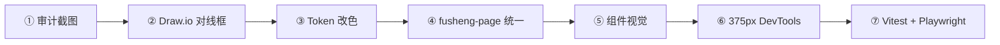

# 浮生前端开发文档 — 现状审计与视觉重做路线图

| 字段 | 内容 |
|------|------|
| **版本** | dev-guide-1.0 |
| **日期** | 2026-07-12 |
| **读者** | 产品 / 设计 / 前端 / Cursor Agent |
| **结论** | **功能骨架已齐，视觉与体验未达标** — 需单独一轮「视觉系统 D 阶段」 |
| **实机截图** | [`audit-screenshots/`](./audit-screenshots/)（2026-07-12 目视采集） |

> **怎么用本文**  
> 1. 先看 §2 现状审计（为何「丑」）  
> 2. 按 §3 插件流水线做每一轮改动  
> 3. 按 §5 分期落地，每阶段用 §6 验收清单  
> 4. 对话模板见 §7

**关联文档**

| 文档 | 用途 |
|------|------|
| [v3 信任深度](./2026-07-12-fusheng-frontend-v3-trust-depth.md) | 功能 / IA / 四层语法 |
| [v4 插件驱动设计](./2026-07-12-fusheng-frontend-design-PLUGIN-DRIVEN.md) | 22 扩展工作流 + 分页面规格 |
| [扩展使用说明](../guides/CURSOR-FRONTEND-EXTENSIONS.md) | 每个插件怎么点 |
| [PRODUCT.md](../../PRODUCT.md) | 品牌气质与反例 |
| [mockups/](./mockups/) | Draw.io 线框 |
| [Phase A 清单](../plan/PHASE-A-FRONTEND-v3-CHECKLIST.md) | 功能完成度 |

---

## 1. 执行摘要

### 1.1 当前状态（2026-07-12）

| 维度 | 评分（1–10） | 说明 |
|------|-------------|------|
| **功能完整度** | 7.5 | 主路径 6 页 + 扩展 Hub 可跑；Trust/四层语法已接线 |
| **信息架构** | 7 | 档案→八字/紫微→报告闭环成立 |
| **视觉设计** | **3.5** | 像「后台表单 + 堆卡片」，不像命盘产品 |
| **排版层级** | **4** | 标题/正文/辅助信息对比弱，长文墙 |
| **品牌一致性** | **4.5** | 有 Token 但未贯彻；全局仍偏 SaaS 后台 |
| **移动端** | **5** | 底栏有，但宽屏内容挤中间、表格体验差 |
| **无障碍** | **5** | 缺 `prefers-reduced-motion`；色块信息偏多 |

**一句话**：我们完成了「能验、能信」的**工程层**，还没完成「愿意看、愿意用」的**产品层**。

### 1.2 与 PRODUCT.md 的冲突点

| PRODUCT 要求 | 现状问题 |
|------------|----------|
| 克制、纸感、高端文书感 | 满屏同质圆角白卡 + 浅阴影，像 Notion 克隆 |
| 不做玄学紫红堆砌 | 未犯紫红，但 **Trust 层大面积粉/橙警示条** 像报错页 |
| 盘面骨架优先 | 有表/盘，但被 **L1/L2/L3/L4 开发标签** 和多层嵌套卡片淹没 |
| 缺失必明示 | 做到了，但 **「缺失」出现次数过多**，像坏数据而非设计 |
| 反例：信息层级混乱 | **解释层（L4）首屏过长**，典籍/引擎/启发式视觉差异不够 |

---

## 2. 现状审计（按页面）

实机截图见 `audit-screenshots/`。

### 2.1 全局壳 `NewAppShell`


| 问题 | 严重度 | 说明 |
|------|--------|------|
| 顶栏信息过载 | 高 | Logo + 页名 + 副标题 + 7 个导航 pill，**品牌重复 3 次** |
| 导航项过多 | 中 | 首页/档案/八字/紫微/报告/工具/登录 — 桌面一行拥挤 |
| 背景冲突 | 中 | `body` 仍有 **蓝色 radial-gradient**（旧科技风），与 `--brand-paper` 暖纸冲突 |
| 主内容无宽度约束 | 高 | 宽屏下卡片 **拉满全宽**，阅读视线无法聚焦 |
| 底栏 + 顶栏双导航 | 低 | 桌面也显示 bottom-nav 逻辑时易重复（需断点审查） |

**目标态**：顶栏只保留 Logo + 当前步 + 账户；副标题下沉到 PageHead；主内容 `max-width: var(--page-max-w)` 居中。

---

### 2.2 首页 `/`

| 问题 | 严重度 |
|------|--------|
| Hero 与下方 4 张卡 **样式完全一致**，无主次 | 高 |
| 就绪环 / 进度条视觉简陋，不像「产品入口」 | 中 |
| 「主路径说明」「扩展工具」纯文字卡，**无图示/无步骤组件** | 中 |
| CTA「生成报告」与导航「报告」语义重复 | 低 |

**目标态**：单屏只回答一件事——「档案是否就绪 → 下一步去哪」；其余折叠到 secondary。

---

### 2.3 档案 `/profile`


| 问题 | 严重度 |
|------|--------|
| **表单密度过高**，像 ERP 录入页 | 高 |
| Tab（基础/八字/紫微/云端）视觉弱，像普通 button group | 中 |
| 侧栏「档案摘要」与主表单 **信息重复** | 中 |
| 口径字段裸 `select`，无分组卡片、无 preset 视觉锚点 | 中 |
| 后端不可用 banner 橙色，与 Trust 预警色 **抢注意力** | 中 |

**目标态**：参照 `mockups/01-profile-tabs.drawio` — Tab 下划线铜金、口径区独立纸色底、侧栏只做 KPI。

---

### 2.4 八字 `/new/bazi`


| 问题 | 严重度 |
|------|--------|
| **`L1 · 摘要` 等开发标签裸露** — 用户不应看到 | **致命** |
| 四层各包一层有色边框，**像调试分区** | 高 |
| `BaziReferenceTable` 信息密但 **无传统命盘气质**（过现代表格风） | 高 |
| Trust 层粉/红底 + 表格式 provenance，**压迫感强** | 高 |
| L4 解释层折叠块过多，**首屏以下全是文字墙** | 高 |
| 口径 banner / cache hint / time warning **三条横条堆叠** | 中 |

**目标态**：参照 `mockups/02-bazi-trust.drawio` — 层与层用 **间距 + 细线分隔**，不用彩色大框；L 标签改为 `aria` 或设计稿备注，不出现在 UI。

---

### 2.5 紫微 `/new/ziwei`、报告 `/report`（摘要）

| 页面 | 主要视觉债 |
|------|------------|
| 紫微 | 方盘与周边控件风格分裂；patterns 卡片与首页白卡同质 |
| 报告 | 章节目录 + 正文双栏比例失调；连续阅读时长文无呼吸感 |
| 扩展 Hub | 四宫格像占位页，无工具图标/场景图 |

线框：`05-ziwei-plate.drawio`、`03-report-cross.drawio` 已有，**高保真未做**。

---

## 3. 插件驱动开发流水线（22 扩展全用）

与 [v4 §2](./2026-07-12-fusheng-frontend-design-PLUGIN-DRIVEN.md) 一致；本文强调 **视觉重做** 时每一步做什么。



### 步骤对照表

| 步骤 | 扩展 | 视觉重做中的动作 |
|------|------|------------------|
| ① 审计 | 浏览器 / Playwright screenshot | 每页存 `audit-screenshots/`，PR 附 before/after |
| ② 线框 | **Draw.io** | 打开 `mockups/*.drawio`，只改区块比例，不加新色 |
| ③ Token | **colorize** + **CSS Var Complete** + **CSS Peek** | 先改 `variables.css`，再改 `fusheng-page.css` |
| ④ 全局样式 | **ESLint** + **Volar** 保存格式化 | 删 scoped 重复样式，收敛到 token |
| ⑤ 组件 | **indent-rainbow** | 拆深嵌套 template；单组件单职责 |
| ⑥ 响应式 | DevTools 375px | 方盘/表横滑；导航收进底栏 |
| ⑦ 回归 | **Vitest** + **Playwright** | 不破 `data-testid`；E2E 目视清单 |

**Tasks（Cursor）**

```
frontend:dev          → http://localhost:5173/static/app/
frontend:lint         → ESLint
frontend:type-check   → vue-tsc
frontend:test         → Vitest
frontend:e2e          → Playwright
```

**静态参照**

- PDF 视觉：`docs/design/pdf-template-preview.html` → **Live Server** 打开
- 打印样式：`report-print.css` + 浏览器 Ctrl+P

---

## 4. 设计系统 — 当前 Token 与应改项

文件：`frontend/src/assets/variables.css`  
全局页样式：`frontend/src/assets/fusheng-page.css`

### 4.1 已存在、应真正用起来

| Token | 应用不到位处 |
|-------|-------------|
| `--page-max-w: 1120px` | 多数页面未 `max-width` |
| `--report-max-w: 1280px` | 仅 report 部分生效 |
| `--layer-classical-*` | AnalysisPanel 边框对比仍弱 |
| `--trust-alert-*` | 滥用：非 missing 也用红框 |
| `--font-cn` / `--font-ui` | 标题层级未拉开字号阶梯 |

### 4.2 建议新增（D1 阶段写入 variables.css）

```css
/* 页面 */
--page-padding-x: clamp(16px, 4vw, 28px);
--section-gap: 28px;           /* 层与层，替代彩色大框 */
--section-rule: 1px solid var(--border-md);

/* 顶栏 */
--shell-header-height: 56px;   /* 压缩 sticky 头 */
--nav-pill-radius: 999px;

/* 卡片层级 */
--card-elevated-shadow: 0 8px 24px rgba(26, 20, 16, 0.06);
--card-flat: transparent border var(--section-rule);

/* 语义 */
--text-caption: var(--text-3);
--text-kpi: var(--brand-ink);
```

### 4.3 必须删除/替换的样式

| 位置 | 问题 |
|------|------|
| `variables.css` `body` 背景 | 去掉蓝色 radial，改为纯 `--brand-paper` 或极淡铜金晕 |
| `NewBaziView` `.bazi-layer--*` 彩色底 | 改为白底 + section-rule |
| `NewBaziView` `.bazi-layer__label` | **从 UI 移除**，仅保留 `sr-only` 或 dev 模式 |
| 多处 `#fff7ed` / `#fdba74` 硬编码 | 统一为 `--trust-drift-bg` / `--trust-alert-*` |

---

## 5. 视觉重做分期（D 阶段）

与功能 [Phase A](../plan/PHASE-A-FRONTEND-v3-CHECKLIST.md) **并行但独立 PR**。

| 阶段 | 范围 | 工期 | 插件重点 | 验收 |
|------|------|------|----------|------|
| **D0** | 本文 + 截图基线 | ✅ | 浏览器截图 | audit-screenshots 入库 |
| **D1** | 全局：壳 + token + fusheng-page | 2d | colorize · CSS Peek | 宽屏居中；body 无蓝晕；顶栏瘦身 |
| **D2** | 首页 + 档案 | 3d | Draw.io 01 · Live Server 对照 | 表单分组；Tab 铜金下划线 |
| **D3** | 八字页 | 3d | Draw.io 02 · Vitest | 无 L 标签；Trust 不吓人；表盘有呼吸 |
| **D4** | 紫微 + 时间轴 | 4d | Draw.io 04/05 · SVG Preview | 方盘 toolbar pill；FortuneStrip |
| **D5** | 报告 + 打印 | 3d | pdf-template · E2E | 目录比 240px；打印不断章 |
| **D6** | 375px + a11y + 扩展 Hub | 2d | DevTools · markdownlint | reduced-motion；Hub 有场景卡片 |

**原则**：每阶段 **只改 CSS + 模板结构**，不改 API / store 逻辑（除非为 a11y 补 aria）。

---

## 6. 验收清单 — 「不再丑」的客观标准

### 6.1 全局（D1 完成即验）

- [ ] 主内容区最大宽度 ≤ 1120px，两侧留白 ≥ 24px（1920 屏）
- [ ] 顶栏高度 ≤ 64px，无第三行副标题
- [ ] 全站无 `#2563eb` 系蓝色渐变背景
- [ ] 同页 **卡片样式最多 2 种**（flat / elevated）
- [ ] 铜金 `--brand-gold` 仅用于：CTA、active nav、KPI 数字、tier badge

### 6.2 八字页（D3）

- [ ] UI 中 **不出现** `L1` `L2` `L3` `L4` 字样
- [ ] Trust 层默认态 **不是** 整页粉红底
- [ ] SummaryStrip 5 KPI 在 1280px 下一行展示
- [ ] 375px 下表可横滑，无页面级横向滚动条
- [ ] heuristic 块默认折叠，展开率由用户主动触发

### 6.3 档案页（D2）

- [ ] 首屏可见 **≤ 8 个**表单项（其余折叠/分 Tab）
- [ ] 口径 Tab 与基础 Tab 视觉权重明显不同
- [ ] 侧栏摘要 **不重复** 表单已填字段

### 6.4 工程

- [ ] `npm run lint && npm run type-check && npm run test && npm run test:e2e` 全绿
- [ ] 现有 `data-testid` 不删
- [ ] 新截图覆盖 `audit-screenshots/` 或 PR 附件

---

## 7. Cursor 对话模板

### 7.1 启动视觉重做 D1

```
@docs/design/2026-07-12-fusheng-frontend-DEV-GUIDE.md
@frontend/src/assets/variables.css
@frontend/src/assets/fusheng-page.css
@frontend/src/components/new/NewAppShell.vue

按 §5 D1：全局视觉债修复。
- body 去蓝晕，主内容 max-width
- 顶栏瘦身，去掉重复副标题
- 统一卡片 flat/elevated 两档
不改 API。保存触发 ESLint。改完 frontend:dev 给我前后对比说明。
```

### 7.2 单页重做（八字示例）

```
@docs/design/mockups/02-bazi-trust.drawio
@docs/design/audit-screenshots/audit-bazi.png
@frontend/src/views/new/NewBaziView.vue
@docs/design/2026-07-12-fusheng-frontend-DEV-GUIDE.md §2.4

D3：移除 L1-L4 用户可见标签；层间用间距+细线；Trust 层降压迫感。
Draw.io 对照 + colorize 检查 token。375px QA。
```

### 7.3 全站验收

```
按 DEV-GUIDE §6 逐项验收。
跑 frontend:lint → type-check → test → e2e。
输出未通过项与截图路径。
```

---

## 8. 代码地图（前端开发入口）

| 区域 | 路径 |
|------|------|
| 路由 | `frontend/src/router/index.ts` |
| 壳 | `frontend/src/components/new/NewAppShell.vue` |
| 页面 | `frontend/src/views/new/*.vue`、`ProfileView.vue`、`ReportView.vue` |
| 浮生组件 | `frontend/src/components/fusheng/` |
| Token | `frontend/src/assets/variables.css` |
| 页样式 | `frontend/src/assets/fusheng-page.css` |
| Trust 逻辑 | `frontend/src/composables/useEngineTrustDisplay.ts` |
| 单测 | `frontend/src/**/__tests__/` |
| E2E | `frontend/e2e/` |
| 线框 | `docs/design/mockups/` |

---

## 9. 变更记录

| 日期 | 说明 |
|------|------|
| 2026-07-12 | dev-guide-1.0：实机审计 + 视觉重做 D0–D6 + 插件流水线 + 验收清单 |
