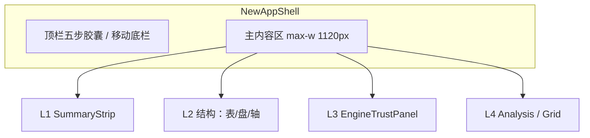
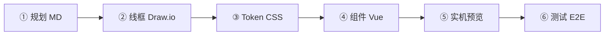

# 浮生前端设计方案 v4 — 插件驱动全流程

| 字段 | 内容 |
|------|------|
| **版本** | v4.0-plugin-driven |
| **日期** | 2026-07-12 |
| **前置** | [v3 信任深度](./2026-07-12-fusheng-frontend-v3-trust-depth.md) · [PRODUCT.md](../../PRODUCT.md) |
| **目标** | 用齐 **22 个前端扩展**，产出可落地、可验收的全站视觉与交互方案 |
| **Token** | `frontend/src/assets/variables.css`（已补 Trust / tier / timeline） |

> **怎么用**：按 §2 插件流水线逐步执行；每页设计对照 §4 + 对应 mockup；开发对话复制 §8 模板。

---

## 1. 设计定位

### 1.1 一句话

**克制纸感 + 铜金强调 + 四层可读** — 像翻阅一本可验证的命盘册，不是玄学 App 皮肤。

### 1.2 视觉关键词

| 要 | 不要（PRODUCT 反例） |
|----|----------------------|
| 暖米白 `--brand-paper` 底 | 紫渐变 + 金红堆砌 |
| 铜金 `--brand-gold` 仅用于 KPI / tier / CTA | 全页金色描边 |
| 朱红 `--brand-cinnabar` 仅 missing / 预警 | 用红色当装饰 |
| 宋体标题 `--font-cn` + 无衬线正文 | 花哨装饰字体 |
| 表格/方盘优先于长文 | 大段 AI 文案占首屏 |

### 1.3 全站布局骨架



---

## 2. 插件驱动设计流水线（22 扩展全用上）

按 **规划 → 线框 → Token → 组件 → 实机 → 测试** 六步；每步标明扩展与 Task。



### 步骤 ① 规划与流程图

| 插件 | 操作 | 产出 |
|------|------|------|
| **Markdown All in One** | 编辑本文 / v3 §6 | 目录、表格格式化 |
| **Markdown Preview Mermaid** | `Ctrl+Shift+V` 预览 §1.3、§2 流程图 | 确认 IA / 用户旅程 |
| **Mermaid 语法高亮** | 编辑 ```mermaid 块 | 流程图语法正确 |
| **markdownlint** | 保存 md 自动检查 | 文档规范 |
| **Todo Tree** | 扫 `DESIGN:` / `UX:` 标签 | 设计任务清单 |

**Task**：无（纯文档）

---

### 步骤 ② 线框与信息层级

| 插件 | 操作 | 产出 |
|------|------|------|
| **Draw.io Integration** | 打开 `docs/design/mockups/*.drawio` | 低保真区块顺序 |
| **Material Icon Theme** | 文件树识别 `.drawio` | 快速定位线框 |

| 线框文件 | 页面 | 状态 |
|----------|------|------|
| `01-profile-tabs.drawio` | `/profile` | ✅ 已有 |
| `02-bazi-trust.drawio` | `/new/bazi` | ✅ 已有 |
| `03-report-cross.drawio` | `/report` 互证 | ✅ 已有 |
| `04-ziwei-timeline.drawio` | `/new/ziwei/timeline` | 📋 待画（见 §4.5 规格） |
| `05-ziwei-plate.drawio` | `/new/ziwei` | 📋 待画（见 §4.4 规格） |

**Draw.io 配色**：只用 mockups/README 中 Token 表，禁止引入新色。

---

### 步骤 ③ 设计 Token 与样式

| 插件 | 操作 | 产出 |
|------|------|------|
| **colorize** | 打开 `variables.css` / `.vue` | 行内预览 `#b8894d` 等 |
| **Color Highlight** | 同上 | 互补色块提示 |
| **CSS Var Complete** | 输入 `var(--trust-` | 自动补全 Trust/tier token |
| **CSS Peek** | 在组件里 `Ctrl+点击` `--brand-gold` | 跳转到 variables 定义 |

**已落地 Token**（`variables.css`）：

| 分组 | 变量示例 | 用途 |
|------|----------|------|
| 品牌 | `--brand-paper`, `--brand-gold`, `--brand-cinnabar` | 底、强调、预警 |
| 分层 | `--layer-classical-*`, `--layer-heuristic-bg` | AnalysisPanel |
| 信任 | `--trust-alert-*`, `--trust-drift-*` | EngineTrustPanel |
| tier | `--tier-canonical`, `--tier-heuristic` | PatternTierBadge |
| 时间轴 | `--timeline-active`, `--fortune-strip-height` | FortuneStrip |
| 容器 | `--page-max-w: 1120px`, `--report-max-w: 1280px` | 页面宽度 |

**Task**：无

---

### 步骤 ④ 组件实现（Vue / CSS）

| 插件 | 操作 | 产出 |
|------|------|------|
| **Vue.volar** | 编辑 `.vue`：高亮、跳转、格式化 | 组件代码 |
| **ESLint** | `Ctrl+S` 保存自动 fix | 规范 |
| **Error Lens** | 行内 TS/ESLint 报错 | 快速修 type |
| **Pretty TS Errors** | 复杂泛型报错可读化 | 少踩 schema 坑 |
| **Auto Rename/Close Tag** | 改 `<div>` 标签名自动同步 | 模板效率 |
| **indent-rainbow** | 读深层 template 嵌套 | Plate / Report 结构 |

**Task**：`frontend:dev` · `frontend:lint` · `frontend:type-check`

---

### 步骤 ⑤ 实机与静态预览

| 插件 | 操作 | 产出 |
|------|------|------|
| **Live Server** | 右键 `pdf-template-preview.html` → Open with Live Server | PDF 章节视觉参照 |
| **浏览器 DevTools** | `frontend:dev` 后 F12 → 375px | 响应式 QA |
| **SVG Preview** | 打开方盘内 `.svg` 资源 | 星曜/icon 预览 |

**Task**：`frontend:dev` → `http://localhost:5173/static/app/`

**目视检查清单**（每页 2 分钟）：

- [ ] 四层区块顺序
- [ ] missing 是否朱红可见
- [ ] heuristic 是否默认折叠
- [ ] 375px 无溢出（方盘区可横滑）

---

### 步骤 ⑥ 测试与回归

| 插件 | 操作 | 产出 |
|------|------|------|
| **Vitest** | 侧边栏 Testing → Run All | 组件/工具单测 |
| **Playwright** | `Tasks: frontend:e2e` 或 Debug 配置 | 主路径 E2E |
| **Vitest Debug** | Run and Debug → `Vitest: 当前文件` | 单文件调试 |

**Task 链**：`frontend:lint` → `frontend:type-check` → `frontend:test` → `frontend:e2e` → `make quality-gate-frontend`

---

## 3. 设计系统规范

### 3.1 字体层级

| 级别 | Token | 示例 |
|------|-------|------|
| 页面标题 | `--font-cn` + `clamp(24px,3.5vw,36px)` | PageHead 主标题 |
| 卡片标题 | `--font-cn` + 17px | `.fs-card h2` |
| KPI 数字 | `--font-ui` + `--fs-xl` semibold | SummaryStrip |
| 表格/盘面 | `--font-ui` + `--fs-sm` | BaziReferenceTable |
| 口径说明 | `--fs-xs` + `--text-2` | banner / meta |
| 典籍引文 | `--font-cn` + `--fs-md` lh 1.75 | classical layer |

### 3.2 卡片与间距

| 元素 | 规范 |
|------|------|
| 页面 grid gap | `--sp-4`（16px），移动 `--sp-3` |
| `.fs-card` | padding 18–20px；radius 16px；border `--border` |
| 区块间距 | 卡片之间 `--sp-5`（20px） |
| 主内容 max-width | `--page-max-w`；报告 `--report-max-w` |

### 3.3 断语 / tier 视觉

| 类型 | 边框/背景 | 默认 |
|------|-----------|------|
| classical | `--layer-classical-border` + bg | 展开 |
| engine | `--layer-engine-bg` | 展开 |
| heuristic | `--layer-heuristic-bg` + 顶栏「启发式」 | **折叠** |
| tier canonical | `--tier-canonical` 实底铜金 | badge |
| tier heuristic | `--tier-heuristic` 灰字 | badge |

### 3.4 Trust 层视觉

| 状态 | 背景 | 图标/文案 |
|------|------|-----------|
| missing | `--trust-alert-bg` + `--trust-alert-border` | 「缺失：{field}」 |
| drift / 双轨 | `--trust-drift-bg` | DualTrackTable |
| ok | `--trust-ok-bg` | 校通过 |

### 3.5 无障碍

- 所有 tier badge：`aria-label="典籍层"` 等  
- 折叠：`aria-expanded`  
- 颜色非唯一信息载体：badge 必带文字  
- `@media (prefers-reduced-motion: reduce)`：折叠/ shimmer 改 instant（实现阶段写入 CSS）

---

## 4. 分页面设计方案

### 4.1 首页 `/`

```
┌─────────────────────────────────────┐
│ PageHead · 浮生若寄                  │
├─────────────────────────────────────┤
│ ProfileReadinessCard（环图+阻塞项）   │
│ [补全档案]  [八字/紫微 锁定态]        │
├─────────────────────────────────────┤
│ 三步图示（档案→排盘→报告）            │
│ 可选：缓存有效 / 最近生成时间         │
└─────────────────────────────────────┘
```

| 设计要点 | Token / 组件 |
|----------|--------------|
| 就绪环 | `--brand-gold` 进度弧；未完成 `--text-3` |
| 阻塞项 | `--brand-cinnabar` 圆点 + 链到 Profile 锚点 |
| onboarding | 可关闭条；localStorage；不遮挡主 CTA |

**插件**：Live Server 不需要；`frontend:dev` 目视 `/`

---

### 4.2 档案 `/profile`

**参照**：`mockups/01-profile-tabs.drawio`

| Tab | 视觉 |
|-----|------|
| 基础 | 标准表单；CityPicker 全宽 |
| 八字口径 | `zi_day_rule` select + 真太阳时 toggle |
| 紫微口径 | AlgoPresetBar + 亮度/右弼 |
| 云端 | Case 列表卡片；与侧栏摘要分离 |

| 交互 | 设计 |
|------|------|
| 改口径 | 底部浮条 `--trust-drift-bg`：「口径已变更，将重新排盘」 |
| 保存 | 主按钮 `--brand-gold` 实心；ghost 次要 |

**插件**：Draw.io 01 · Todo Tree 扫 Profile 相关 DESIGN 项

---

### 4.3 八字 `/new/bazi`

**参照**：`mockups/02-bazi-trust.drawio`

垂直顺序（四层）：

1. PageHead + 口径 banner（`--fs-xs` `--text-2`）
2. **L1** SummaryStrip — 5 KPI 横排；移动 2 列 grid
3. **L2** BaziReferenceTable — 六柱；藏干贡献可选折叠
4. **L2** BaziLiuriTodayCard — 日期 picker + 流日柱
5. **L2** BaziStructuralRelations — 合冲刑害/空亡/神煞
6. **L3** EngineTrustPanel compact — missing + provenance + 用神双轨
7. **L4** AnalysisPanel — heuristic 折叠
8. 大运叙事 — 前 3 条 engine layer

| 移动 375px | 行为 |
|------------|------|
| SummaryStrip | 2×2 grid |
| ReferenceTable | 横向 scroll，固定柱宽 `--pillar-w` |
| Trust | 全宽；provenance 表可横滑 |

**插件**：colorize 检查 layer 色 · CSS Peek 查 token · Vitest 测 Trust 构建

---

### 4.4 紫微本命 `/new/ziwei`

**待画线框**：`05-ziwei-plate.drawio`

```
PageHead
SummaryStrip（五行局/命宫/身宫/命主）
┌─ FushengZiweiPlate ─────────────┐
│ [本命|大限|流年|流月] toolbar      │
│  12 宫方盘 · 选中宫高亮           │
└─────────────────────────────────┘
ZiweiAlgoSettings + AlgoPresetBar
ZiweiFlyingTab
EngineTrustPanel（含 iztro 表）
AnalysisPanel + PatternTierBadge
PalaceAnalysisGrid（前 6 宫 + 「报告查看全部」）
CTA → 时间轴 / 报告
```

| 设计要点 | 说明 |
|----------|------|
| 方盘 | 宫格线 `--border-md`；选中 `--timeline-active` 描边 |
| toolbar | pill 切换；active `--brand-gold-lt` 底 |
| summary 字段 | **不得**作首屏主文案；仅 heuristic 折叠区 |
| patterns | 每条 PatternTierBadge + rule_id tooltip |

**插件**：SVG Preview 看星曜 icon · indent-rainbow 读 Plate template

---

### 4.5 紫微时间轴 `/new/ziwei/timeline`

**待画线框**：`04-ziwei-timeline.drawio`

```
TimelineDatePicker（今日 ▼）
FortuneStrip [大限][流年][流月][流日]  ← scroll-snap
大运列表（可选中高亮）
FushengZiweiPlate（overlay 受控）
ZiweiForecastSummary（tier + 依据 3 条）
EngineTrustPanel compact
```

| 移动 | 桌面 |
|------|------|
| FortuneStrip 横滑 snap | 四格等分 `--fortune-strip-height` |
| 方盘横滑 | 方盘居中 max 480px |

**插件**：Playwright 选日期断言 · `frontend:dev` 双路由对比 overlay

---

### 4.6 报告 `/report`

**参照**：`mockups/03-report-cross.drawio`

| 区域 | 设计 |
|------|------|
| 目录 | 桌面左栏 240px；`<960px` 顶栏横滑 |
| 章节 | 每章 L1→L4 子集；Trust compact |
| 互证章 | DualTrackTable 固定 case；iztro 对照 |
| PDF | `report-print.css`：Trust 块打印展开；章节分页 |

**插件**：Live Server 打开 `pdf-template-preview.html` 对照 · E2E 互证 ≥3 行

---

## 5. 组件视觉速查

| 组件 | 关键样式 | 插件验证 |
|------|----------|----------|
| `SummaryStrip` | KPI 卡片 `--surface` 小圆角 | colorize |
| `EngineTrustPanel` | trust token 三色态 | Vitest + 目视 |
| `PatternTierBadge` | tier token 三套 | phaseAComponents.spec |
| `DualTrackTable` | 表头 `--brand-gold-lt` | Draw.io 03 |
| `PalaceAnalysisGrid` | 宫名 `--font-cn` | ESLint |
| `FortuneStrip` | `--fortune-strip-height` | DevTools 375px |
| `ProfileTabNav` | active 下划线铜金 | Draw.io 01 |
| `AlgoPresetBar` | preset pill + drift 提示 | E2E |

---

## 6. 响应式断点

| 断点 | 布局变化 |
|------|----------|
| `<640px` | 单列；FortuneStrip 横滑；报告目录置顶 |
| `640–960px` | Profile Tab 纵向堆叠 |
| `>960px` | 报告双栏；Profile 可选左列表 |
| `>1120px` | 主内容居中 `--page-max-w` |

---

## 7. 设计 → 开发分期

| 阶段 | 页面 | 插件重点 | 工期 |
|------|------|----------|------|
| **D1** | Token + fusheng-page.css 统一 | colorize · CSS Var | 2d |
| **D2** | 八字页对齐 mockups 02 | Draw.io · Vitest | 3d |
| **D3** | 紫微页 + 05 线框 | SVG · indent-rainbow | 4d |
| **D4** | 时间轴 + 04 线框 | Playwright | 4d |
| **D5** | 报告 + PDF 打印 | Live Server · E2E | 3d |
| **D6** | 全站 375px + a11y | DevTools · markdownlint 文档 | 2d |

> 与功能补全 [路线图](../plan/BAZI-ZIWEI-COMPLETION-ROADMAP.md) **并行**：D2 可在波次 2 八字字段接完后做；D3–D4 在波次 3 运限后做。

---

## 8. 对话模板（按本方案执行）

### 8.1 启动全站设计

```
@docs/design/2026-07-12-fusheng-frontend-design-PLUGIN-DRIVEN.md
@docs/design/mockups/
@frontend/src/assets/variables.css
@PRODUCT.md

按 v4 插件驱动方案，从 D1 开始：
统一 fusheng-page.css 使用 --page-max-w、Trust/tier token；
不改 API 逻辑。我保存时 ESLint 自动 format。
完成后 frontend:dev 给我各页检查清单。
```

### 8.2 单页视觉（以八字为例）

```
@mockups/02-bazi-trust.drawio
@NewBaziView.vue
@v4设计 §4.3

对齐 mockups 02 做八字页视觉：间距、L1–L4 分隔线、heuristic 折叠样式。
375px QA。插件：Draw.io 对照 + colorize 检查 layer 色。
```

### 8.3 设计验收

```
按 v4 §2 步骤⑥ 跑完整 Task 链：
frontend:lint → type-check → test → e2e → quality-gate-frontend
输出各页 375px 目视结果与待修项。
```

---

## 9. 变更记录

| 日期 | 说明 |
|------|------|
| 2026-07-12 | v4 初版：22 插件流水线 + 6 页设计 + Token 落地 |
