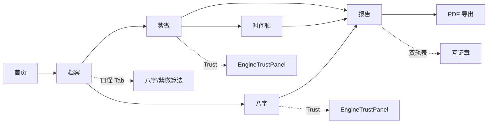

# 浮生前端方案 v3.0 — 信任深度与口径可读

| 字段 | 内容 |
|------|------|
| **版本** | v3.0-draft |
| **日期** | 2026-07-12 |
| **前置** | [v2.4 已落地方案](./2026-07-11-fusheng-frontend-v2.md) · [PRODUCT.md](../../PRODUCT.md) |
| **目标** | 主路径产品分 P **9.1 → 9.4**；八字/紫微呈现 **9.3/9.2 → 9.6/9.5** |
| **范围** | 主路径 6 页 + 扩展 Hub（轻量引用）；不含六爻/风水新模块 |

---

## 1. 设计定位

### 1.1 v2 → v3 演进

| 维度 | v2.4（现状） | v3.0（目标） |
|------|--------------|--------------|
| 核心命题 | 单一主路径、三层语法 | **「能验、能信、能调口径」** |
| 内容语法 | 摘要 → 结构 → 解释 | 摘要 → 结构 → **信任层** → 解释 |
| 缺失处理 | 部分页面仍静默 | **全站 `missing_fields` 必明示** |
| 断语分层 | `AnalysisPanel` 有 layer | **典籍/引擎/启发式硬样式 + 默认折叠规则** |
| 档案 | 基础字段 + 部分口径 | **八字/紫微口径分组 Tab + 高级折叠** |
| 运限 | 方盘叠宫 + 时间轴页 | **日期驱动流日 + 四格运限摘要条** |
| 报告 | 10 章 + EngineTrustPanel | **结构化十二宫 + 双轨/E2E 固定清单** |

### 1.2 设计原则（继承 PRODUCT.md）

1. **先骨架、再解释** — 表格/方盘/时间轴始终优先于长文  
2. **缺失必明示** — 无数据写「缺失」，不用占位符糊弄  
3. **口径可核对** — 双轨、iztro、右弼 drift 必须用户可见  
4. **启发式降级** — 非典籍层默认折叠，展开需主动点击  
5. **档案单真相源** — 改口径 → invalidate 缓存 → 全站一致重算  

### 1.3 非目标（v3 不做）

- 六爻 / 风水 / 西方盘新 UI  
- LLM 替代典籍主断语  
- 旧 SPA 全量功能回迁  
- 移动端独立 App  

---

## 2. 信息架构

### 2.1 路由树（主路径 + 扩展）

```
/                          首页 · 就绪引导
/profile                   档案 · Tab 化编辑
/new/bazi                  八字 · 结构验证
/new/ziwei                 紫微 · 本命方盘
/new/ziwei/timeline        紫微 · 运限时间轴
/report                    综合报告 · PDF
/extensions                扩展工具箱 Hub
/extensions/*              合盘/择日/相似（保持轻量）
/login                     登录（云 Case / 快照）
```

### 2.2 用户旅程（带信任检查点）



### 2.3 全局导航（不变）

- 桌面：顶栏五步胶囊（首页 / 档案 / 八字 / 紫微 / 报告）  
- 移动：底部固定五步 + 安全区  
- **新增**：档案页内 Tab，不改变顶栏步数  

---

## 3. 内容语法 v3：四层模型

在 v2「摘要 → 结构 → 解释」之间插入 **信任层（Trust Layer）**。

| 层级 | 组件 | 默认状态 | 职责 |
|------|------|----------|------|
| **L1 摘要** | `SummaryStrip` | 始终可见 | 3–5 个 KPI：日主/格局/用神/五行局/命宫 |
| **L2 结构** | `BaziReferenceTable` / `FushengZiweiPlate` / 时间轴 | 默认展开 | 可验证的盘面骨架 |
| **L3 信任** | `EngineTrustPanel` + 子块 | 默认展开（compact 模式可折叠） | missing / provenance / 双轨 / iztro / 流日联动 |
| **L4 解释** | `AnalysisPanel` / `PalaceAnalysisGrid` | 典籍&引擎展开；启发式折叠 | 断语、建议、格局描述 |

### 3.1 断语分层视觉规范

| layer | 标签 | 边框/背景 Token | 默认展开 |
|-------|------|-----------------|----------|
| `classical` | 典籍 | `--layer-classical-border` / `--layer-classical-bg` | ✅ |
| `engine` | 引擎 | `--layer-engine-bg` | ✅ |
| `heuristic` | 启发式 | `--layer-heuristic-bg` + 顶栏「启发式 · 非典籍」 | ❌ 需点击展开 |
| `modern_convention` | 现代口径 | 同 heuristic | ❌ |

**格局 tier 扩展标签**（紫微 Z-05）：

| tier | 标签色 | 文案 |
|------|--------|------|
| `canonical` | 铜金实底 | 全书口径 |
| `extended` | 铜金描边 | 扩展格 |
| `heuristic` | 灰底 | 启发式 · 仅供参考 |

---

## 4. 设计系统扩展

### 4.1 新增 Token（`variables.css`）

```css
/* 信任层 */
--trust-alert-bg: #fef2f2;
--trust-alert-border: var(--brand-cinnabar);
--trust-ok-bg: #f0fdf4;
--trust-drift-bg: #fffbeb;

/* 格局 tier */
--tier-canonical: var(--brand-gold);
--tier-extended: var(--brand-gold-dark);
--tier-heuristic: #9a8b7a;

/* 运限时间轴 */
--timeline-track: var(--border-md);
--timeline-active: var(--brand-gold);
--timeline-node-size: 10px;
```

### 4.2  typography 层级

| 用途 | 字体 | 字号 |
|------|------|------|
| 页面标题 | `--font-cn` | `--fs-2xl` |
| 卡片标题 | `--font-ui` | `--fs-lg` semibold |
| 表格/盘面 | `--font-ui` | `--fs-sm` |
| 典籍引文 | `--font-cn` | `--fs-md` line-height 1.75 |
| 口径说明 | `--font-ui` | `--fs-xs` `--text-2` |

### 4.3 间距与栅格

- 页面最大宽：`1120px`（报告页 `1280px`）  
- 卡片内边距：`--sp-4`（移动 `--sp-3`）  
- 区块间距：`--sp-5`（移动 `--sp-4`）  
- 报告双栏：目录 `240px` + 正文 `1fr`（`<960px` 目录改顶部横向滚动）  

---

## 5. 组件库（v3 增量）

### 5.1 已有 · 增强

| 组件 | 路径 | v3 变更 |
|------|------|---------|
| `EngineTrustPanel` | `components/fusheng/` | 拆为 compact / full；Report 用 full |
| `AnalysisPanel` | `components/fusheng/` | 统一 tier badge；heuristic 顶栏 |
| `ZiweiAlgoSettings` | `components/ziwei/` | 抽离为档案+紫微共用 |
| `FushengZiweiPlate` | `components/fusheng/` | 与 Timeline 共享 overlay 状态 composable |
| `BaziReferenceTable` | `components/new/` | 增加藏干贡献列（可选） |

### 5.2 新增组件

| 组件 | 职责 | 主要 Props |
|------|------|------------|
| **`ProfileTabNav`** | 档案页 Tab 切换 | `tabs`, `active`, `@change` |
| **`BaziRelationsCard`** | 合冲刑害/空亡/神煞 | `relations`, `kongwang`, `shensha` |
| **`LiuriTodayCard`** | 今日流日/流时/联动 | `liuri`, `warnings`, `@pick-date` |
| **`FortuneStrip`** | 大限/流年/流月/流日四格 | `dayun`, `liunian`, `liuyue`, `liuri`, `@select-layer` |
| **`TimelineDatePicker`** | 运限日期选择 | `modelValue`, `min`, `max` |
| **`PalaceAnalysisGrid`** | 十二宫 structured | `rows: PalaceStructuredRow[]` |
| **`PatternTierBadge`** | 格局 tier 标签 | `tier`, `ruleId?` |
| **`AlgoPresetBar`** | 一键口径（如右弼 hour） | `presets[]`, `@apply` |
| **`DualTrackTable`** | 双轨对照表 | `rows: DualTrackRow[]` |
| **`HiddenStemContrib`** | 十神藏干贡献条 | `contrib: Record<string, number>` |

### 5.3 Composables

| 名称 | 职责 |
|------|------|
| `useEngineTrustDisplay` | 已有；统一 Bazi/Ziwei/Report 数据源 |
| `useZiweiOverlayState` | 方盘与时间轴共享 overlayLayer / dayunBranch / liuyueMonth |
| `useFortuneTimeline` | 日期 → API `target_date` → 刷新 liuri / flow |
| `useAlgoInvalidation` | 档案口径变更 → `fushengReport.invalidate()` |

### 5.4 工具函数（已有，v3 对齐）

- `buildEngineTrustDisplay.ts` — Trust 层单一真相源  
- `buildChartRequests.ts` — `include_liuri` / `include_flow_liuri` / `target_date`  
- `buildBaziColumns.ts` — 六柱表  

---

## 6. 分页面设计

### 6.1 首页 `/` — P 8.5 → 9.0

**布局**

```
┌─────────────────────────────────────────┐
│ PageHead · 浮生若寄                      │
├─────────────────────────────────────────┤
│ ProfileReadinessCard（完整度/阻塞项）      │
│ [补全档案]  [查看八字]（锁定态灰显）        │
├─────────────────────────────────────────┤
│ 三步图示：档案 → 排盘 → 报告              │
│ （可选）最近生成时间 / 缓存有效提示         │
└─────────────────────────────────────────┘
```

**v3 增量**

- 首次访问 **3 步 onboarding 条**（可关闭，localStorage）  
- 完整度 `<100%` 时列出 **前 3 个阻塞字段** + 跳转 Profile 锚点  
- 不做独立 wizard 页（控制范围）  

---

### 6.2 档案 `/profile` — P 9.0 → 9.5

**Tab 结构**

| Tab | 内容 |
|-----|------|
| **基础** | 姓名、性别、出生时间/地点、现居地、关注重点 |
| **八字口径** | `zi_day_rule`、真太阳时、历法/闰月、时辰精度、未知时辰兜底 |
| **紫微口径** | `year_divide` / `day_divide` / `late_zishi`、亮度、右弼 + **AlgoPresetBar** |
| **高级** | 折叠：city_tier、industry、其余 ZiweiAlgo 20+ 项（只读说明 + 跳转 API 文档链接） |
| **云端** | 登录后：Case 列表、保存/拉取、快照恢复（已有逻辑，UI 集中到此 Tab） |

**布局（桌面）**

```
┌──────────────────┬─────────────────────┐
│ ProfileTabNav    │ 完整度环 + 时间可信度 │
├──────────────────┴─────────────────────┤
│ 表单区（当前 Tab）                        │
│ CityPicker / 口径 select / 说明 tooltip   │
├────────────────────────────────────────┤
│ [保存档案] [同步云端] [查看八字] [生成报告]   │
└────────────────────────────────────────┘
```

**交互**

- 改 **八字/紫微口径 Tab** 任一字段 → 底部浮条：「口径已变更，将重新排盘」+ 确认  
- **右弼 preset**：「对齐 iztro（hour 右弼）」一键写入并 invalidate  
- 多档案：左侧列表保留，**默认档案**星标；切换时提示缓存失效  

**字段 → API 映射**

| UI 字段 | ProfileData | BaziRequest | ZiweiRequest |
|---------|-------------|-------------|--------------|
| 子时规则 | `ziDayRule` | `zi_day_rule` | — |
| 年界 | `yearDivide` | — | `year_divide` |
| 日界 | `dayDivide` | — | `day_divide` |
| 晚子时 | `lateZishi` | — | `day_divide` 联动 |
| 亮度 | `ziweiBrightnessMethod` | — | `brightness_method` |
| 右弼 | `ziweiYoubiMethod` | — | `youbi_method` |

---

### 6.3 八字 `/new/bazi` — P 9.0 → 9.5

**垂直区块顺序（四层语法）**

```
1. PageHead + 口径 banner（precision / 真太阳时 / zi_day_rule）
2. SummaryStrip（日主/强弱/格局/用神/流年）
3. BaziReferenceTable（六柱 · 默认展开）
4. LiuriTodayCard（今日流日 · 可改日期）
5. BaziRelationsCard（合冲刑害/空亡/神煞 · 默认展开）
6. HiddenStemContrib（可选折叠）
7. EngineTrustPanel（compact：missing + provenance + 双轨）
8. AnalysisPanel（detailBlocks · heuristic 折叠）
9. 大运叙事摘要（dayunReport 前 3 条）
```

**BaziRelationsCard 线框**

```
┌─ 结构关系 ─────────────────────────────┐
│ [六合] 子丑  [六冲] 子午  …            │
│ 空亡：辰巳  神煞：天乙、文昌 …          │
│ （空）→ 显式「暂无关系数据 / 缺失」      │
└────────────────────────────────────────┘
```

**LiuriTodayCard**

- 默认 `target_date=today`（`buildChartRequests` 已 `include_liuri: true`）  
- 展示：日柱、时柱、flow_summary、联动评分、换运 warning  
- 「选日期」→ 局部 refresh 或 `loadBazi(true, date)`  

**评分对齐**：B-06 P↑、B-05 P↑、B-09 P↑  

---

### 6.4 紫微 `/new/ziwei` — P 9.0 → 9.5

**垂直区块顺序**

```
1. PageHead + archive banner
2. SummaryStrip（五行局/命宫/身宫/命主）
3. FushengZiweiPlate（叠宫 toolbar：本命/大限/流年/流月/飞星）
4. ZiweiAlgoSettings（读写档案亮度/右弼 + provenance 回显）
5. ZiweiFlyingTab（飞星 · 与 overlay 状态联动）
6. EngineTrustPanel（iztro 双轨表 + missing）
7. AnalysisPanel（patterns 带 PatternTierBadge）
8. PalaceAnalysisGrid（analysis_structured 前 6 宫，其余「报告查看全部」）
9. CTA → 时间轴 / 报告
```

**格局卡片规则**

- `patterns[0..n]` 每条带 `PatternTierBadge` + `rule_id`（tooltip）  
- `tier=heuristic` 仅在 AnalysisPanel 折叠区出现  
- `summary` 字段 → heuristic 块，永不作为首屏主文案  

**评分对齐**：Z-07 P↑、Z-10 P↑  

---

### 6.5 运限时间轴 `/new/ziwei/timeline` — P 8.0 → 9.0

**布局**

```
┌─ TimelineDatePicker ─ 今日 ▼ ─────────┐
├─ FortuneStrip ────────────────────────┤
│ [大限 壬午] [流年 2026] [流月 五月] [流日 甲子] │  ← 点击切换 overlay
├─ 大运列表（可选中 · 高亮当前）──────────┤
├─ FushengZiweiPlate（overlay 受控）──────┤
├─ forecast tier 摘要（吉/平/凶 + 依据 3 条）│
└─ EngineTrustPanel（liuri_liushi · compact）│
```

**状态同步**

- `useZiweiOverlayState` 在 `FushengZiweiView` 与 `FushengZiweiTimeline` 间共享（Pinia 或 composable + store）  
- 选日期 → `buildZiweiRequest` 增 `target_date` + `include_flow_liuri: true` → `loadZiwei(true)`  

**移动**

- FortuneStrip 横向 scroll-snap  
- 方盘区保留横向滑动  

**评分对齐**：Z-04 P↑、Timeline 综合 8.8→9.2  

---

### 6.6 报告 `/report` — P 9.5 → 9.7

**章节（左 nav）**

| id | 标题 | v3 增强 |
|----|------|---------|
| cover | 封面 | 引擎版本 + 生成时间 |
| meta | 口径说明 | 全量 requestMeta + provenance 表 |
| archive | 基础档案 | 完整度/时间可信度 |
| name | 姓名分析 | 条件章 |
| cross | 互证 | **DualTrackTable** 固定 ZIP/ZW 清单 + iztro |
| bazi | 八字总览 | 四柱 + **BaziRelationsCard** + Trust full |
| dayun | 运势时间轴 | dayun 表 + **LiuriTodayCard** + 叙事 |
| ziwei | 紫微总览 | 嵌入方盘 + patterns tier |
| palaces | 十二宫 | **PalaceAnalysisGrid** 全量 structured |
| summary | 综合总结 | 仅 classical+engine 首句；heuristic 折叠 |
| notes | 批注区 | 不变 |

**EngineTrustPanel 模式**

- 八字章 / 紫微章 / 互证章：`compact={false}`，含 pillarDetails、relations、palaceStructured  
- PDF 导出：Trust 块默认 **展开**（`report-print.css` 增 `@media print` 规则）  

**导出**

- 优先服务端 PDF；客户端 fallback  
- 每章 `.report-chapter` 分页不变  

**评分对齐**：X-03、B-10、Z-10  

---

## 7. 数据绑定总表（Trust 层）

| API 字段 | 展示组件 | 页面 |
|----------|----------|------|
| `missing_fields` | EngineTrustPanel alert | 八字/紫微/Report |
| `provenance.methods` | provenance 表 | Trust / Report meta |
| `geju.recorded_geju` / `dual_track_note` | DualTrackTable | Trust / Report cross |
| `liuri_liushi` | LiuriTodayCard | 八字/Report dayun/Timeline |
| `dizhi_relations` / `kongwang` / `shensha` | BaziRelationsCard | 八字/Report bazi |
| `analysis_structured` | PalaceAnalysisGrid | 紫微/Report palaces |
| `patterns[].tier` / `rule_id` | PatternTierBadge | 紫微/Report |
| `iztro_crosscheck` | iztro 双轨表 | 紫微/Report cross |
| `structural_summary` | ziweiStructural 列表 | Trust |
| `bazi_structural_summary` | baziStructural 列表 | Trust |

**构建入口**：仅通过 `useEngineTrustDisplay` + `buildEngineTrustDisplay.ts`，禁止页面内联解析。

---

## 8. 响应式与无障碍

| 断点 | 行为 |
|------|------|
| `<640px` | 单列；FortuneStrip 横滑；报告目录置顶 |
| `640–960px` | 档案 Tab 纵向堆叠 |
| `>960px` | 报告双栏；档案可选左列表 |

**a11y**

- 所有 layer badge：`aria-label="典籍层"` 等  
- heuristic 折叠：`aria-expanded`  
- 颜色非唯一信息载体：tier 必带文字标签  
- `prefers-reduced-motion`：折叠动画降级为 instant  

---

## 9. 实施分期（对齐改进方案）

### Phase A（2 周）— 产品显性化

| 任务 | 页面/组件 | 验收 |
|------|-----------|------|
| A1 | `BaziRelationsCard` + 八字/Report 接入 | 无关系数据时显示「缺失」 |
| A2 | `AnalysisPanel` heuristic 硬样式 | vitest 快照 |
| A3 | `PalaceAnalysisGrid` + Report palaces | 12 宫均有 structured 或「缺失」 |
| A4 | Profile Tab（基础/八字口径/紫微口径） | E2E 改 ziDayRule 触发 invalidate |
| A5 | `PatternTierBadge` | 至少 3 种 tier 视觉可辨 |

### Phase B（4 周）— 运限深度

| 任务 | 页面/组件 | 验收 |
|------|-----------|------|
| B1 | `LiuriTodayCard` + `FortuneStrip` | 改日期刷新流日 |
| B2 | `useZiweiOverlayState` | 方盘↔时间轴状态一致 |
| B3 | `TimelineDatePicker` | Playwright 选日期断言 overlay |
| B4 | forecast 摘要条 | 展示 tier + evidence 前 3 条 |
| B5 | `AlgoPresetBar` 右弼 hour | 一键后 iztro 辅煞 diff 提示 |

### Phase C（4 周）— 报告与回归

| 任务 | 验收 |
|------|------|
| C1 | `DualTrackTable` 固定 ZIP09/21/22 + ZW03 | E2E 3 行断言 |
| C2 | Report PDF Trust 块打印展开 | 人工 QA 1 份 PDF |
| C3 | `classics verification_status` UI | 未 verified 显示「语料待核」 |
| C4 | onboarding 条 + 阻塞字段锚点 | 新用户 E2E |

---

## 10. 文件结构（v3 增量）

```
frontend/src/
├── components/fusheng/
│   ├── EngineTrustPanel.vue      # 增强 compact/full
│   ├── BaziRelationsCard.vue     # 新
│   ├── LiuriTodayCard.vue        # 新
│   ├── FortuneStrip.vue          # 新
│   ├── PalaceAnalysisGrid.vue    # 新
│   ├── DualTrackTable.vue        # 新
│   ├── PatternTierBadge.vue      # 新
│   ├── AlgoPresetBar.vue         # 新
│   ├── HiddenStemContrib.vue     # 新
│   └── ProfileTabNav.vue         # 新
├── composables/
│   ├── useEngineTrustDisplay.ts  # 已有
│   ├── useZiweiOverlayState.ts   # 新
│   ├── useFortuneTimeline.ts     # 新
│   └── useAlgoInvalidation.ts    # 新
├── views/
│   ├── ProfileView.vue           # Tab 化重构
│   ├── new/NewBaziView.vue       # +Relations +Liuri
│   ├── new/FushengZiweiView.vue  # +PalaceGrid
│   ├── new/FushengZiweiTimeline.vue # +DatePicker +FortuneStrip
│   └── ReportView.vue            # 章节增强
└── assets/
    ├── variables.css             # +trust/tier tokens
    └── report-print.css          # Trust 打印展开
```

---

## 11. 测试与验收

| 类型 | 覆盖 |
|------|------|
| **Vitest** | `buildEngineTrustDisplay`、Relations 空态、tier badge |
| **E2E** | 档案改口径 → 八字重算；ZW03 双轨表；右弼 preset；Report PDF 按钮 |
| **视觉** | 典籍/启发式并排截图对比（防回归） |
| **门禁** | `make quality-gate-frontend` + scorecard 24/24 不降 |

**页面级 Done 定义**

1. 四层语法区块顺序符合 §6  
2. Trust 层无静默 missing  
3. heuristic 默认折叠  
4. 改档案口径 → 缓存 invalidate  
5. 移动 375px 无横向溢出（方盘区除外）  

---

## 12. 与 v2.4 文档关系

- v2.4 的组件名、路由、品牌 Token **继续有效**  
- v3 为 **增量设计**，不推翻 NewAppShell / fusheng-page.css  
- 冲突时以本文档 Phase A 任务为准更新 v2.4 §8 后续迭代清单  

---

## 13. 变更记录

| 日期 | 版本 | 说明 |
|------|------|------|
| 2026-07-12 | v3.0-draft | 基于 P 提升路线图的首版前端设计方案 |
| 2026-07-12 | v3.0-draft+ | 增补线框模板 `docs/design/mockups/` |
