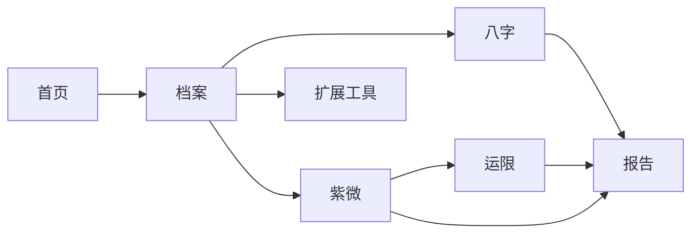
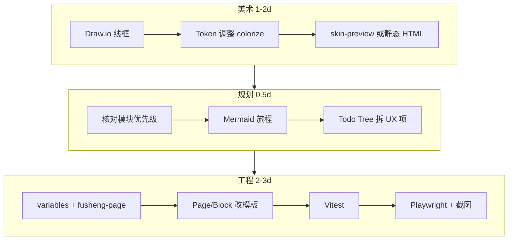

# 浮生前端开发手册

> **已并入统一开发文档**：[`docs/guides/FUSHENG-SONG-DEVELOPMENT.md`](./FUSHENG-SONG-DEVELOPMENT.md)（song-dev-1.0）。本文保留插件详表、竞品光谱等分拆内容。

| 字段 | 内容 |
|------|------|
| **版本** | handbook-1.1 |
| **日期** | 2026-07-12 |
| **范围** | `frontend/` 全站 UI · 交互 · 工程 |
| **依据** | 实机界面、`PRODUCT.md`、当前代码结构、`.vscode` 插件配置 |
| **不依据** | 历史 v2/v3/v4 设计方案文档（本文从零重写） |

---

## 0. 这份文档解决什么问题

当前前端 **能跑、能验、能出报告**，但界面在美术、信息层级、品牌气质上 **未达产品标准**。  
本手册按三个角色分工，把「做成什么样」和「怎么在 Cursor 里落地」写在一起：

| 角色 | 负责什么 | 主要产出 |
|------|----------|----------|
| **美术** | 视觉语言、色彩、字体、版面气质 | Token 定稿、组件皮肤、静态样稿 |
| **界面规划** | 信息架构、页面模块、交互路径 | 线框、模块优先级、响应式规则 |
| **前端工程师** | 组件实现、样式系统、测试与发布 | Vue 代码、CSS、Vitest/Playwright |

**协作原则**：美术定「皮」，规划定「骨」，工程保「可维护 + 可测」。任何一页改动必须三者对齐后再合并。

---

## 1. 产品边界（三人共同遵守）

摘自 [`PRODUCT.md`](../../PRODUCT.md)，作为一切视觉与交互的上限：

- **品牌**：浮生 · 浮生若寄，知命知心  
- **气质**：克制、可信、微神秘；像可翻阅的命盘册，不是玄学 App，也不是 SaaS 后台  
- **成功标准**：盘面可读、可验证；缺失数据必须写明「缺失」  
- **反例**：紫红渐变堆砌、金箔装饰、信息层级混乱、为好看而藏数据  

---

## 1.5 市面方案调研与浮生定位

> 本节基于 2024–2026 年公开产品、开源项目与原型库检索，**不照搬**任一竞品，只提炼可迁移模式与明确反例。

### 1.5.1 竞品光谱（命理 / 排盘类）

| 产品 / 项目 | 类型 | 布局特征 | 视觉气质 | 可学 | 忌学 |
|-------------|------|----------|----------|------|------|
| [Baguame](https://baguame.com/bazi/) | 专业八字 Web | **盘面居中**；Basic/Pro 深度切换；移动端同屏对比 | 扁平、文本优先、五行色仅标字符 | 渐进披露、合盘并排、hour 级导航 | 偏工具站、缺档案叙事 |
| [ziwei.pub](https://ziwei.pub/)（紫微派 / iztro） | 紫微在线排盘 | **十二宫方盘为锚点**；运限按钮叠宫；三方四正线 | 极简白底、字号分区、功能导向 | 宫格信息密度、运限 overlay 交互 | 过于「计算器」、无个人档案感 |
| [GabrielRw/bazi-calculator](https://github.com/GabrielRw/bazi-calculator) | 开源八字 | 四柱 Hero + 模块化 Section 滚动 | Next/shadcn 现代扁平 | 区块命名、hover 释义、 famous match | 通用 SaaS 组件肤 |
| [ZiweiKnows](https://github.com/omg-potter/ziweidoushu) | 开源紫微+AI | 命盘 Hero → K 线 / 年度 / 合盘 Tab | 玻璃拟态 + 暗色 + 分享金句卡 | 运限可视化、分享卡片结构 | 黑金箔、玻璃堆叠、玄学装饰 |
| [astrologybazi.com](https://astrologybazi.com/)（天机玄鉴） | 八字+紫微聚合 | Widget 嵌入；Art Deco 标题区 | 装饰 Art Deco + 免费工具感 | 双盘同站、零注册路径 | 装饰线过重 |
| [PMAI 八字原型](https://www.pm-ai.cn/share/detail/prototype/893593) | 产品原型 | 表单 → 命盘 → 分层解读 | 传统色 + 卡片分区 | 录入→结果旅程、免责声明位 | 原型级粗糙、信息堆叠 |
| [易奇八字紫微](https://github.com/fdxuyq/Yiqi-BaZi-ZiWei) | 命理师工具 | **八字紫微同屏**；案例库侧栏 | Element Plus 后台风 | 案例管理、复盘工作流 | 后台表格审美 |

### 1.5.2 2024–2025 跨行业 UI 趋势（择用）

| 趋势 | 对浮生的含义 | 采纳方式 |
|------|--------------|----------|
| **Text-first**（Medium/Pixelmatters 2025） | 解读层可读性优先于装饰 | 典籍/引擎断语用衬线正文 + 宽 measure |
| **Post-flat 微深度** | 纸感需要轻微层次，不是 Material 阴影 | 1px 边框 + 纸纹伪元素，阴影 ≤8% |
| **Motion as feedback** | 动效服务于状态，不炫技 | 运限切换 150ms；尊重 `prefers-reduced-motion` |
| **渐进披露**（Baguame Basic/Pro） | 专业用户要深，新手要浅 | 八字/紫微页：**摘要 / 结构 / 深读** 三档，非 L1–L4 开发标签 |
| **盘面即 Hero**（ziwei.pub / Baguame） | 用户来是为了「看见盘」 | 八字六柱、紫微方盘占首屏视觉权重 ≥40% |

### 1.5.3 浮生差异化（相对市面）

浮生不是「再来一个排盘计算器」，而是 **个人档案型命盘阅读器**：

| 维度 | 市面常见 | 浮生应坚持 |
|------|----------|------------|
| 入口 | 出生表单 → 一次性排盘 | **档案** 为真相源，全站复用 |
| 信任 | 结果展示为主 | **Trust 脚注层**：缺失 / 双轨 / iztro 可核对 |
| 气质 | 玄学金箔 / 科技紫渐变 / 纯工具白 | **暖纸文书感**：克制铜金点缀 |
| 深度 | AI 聊天主导 或 静态长文 | **分层断语**：典籍 → 引擎 → 启发式（可折叠） |
| 报告 | 截图导出 | **连续阅读 + 打印/PDF** 独立样式 |

### 1.5.4 视觉坐标（浮生落点）

```text
装饰度
  高 │  ZiweiKnows 金箔卡 · 天机 Art Deco
     │
     │        ★ 浮生目标区
     │        （纸感文书 + 盘面 Hero + 克制铜金）
     │
  低 │  ziwei.pub · Baguame · shadcn 工具站
     └──────────────────────────────────→ 工具感
            低                              高
```

**目标一句话**：取 ziwei.pub / Baguame 的 **盘面清晰度** 与 **渐进披露**，加上 **档案叙事** 与 **Trust 可验证**，避开 ZiweiKnows 式金箔玻璃和 Element 后台表格审美。

---

## 2. 美术篇 — 视觉系统从零定义

> **艺术风格定案**：[`docs/design/FUSHENG-ART-STYLE.md`](../design/FUSHENG-ART-STYLE.md) — **宋式典籍册页极简**（全文法、参考源、分场景应用以该文档为准）

### 2.1 视觉命题（Art Direction Brief）

**一句话**：暖色宣纸上的铜金印记 — 安静、可核对、有文书感。

| 维度 | 要 | 不要 |
|------|----|------|
| 底色 | 米白纸张 `#f5f0e6`，局部留白 | 纯白刺眼、冷灰科技底 |
| 强调 | 铜金 `#b8894d` 只点 KPI、CTA、当前导航 | 全页金边、金色大标题 |
| 预警 | 朱红 `#8b3a2a` 只用于缺失/错误/双轨漂移 | 整页粉红底、橙色 banner 堆叠 |
| 盘面 | 五行色仅出现在干支/星曜字符 | 五行色铺背景 |
| 阴影 | 极轻（6–8% 透明度），或不用 | 多层 card 阴影像 Material |

### 2.2 色彩系统（实施文件）

**唯一真源**：`frontend/src/assets/variables.css`

| 分组 | 变量 | 美术用法 |
|------|------|----------|
| 品牌 | `--brand-ink/paper/gold/cinnabar/mist` | 墨=正文；纸=底；金=强调；朱=警示 |
| 表面 | `--surface`, `--surface-2` | 卡片与嵌套区两级即可 |
| 五行 | `--wx-wood/fire/earth/metal/water` | **仅**命盘字符，不进 UI chrome |
| 断语层 | `--layer-classical-*`, `--layer-engine-bg`, `--layer-heuristic-bg` | 典籍铜边；引擎浅褐；启发式淡黄 |
| 信任 | `--trust-alert/ok/drift-*` | 小面积条，禁止整 section 铺色 |

**插件**

| 扩展 | 美术怎么用 |
|------|------------|
| **colorize** | 打开 `variables.css`，改色时行内看色块 |
| **Color Highlight** | 对比相邻色是否过近（纸底 vs 卡底） |
| **CSS Var Complete** | 写 `var(--brand-` 补全，避免硬编码 hex |
| **Draw.io Integration** | 线框只用 README 五色，禁止引入新色 |

### 2.3 字体与排版

| 级别 | 字体 | 字号建议 | 场景 |
|------|------|----------|------|
| 显示 | `--font-cn` | `clamp(28px, 4vw, 40px)` | 首页档案名、报告封面 |
| 页标题 | `--font-cn` | `22–26px` | PageHead 主标题 |
| 区块标题 | `--font-cn` | `17–18px` | 卡片 h2 |
| 正文 | `--font-ui` | `14–15px` | 说明、表格 |
| 辅助 | `--font-ui` | `12–13px` | 口径 banner、meta |
| KPI 数字 | `--font-ui` semibold | `18–20px` | SummaryStrip |
| 命盘字符 | `--font-cn` | 按柱宽缩放 | 六柱表、方盘 |

**行高**：正文 `1.65–1.75`；典籍引文 `1.8`。

**插件**：Markdown Preview 不用于 UI；实机用 **Live Server**（静态样稿）或 **Tasks: frontend:dev**。

### 2.4 版面与留白

| 规则 | 数值 |
|------|------|
| 主内容最大宽 | `--page-max-w: 1120px`（报告 `--report-max-w: 1280px`） |
| 页左右内边距 | `clamp(16px, 4vw, 28px)` |
| 区块间距 | `24–32px`（用间距分区，不用彩色大框） |
| 卡片内边距 | `16–20px` |
| 卡片样式档 | **两档**：`flat`（细边框无阴影）/ `elevated`（轻阴影，仅 Hero、CTA 区） |

**当前实机问题（美术需优先改）**

1. 宽屏内容拉满，视线无法聚焦  
2. 同页 5–6 种同质圆角白卡，无主次  
3. `body` 残留蓝色 radial 渐变，破坏纸感  
4. 开发用「L1/L2」彩色分区框不应出现在用户界面  

### 2.5 命盘专有视觉

| 元素 | 美术要求 |
|------|----------|
| **六柱表** | 柱宽固定；日主列轻底高亮；藏干字号小于天干 40% |
| **紫微方盘** | 宫格线 `--border-md`；选中宫 `--timeline-active` 描边；非选中不发光 |
| **SummaryStrip** | 5 个 KPI 横排（桌面）；移动 2×2 + 1；数字铜金，标签雾棕 |
| **Trust 区** | 像「脚注校验」，不像报错页；表格式、小字号、白底 |

### 2.6 三种布局母版（全站复用）

市面共性：**盘面 / 命盘占视觉锚点**，辅助信息环绕，解读下沉。浮生三母版：

#### 母版 A — `Chart-Centric`（八字 / 紫微主路径）

适用：`/new/bazi`、`/new/ziwei`、`/new/ziwei/timeline`

```text
┌─────────────────────────────────────────────────────────┐
│ 口径条（单行，12px，可折叠详情）                            │
├─────────────────────────────────────────────────────────┤
│ SummaryStrip（KPI 横带，无彩色分区框）                     │
├──────────────────────────┬──────────────────────────────┤
│ 盘面 Hero（≥55% 宽）      │ 辅助面板（流日/叠宫/口径）     │
│ 六柱表 或 方盘             │ 关系卡 / toolbar             │
├──────────────────────────┴──────────────────────────────┤
│ Trust 脚注带（白底细边框，非 alert 色块）                  │
├─────────────────────────────────────────────────────────┤
│ 解读区：典籍 │ 引擎 │ 启发式（手风琴，默认收启发式）       │
└─────────────────────────────────────────────────────────┘
```

移动端：盘面全宽置顶 → SummaryStrip 2×2 → 辅助面板折叠 → Trust → 解读。

参考：Baguame「盘面优先」+ ziwei.pub「宫格 Hero」，**不用**等分白卡栅格。

#### 母版 B — `Archive-Workbench`（档案 / 首页）

适用：`/`、`/profile`

```text
┌─────────────────────────────────────────────────────────┐
│ Hero：档案名 + 就绪状态 + 主 CTA（elevated 唯一大卡）      │
├──────────────────────────┬──────────────────────────────┤
│ 主表单 / 路径图示（左 65%）│ KPI 侧栏（右 35%，仅数字）    │
│ Tab：基础│八字口径│紫微│云端 │ 完整度 · 时间可信度 · 快捷链 │
└──────────────────────────┴──────────────────────────────┘
```

参考：易奇「案例工作流」信息分工，但 **视觉去 Element 表格感** — 表单行距加大、分组用间距不用嵌套框。

#### 母版 C — `Document-Reader`（报告）

适用：`/report`

```text
┌──────────┬──────────────────────────────────────────────┐
│ 目录     │ 章节流式阅读                                  │
│ 240px    │ 章标题（衬线）+ 正文 + 互证表（固定样式）      │
│ sticky   │ 打印时目录隐藏                                │
└──────────┴──────────────────────────────────────────────┘
```

参考：Baguame text-first + 印刷品章节感，宽屏 `--report-max-w: 1280px`。

### 2.7 组件设计系统（最小集）

> 补齐「两档卡片」之外的组件规范，避免 scoped 各写各的。

| 组件 | 变体 | 规则 |
|------|------|------|
| **Button** | `primary` / `secondary` / `ghost` / `danger` | primary 仅每屏 1 个主 CTA；danger 仅删除/登出 |
| **Card** | `flat` / `elevated` | elevated 每页 ≤1（Hero）；其余 flat |
| **Badge** | `tier-canonical` / `tier-extended` / `tier-heuristic` / `trust-missing` | 字号 11px；不铺满色块 |
| **Tab** | 下划线铜金 2px | 档案 4 Tab；报告章切换 |
| **Table** | `fs-table--compact` | Trust / 双轨；斑马纹禁用，用行线 |
| **Form row** | label 上置 | 档案表单；触控目标 ≥44px |
| **Summary KPI** | 数字铜金 + 标签雾棕 | 不用彩色背景区分 KPI |

**深度切换（借鉴 Baguame Basic/Pro，浮生命名）**

| 档位 | 用户文案 | 展示内容 |
|------|----------|----------|
| **速览** | 默认 | 摘要 + 盘面 + Trust 摘要行 |
| **结构** | 「展开结构」 | 藏干、关系、叠宫 overlay |
| **深读** | 「展开解读」 | 典籍 / 引擎 / 启发式 |

实现：`fusheng-page.css` 增加 `.fs-depth-toggle` + 各页 composable 状态，**禁止**用 L1/L2/L3/L4 作为用户可见文案。

### 2.8 纸感微纹理（现代拟物，克制版）

市面 ZiweiKnows 用玻璃+金箔过重；浮生采用 **2024 微质感趋势**的轻量版：

```css
/* 仅 body / .shell 背景，opacity ≤ 4% */
--paper-grain: url("data:image/svg+xml,..."); /* 噪点 SVG */
--shell-bg: var(--brand-paper);
```

- 禁止：全页 `backdrop-filter`、金箔渐变、紫色光晕  
- 允许：顶栏 1px 底边、卡片 1px `--border`、盘面区极浅 `--surface-2` 垫底  

### 2.9 无障碍与动效

| 项 | 要求 |
|----|------|
| 对比度 | 正文 `--brand-ink` on `--brand-paper` ≥ 7:1；铜金 on 纸底 **不得**作小字号正文 |
| 焦点 | `:focus-visible` 2px `--brand-gold` outline，offset 2px |
| 键盘 | 导航、Tab、手风琴、运限条可操作 |
| 色盲 | 五行除颜色外加字形位置；Trust 状态加图标+文案 |
| 动效 | 默认 150–200ms ease；`prefers-reduced-motion: reduce` 时归零 |

### 2.10 美术交付清单

| # | 交付物 | 工具 | 路径 |
|---|--------|------|------|
| A1 | Token 定稿表（含禁用色说明） | colorize | `variables.css` |
| A2 | 组件皮肤样页（见 §2.10.1 清单） | Live Server | [`docs/design/skin-preview.html`](../design/skin-preview.html) ✅ |
| A3 | 五页线框（低保真，**新建** handbook 版） | Draw.io | `docs/design/mockups/handbook-*.drawio` |
| A4 | 竞品对照截图 + 浮生 before/after | Playwright | `docs/design/audit-screenshots/` |
| A5 | 高保真目标说明（八字 1920+375） | 浏览器 | [`docs/design/targets/handbook-bazi-layout.md`](../design/targets/handbook-bazi-layout.md) ✅ |

#### 2.10.1 `skin-preview.html` 必含区块

1. 三色背景对比（纸底 / 表面 / 错误反例蓝晕）  
2. 按钮四变体 + disabled  
3. 卡片 flat / elevated 并排  
4. SummaryStrip 5 KPI  
5. 六柱表 miniature（日主列高亮）  
6. Trust 脚注条（ok / drift / missing 三态）  
7. tier 徽章三档  
8. 深度切换控件（速览 / 结构 / 深读）  

---

## 3. 界面规划篇 — 信息架构与页面蓝图

### 3.0 全局布局框架（优化后）

```text
┌────────────────────────────────────────────────────────────┐
│ TopBar（高 56px）：Logo 32px + 页名 + 导航≤5 + 工具/登录次要   │
├────────────────────────────────────────────────────────────┤
│                                                            │
│              Main（max-width 居中，两侧 gutter）             │
│              套用母版 A / B / C                             │
│                                                            │
├────────────────────────────────────────────────────────────┤
│ BottomNav（仅 <640px，高 56px，5 步）                        │
└────────────────────────────────────────────────────────────┘
```

**相对当前 `NewAppShell` 的改动项**

| 现状问题 | 规划改法 |
|----------|----------|
| 顶栏 brand + 页名 + 副标题三层文案 | 仅保留 **页名**（衬线 18px）；品牌 slogan 只在首页 Hero |
| 导航 7 项挤顶栏 | 主路径 5 项；扩展/登录收到右侧 `···` 或次要链接 |
| `main.content` 无 max-width | 加 `max-width: var(--page-max-w); margin-inline: auto` |
| 壳背景 radial 偏金+潜在蓝晕 | 统一 `--brand-paper` + §2.8 微纹理 |


### 3.1 用户与主路径

**用户**：已有出生信息的排盘阅读者；次要用户为维护引擎的开发者。



**路由真源**：`frontend/src/router/index.ts`  
**壳**：除 `/login` 外，全部由 `NewAppShell` 包裹（`App.vue`）。

### 3.2 全局导航规划

| 端 | 行为 |
|----|------|
| 桌面 | 顶栏最多 **5 步**：首页 / 档案 / 八字 / 紫微 / 报告；「工具」「登录」降为次要 |
| 移动 | 底栏固定 5 步；顶栏只留 Logo + 当前页名 |
| 锁定 | 档案未齐时，八字/紫微/报告链到档案并带 `?redirect=` |

**规划原则**：导航项与 PageHead 副标题 **不重复**同一句话。

### 3.3 页面蓝图（模块优先级）

#### 首页 `/`

| 优先级 | 模块 | 首屏 |
|--------|------|------|
| P0 | 档案就绪状态 + 主 CTA | ✅ |
| P1 | 档案名 / 出生摘要 | ✅ |
| P2 | 三步路径图示 | 可折叠 |
| P3 | 扩展工具入口 | 次屏 |

#### 档案 `/profile`

| Tab | P0 模块 |
|-----|---------|
| 基础 | 出生时间、性别、出生地 |
| 八字口径 | 子时规则、真太阳时 |
| 紫微口径 | 年界/换日/亮度/右弼 |
| 云端 | Case 列表、快照 |

**侧栏**：只显示 KPI（完整度、时间可信度），**不重复**表单字段。

#### 八字 `/new/bazi`

**布局母版**：A（Chart-Centric）  
**阅读顺序**（用户心智，非开发标签）：

1. 口径说明条（一行）  
2. **摘要带**：日主 / 强弱 / 格局 / 用神 / 流年  
3. **盘面 Hero**：六柱表（左主右辅：流日卡 + 关系卡，桌面 ≥960px 双栏）  
4. **Trust 脚注**：缺失 / provenance / 双轨（白底表格式）  
5. **解读区**：典籍 → 引擎 → 启发式（默认折叠启发式）  

**深度切换**：默认速览；「展开结构」显示藏干贡献；「展开解读」打开 L4 内容（组件内部命名可保留，UI 不暴露 L*）。

#### 紫微 `/new/ziwei`

**布局母版**：A  
1. 摘要（五行局 / 命宫 / 身宫）  
2. **方盘 Hero**（宽 ≥60%）+ 右侧叠宫 toolbar / 口径折叠  
3. 格局列表（tier 徽章横滑或表格式，参考 ziwei.pub 字号分区）  
4. Trust 脚注 → 解读手风琴  

#### 紫微运限 `/new/ziwei/timeline`

**布局母版**：A（运限变体）  
1. 日期选择（sticky 顶条，高 ≤48px）  
2. **FortuneStrip** 横滑（借鉴 ziwei.pub 运限按钮组，但更轻）  
3. 方盘 overlay 占主区域  
4. forecast 摘要卡（flat，单卡）  

#### 报告 `/report`

**布局母版**：C（Document-Reader）  
1. 目录（桌面左栏 240px sticky）  
2. 章节连续阅读 / 单章切换  
3. 互证章双轨表 — 印刷风格表格，固定可见  
4. PDF / 打印：`report-print.css` 隐藏导航与 Trust 色块  

#### 扩展 `/extensions/*`

**布局母版**：B 简化版（工具入口）  
Hub 四卡网格 `2×2`（桌面）/ 单列（移动）；每卡：图标 + 场景标题 + 一句用途 + 箭头，参考 PMAI 原型「场景入口」而非空白占位。

#### 登录 `/login` · 404

- **登录**：裸壳全屏居中卡（elevated 单卡），无底部导航  
- **404**：母版 B 简化，返回首页 CTA

### 3.4 交互规范

| 场景 | 规则 |
|------|------|
| 改档案口径 | 保存后浮条提示「将重新排盘」；invalidate 缓存 |
| 缺失数据 | 文案「缺失」，不用 `—` 或空白 |
| 启发式断语 | 默认折叠；展开需点击；badge 写「启发式」 |
| 表/方盘 | 375px 允许横向滚动，页面本身不横滚 |
| 加载 | `AppLoading` / `ResultStateCard`，禁止白屏 |

### 3.5 响应式断点

| 宽度 | 布局 |
|------|------|
| `<640px` | 单列；底栏导航；FortuneStrip 横滑 |
| `640–960px` | Profile 表单单列；报告目录置顶 |
| `>960px` | 报告双栏；八字结构双栏 |
| `>1120px` | 主内容居中留白 |

### 3.6 界面规划交付清单

| # | 交付物 | 工具 |
|---|--------|------|
| P1 | 每页模块优先级表（本文 §3.3 维护） | Markdown All in One |
| P2 | 线框更新 | Draw.io |
| P3 | 用户旅程图 | Mermaid Preview |
| P4 | 交互 TODO | Todo Tree 标签 `UX:` |

**Todo Tree 标签**：`UX:` 交互 · `DESIGN:` 视觉 · `A11Y:` 无障碍 · `TODO:` 工程

---

## 4. 前端工程篇 — 实现架构

### 4.1 技术栈

| 层 | 选型 |
|----|------|
| 框架 | Vue 3.5 + `<script setup>` |
| 路由 | Vue Router 4，`base: /static/app/` |
| 状态 | Pinia（`profile`, `fushengReport`, `auth`, `ai`, `reportNotes`） |
| HTTP | Axios（`api/client.ts`） |
| 构建 | Vite 6 |
| 类型 | `vue-tsc` + `openapi-typescript` → `api/schema.d.ts` |
| 单测 | Vitest 4 + jsdom |
| E2E | Playwright（Chrome channel 回退） |

### 4.2 目录约定

```
frontend/src/
├── api/              # 接口封装（勿在 .vue 里直接 axios）
├── assets/
│   ├── variables.css      # Token 唯一真源
│   ├── fusheng-page.css   # 跨页工具类 .fs-*
│   └── report-print.css   # 打印/PDF
├── components/
│   ├── new/          # 壳、八字表等新版基础件
│   ├── fusheng/      # 业务展示组件（优先复用）
│   └── ziwei/        # 紫微专用
├── composables/      # useFushengReport, useEngineTrustDisplay 等
├── stores/           # Pinia
├── utils/            # 纯函数 + __tests__
├── views/            # 路由页面
│   ├── new/          # 主路径
│   └── extensions/   # 扩展工具
└── router/index.ts
```

### 4.3 组件分层规则

| 层 | 职责 | 示例 |
|----|------|------|
| **Page** | 拼装区块、拉数据、不放复杂样式 | `NewBaziView.vue` |
| **Block** | 单一块 UI + props | `SummaryStrip`, `EngineTrustPanel` |
| **Primitive** | 无业务语义 | `.fs-btn`, `.fs-card`（在 fusheng-page.css） |

**禁止**：Page 内 200 行 scoped CSS — 抽到 `fusheng-page.css` 或 Block 组件。

### 4.4 数据流（必读）

```
ProfileStore（档案真相源）
    ↓ buildChartRequests / buildProfileSignature
useFushengReport → loadBazi / loadZiwei / loadReport
    ↓
useEngineTrustDisplay(bazi, ziwei) → EngineTrustPanel props
    ↓
Page 只负责布局，不在 Page 内重写 trust 逻辑
```

### 4.5 样式实现顺序

1. 先改 `variables.css` Token  
2. 再改 `fusheng-page.css` 工具类  
3. 最后组件 `scoped` 只写布局微调  
4. 禁止新增硬编码 `#fff7ed` 等散落色  

**插件**

| 扩展 | 工程师怎么用 |
|------|--------------|
| **CSS Peek** | `Ctrl+点击` class 跳定义 |
| **Volar** | 保存自动格式化 Vue |
| **ESLint** | 保存 fix；终端 `npm run lint` |
| **Error Lens** | 行内 TS 错误 |
| **Pretty TS Errors** | 复杂泛型报错可读化 |
| **indent-rainbow** | template 嵌套过深时拆组件 |
| **Auto Rename/Close Tag** | 大段 template 编辑 |

### 4.6 测试策略

| 类型 | 位置 | 命令 |
|------|------|------|
| 单元 | `src/**/__tests__/*.spec.ts` | `npm run test` |
| 组件 | `components/**/__tests__/` | Vitest 侧边栏 ▶ |
| 路由守卫 | `router/__tests__/` | 同上 |
| E2E | `e2e/*.spec.ts` | `npm run test:e2e` |

**Launch 配置**（`.vscode/launch.json`）

- `Vitest: 当前文件` — 调试单个 spec  
- `Playwright: 当前 E2E 文件` — headed 调试  

**E2E 约定**：保留 `data-testid`；改 UI 时同步改 `e2e/helpers/`。

### 4.7 常用命令

```powershell
cd frontend
npm ci
npm run dev              # http://localhost:5173/static/app/
npm run type-check
npm run lint
npm run lint:fix
npm run test
npm run test:e2e
npm run build
npm run gen:types        # 需先更新 docs/openapi.json
```

**Tasks**（`Ctrl+Shift+P` → Run Task）

| Task | 用途 |
|------|------|
| `frontend:dev` | 本地预览 |
| `frontend:lint` | ESLint |
| `frontend:type-check` | vue-tsc |
| `frontend:test` | Vitest 全量 |
| `frontend:e2e` | Playwright |

仓库根：`make quality-gate-frontend`（CI 同级）。

### 4.8 工程交付清单

| # | 交付物 | 验收 |
|---|--------|------|
| E1 | PR 含截图 before/after | 宽屏 + 375px |
| E2 | `lint + type-check + test` 绿 | 本地或 CI |
| E3 | 新组件有 spec 或 E2E 触点 | 缺失态必测 |
| E4 | 无新增硬编码色 | grep 审查 |

---

## 5. 插件与扩展 — 全量工作流（22 个）

### 5.1 一次性初始化

1. Cursor 打开仓库根 `c2/`（不要只开 `frontend/`）  
2. 信任工作区 → 安装推荐扩展（`.vscode/extensions.json`）  
3. `Developer: Reload Window`  
4. `cd frontend && npm ci`  
5. 首次 E2E：`npm run install:e2e`  

验证：

```powershell
cursor --list-extensions | Select-String "volar|vitest|eslint|drawio|colorize"
```

### 5.2 扩展全表

| # | 扩展 ID | 分类 | 美术 | 规划 | 工程 |
|---|---------|------|:----:|:----:|:----:|
| 1 | `Vue.volar` | 核心 | | | ✅ |
| 2 | `dbaeumer.vscode-eslint` | 核心 | | | ✅ |
| 3 | `yzhang.markdown-all-in-one` | 文档 | | ✅ | ✅ |
| 4 | `bierner.markdown-mermaid` | 文档 | | ✅ | |
| 5 | `bpruitt-goddard.mermaid-markdown-syntax-highlighting` | 文档 | | ✅ | |
| 6 | `hediet.vscode-drawio` | 线框 | ✅ | ✅ | |
| 7 | `DavidAnson.vscode-markdownlint` | 文档 | | ✅ | ✅ |
| 8 | `naumovs.color-highlight` | 设计 | ✅ | | |
| 9 | `kamikillerto.vscode-colorize` | 设计 | ✅ | | ✅ |
| 10 | `pranaygp.vscode-css-peek` | 设计 | | | ✅ |
| 11 | `phoenisx.cssvar` | 设计 | ✅ | | ✅ |
| 12 | `jock.svg` | 资产 | ✅ | | |
| 13 | `ms-vscode.live-server` | 预览 | ✅ | ✅ | |
| 14 | `PKief.material-icon-theme` | 体验 | | | ✅ |
| 15 | `formulahendry.auto-rename-tag` | 效率 | | | ✅ |
| 16 | `formulahendry.auto-close-tag` | 效率 | | | ✅ |
| 17 | `oderwat.indent-rainbow` | 效率 | | | ✅ |
| 18 | `Gruntfuggly.todo-tree` | 协作 | ✅ | ✅ | ✅ |
| 19 | `ms-playwright.playwright` | 测试 | | | ✅ |
| 20 | `vitest.explorer` | 测试 | | | ✅ |
| 21 | `usernamehw.errorlens` | 体验 | | | ✅ |
| 22 | `yoavbls.pretty-ts-errors` | 体验 | | | ✅ |

### 5.3 单轮迭代标准流程（建议 1 周 / 页）



### 5.4 保存即触发（`.vscode/settings.json`）

| 保存文件类型 | 自动行为 |
|--------------|----------|
| `.vue` / `.ts` | ESLint fix + Volar 格式化 |
| `.md` | markdownlint |
| `.css` | colorize 行内预览（打开时） |

---

## 6. 分阶段实施计划（优化后）

> 原则：**先母版与 Token（全局）→ 再盘面 Hero 页 → 再文书型报告**。每阶段可独立 PR，不要求三角色全部对齐才合并（见 §6.1）。

### 6.1 协作节奏（务实版）

| 阶段类型 | 对齐要求 |
|----------|----------|
| S0 / S0.5 | 工程可先改，美术 24h 内对照截图 |
| S1–S3 | 规划确认模块优先级后开工；美术提供 skin-preview 或 target 图 |
| S4 报告 | 规划+工程；打印样式单独验收 |

### 6.2 阶段明细

| 阶段 | 目标 | 主责 | 关键产出 | 插件 |
|------|------|------|----------|------|
| **S0** | 壳布局：max-width、顶栏瘦身、导航≤5、去蓝晕 | 工程+美术 | `NewAppShell` + `body` 背景 | colorize |
| **S0.5** | `skin-preview.html` + Token 冻结 | 美术 | A2 交付物 | Live Server |
| **S1** | 首页+档案 母版 B | 规划+美术 | Profile 侧栏 KPI-only | Draw.io handbook-01 |
| **S2** | 八字 母版 A + 深度切换 | 三角色 | 去 L* 标签、Trust 脚注化 | Vitest |
| **S3** | 紫微+运限 母版 A | 美术+工程 | 方盘 Hero、FortuneStrip | Playwright |
| **S4** | 报告 母版 C + 打印 | 规划+工程 | `report-print.css` | E2E |
| **S5** | 扩展 Hub + 全站 a11y | 工程 | 375 回归 | markdownlint |
| **S6** | 竞品对照验收 | 三角色 | A4/A5 截图入库 | Playwright |

**工期参考**：S0 1–2 天；S2/S4 各 1.5–2 周（含测试）；全链路约 6–8 周单人+AI。

---

## 7. 验收标准（三角色各一份）

### 7.1 美术验收

- [ ] 主内容 `max-width` 生效，宽屏两侧留白 ≥ 24px  
- [ ] 全站卡片样式 ≤ 2 档（flat / elevated）；elevated 每页 ≤1  
- [ ] 铜金仅用于 KPI、CTA、active nav、tier canonical  
- [ ] 朱红仅用于缺失/错误/漂移，无整页粉红 section  
- [ ] 无蓝紫科技风渐变背景；无金箔/玻璃拟态主视觉  
- [ ] 八字/紫微页盘面 Hero 占首屏视觉权重 ≥40%  
- [ ] `skin-preview.html` 八区块齐全（§2.10.1）  

### 7.2 界面规划验收

- [ ] 每页套用正确母版（A/B/C）  
- [ ] 每页 P0 模块在首屏或首屏+一滚内可见  
- [ ] 导航 ≤ 5 个主步，顶栏无重复 slogan  
- [ ] 档案侧栏仅 KPI，不重复表单  
- [ ] 用户可见深度文案为「速览/结构/深读」，无 L1–L4  
- [ ] 缺失态文案统一「缺失」  
- [ ] 375px 无页面级横向滚动  

### 7.3 工程验收

- [ ] `npm run type-check && npm run lint && npm run test && npm run build` 通过  
- [ ] E2E 主路径绿（或仅已知 fixme 文档化）  
- [ ] 无新增硬编码色（`variables.css` 外）  
- [ ] Trust 数据只经 `useEngineTrustDisplay`  
- [ ] `data-testid` 未无故删除  

---

## 8. Cursor Agent 对话模板

### 8.1 美术 + 工程：全局视觉 S0

```
@docs/guides/FUSHENG-FRONTEND-HANDBOOK.md §2 §6 S0
@frontend/src/assets/variables.css
@frontend/src/assets/fusheng-page.css
@frontend/src/components/new/NewAppShell.vue

按手册 S0：顶栏瘦身、主内容居中、去 body 蓝晕、卡片两档化。
不改 API。用 colorize 自检 Token。完成后 frontend:dev 给 1920 与 375 说明。
```

### 8.2 界面规划 + 工程：单页（八字）

```
@docs/guides/FUSHENG-FRONTEND-HANDBOOK.md §2.6 母版A §3.3 八字
@docs/design/mockups/handbook-02-bazi.drawio（新建，仅 IA 参考）
@frontend/src/views/new/NewBaziView.vue

按母版 A 重排：盘面 Hero 左主右辅；用户文案用速览/结构/深读，禁止 L1–L4 外露。
Trust 改脚注白底表；Playwright 不破 testid。
```

### 8.3 三角色联合验收

```
@docs/guides/FUSHENG-FRONTEND-HANDBOOK.md §7

跑 frontend:lint → type-check → test → e2e。
按 §7.1–7.3 逐项勾选，列出未通过项与截图路径。
```

---

## 9. 附录

### 9.1 关键文件索引

| 用途 | 路径 |
|------|------|
| Token | `frontend/src/assets/variables.css` |
| 页工具类 | `frontend/src/assets/fusheng-page.css` |
| 应用壳 | `frontend/src/components/new/NewAppShell.vue` |
| 路由 | `frontend/src/router/index.ts` |
| Trust 逻辑 | `frontend/src/composables/useEngineTrustDisplay.ts` |
| 扩展配置 | `.vscode/extensions.json` |
| CSS 变量提示 | `.vscode/css-custom-data.json` |
| 实机截图 | `docs/design/audit-screenshots/` |
| 皮肤样页 A2 | `docs/design/skin-preview.html` |
| 八字布局目标 A5 | `docs/design/targets/handbook-bazi-layout.md` |

### 9.2 相关文档（非设计方案继承）

| 文档 | 用途 |
|------|------|
| [`PRODUCT.md`](../../PRODUCT.md) | 品牌边界 |
| [`CURSOR-FRONTEND-EXTENSIONS.md`](./CURSOR-FRONTEND-EXTENSIONS.md) | 扩展详细点击说明 |
| [`CURSOR-AGENT-USAGE.md`](./CURSOR-AGENT-USAGE.md) | Agent 对话索引 |

### 9.3 市面参考链接（外部）

| 名称 | URL | 手册中的用途 |
|------|-----|--------------|
| Baguame | https://baguame.com/bazi/ | 渐进披露、移动合盘 |
| 紫微派 | https://ziwei.pub/ | 方盘 Hero、运限交互 |
| iztro 文档 | https://docs.iztro.com | 紫微组件行为对照 |
| PMAI 八字原型 | https://www.pm-ai.cn/share/detail/prototype/893593 | 录入→结果旅程 |

### 9.4 变更记录

| 日期 | 说明 |
|------|------|
| 2026-07-12 | handbook-1.0：三角色从零重写，插件全映射 |
| 2026-07-12 | handbook-1.1：市面调研 §1.5、布局母版 §2.6–2.9、组件系统 §2.7、务实协作 §6.1、竞品链接 §9.3 |
| 2026-07-12 | A2 `skin-preview.html` + A5 `handbook-bazi-layout.md` 交付 |
