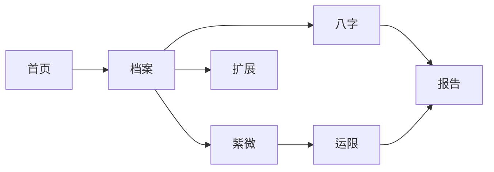

# 浮生 · 宋式典籍册页极简 — 统一开发文档

| 字段 | 内容 |
|------|------|
| **版本** | song-dev-1.5 |
| **日期** | 2026-07-12 |
| **定案风格** | **宋式典籍册页极简**（Song Archival Codex Minimal） |
| **美术定案** | **[`FUSHENG-DESIGN-MASTERPLAN.md`](../design/FUSHENG-DESIGN-MASTERPLAN.md)** ← 色彩·字体·布局唯一权威 |
| **工程方案** | **[`FUSHENG-FRONTEND-PLAN.md`](./FUSHENG-FRONTEND-PLAN.md)** ← 打磨期完整前端方案与问题台账 |
| **快速上手** | [`FUSHENG-QUICKSTART.md`](./FUSHENG-QUICKSTART.md) |
| **上位** | [`PRODUCT.md`](../../PRODUCT.md) |
| **视觉样张** | [`skin-preview.html`](../design/skin-preview.html) |
| **宋式参考清单** | [`SONG-AESTHETICS-REFERENCES.md`](../design/SONG-AESTHETICS-REFERENCES.md) ← **改方案前先读** |
| **宋式意境文献** | [`SONG-AESTHETICS-MOOD-AND-POETRY.md`](../design/SONG-AESTHETICS-MOOD-AND-POETRY.md) ← 意境语汇与文案句库 |

> **本文档为工程与阶段实施入口**。美术、色彩、字体、布局的 **定案** 见 **[`FUSHENG-DESIGN-MASTERPLAN.md`](../design/FUSHENG-DESIGN-MASTERPLAN.md)**。分拆参阅：[`FUSHENG-ART-STYLE.md`](../design/FUSHENG-ART-STYLE.md)（风格溯源）、[`handbook-bazi-layout.md`](../design/targets/handbook-bazi-layout.md)（八字像素）。

---

## 文档地图

```text
第零篇  前端设计总方案（美术+规划定案）  ← FUSHENG-DESIGN-MASTERPLAN.md
第一篇  宋式美学溯源与浮生定案
第二篇  美术完整方案（工程 Token 映射）
第三篇  界面规划完整方案
第四篇  前端工程完整方案
第五篇  协作实施与验收
第六篇  前后端协作契约（后端需支持什么）  ← 本文 §6
```

---

# 第一篇　宋式美学溯源与浮生定案

## 1.1 宋代美学核心（研究摘要）

宋代美学常概括为 **「雅、淡、简、韵」**，是中国古代美学的高峰之一，与唐代张扬外向不同，宋型文化 **内向、收敛、重理轻饰**。

| 概念 | 宋式含义 | 浮生 UI 映射 |
|------|----------|--------------|
| **雅** | 文人士大夫品味，精致而不炫富 | 档案像私人辑录，非营销落地页 |
| **淡** | 水墨单色、汝瓷素釉、低饱和 | 纸墨铜朱，禁金箔紫雾 |
| **简** | 圆方素质、以少胜多 | 两档卡片、册线分区、无纹样底 |
| **韵** | 意在言外、留白生境 | Trust 校勘、双轨朱批、折叠深读 |
| **格物致知** | 穷理尽性、探究秩序 | 盘面可核对、引擎 Trust、缺失明示 |
| **以白当黑** | 留白即结构 | 宽屏 gutter、章间天头地脚 |
| **诗画一律** | 图文互证 | 盘面 Hero + 典籍引文并排 |

**哲学底色**：理学影响下的 **理性深度**——美是通向秩序的路径，不是装饰堆砌。浮生「知命知心」与「可验证排盘」与此一致。

## 1.2 宋刻本版式 → 数字界面转译

宋刻本是宋代 **实用与审美并重** 的典范。以下从典籍物理版式映射到 Web 组件：

| 宋刻本元素 | 典籍作用 | 浮生数字等价物 |
|------------|----------|----------------|
| **版框**（双边/单边） | 界定阅读区 | 主内容 `max-width: 1120px` + 左右册线 |
| **版心**（卷名、页码、鱼尾） | 导航与元信息 | 顶栏页名、口径眉批、章 meta |
| **行线 / 行界** | 纵向阅读节奏 | 六柱表纵线、方盘宫格线 |
| **7∶10 框高宽比** | 比例范式（约 0.65–0.75） | 内容区宽高比克制；报告 1280 宽 |
| **双行小字注释** | 经注不抢正文 | 藏干、Trust 脚注 11–12px |
| **天头地脚** | 版心占开本 ~70% | 顶栏 56px 后天头；区块间距 24–32px |
| **蝴蝶装 / 册页** | 对折阅读、逐册翻阅 | 档案=一编；报告=卷目连续读 |
| **浙本欧体 / 蜀本颜体** | 端正易读 | **霞鹜新致宋** 篇题/干支 + **系统无衬线** 正文（见 §2.3） |

参考：[宋刻本版面比例研究](https://m-news.artron.net/news/20240722/n1454727.html) · [识典古籍](https://www.shidianguji.com) · [印刷博物馆宋版介绍](http://www.kepu.net.cn/gb/civilization/printing/evolve/evl316_02.html)

## 1.3 界画与盘面精度

宋代 **界画**（建筑人物线画）以直线、比例严谨著称。浮生命盘 UI 取此 **「界」** 而非建筑纹样：

- 八字六柱表 = 界格表  
- 紫微十二宫 = 界画宫格  
- 运限叠宫 = 行界切换，非发光特效  

## 1.4 风格定案与竞品坐标

**定案名称**：宋式典籍册页极简  

**一句话**：宋代典籍册页的版式纪律 + 现代极简的留白与 WCAG 对比度。

```text
装饰度
  高 │  ZiweiKnows 金箔 · 天机 Art Deco
     │        ★ 浮生（宋式册页极简）
  低 │  ziwei.pub · Baguame
     └────────────────────────→ 工具感
```

| 风格 | 结论 |
|------|------|
| 宋式典籍册页极简 | ✅ **主风格** |
| 极简新中式（观夏/无印） | 吸收留白与材质 |
| 海派 Art Deco | ≤5%，仅卷名装饰 |
| 水墨园林 / 金箔玻璃 / 纯工具扁平 | ❌ 拒绝 |

## 1.5 产品边界（三人共同遵守）

- **品牌**：浮生 · 浮生若寄，知命知心  
- **气质**：克制、可信、微神秘；**可翻阅的命盘册**  
- **反例**：紫红渐变、金箔、信息混乱、隐藏缺失  

---

# 第二篇　美术完整方案

## 2.1 情绪与气质

```text
安静 │ 可核对 │ 纸页感 │ 细线框 │ 点状朱批
────────────────────────────────────────
不要：金箔 │ 紫雾 │ 玻璃 │ 八卦底 │ 水墨山
```

## 2.2 色彩系统（Token 真源）

**文件**：`frontend/src/assets/variables.css`

| 角色 | Token | 色值 | 宋式隐喻 | 用法 |
|------|-------|------|----------|------|
| 纸 | `--brand-paper` | `#f5f0e6` | 熟宣纸 | body、shell |
| 墨 | `--brand-ink` | `#1a1410` | 松烟墨 | 正文 |
| 铜 | `--brand-gold` | `#b8894d` | 鎏金点缀 | KPI、CTA、active、典籍左边框 |
| 朱 | `--brand-cinnabar` | `#8b3a2a` | 朱批 | 缺失/双轨 **单行** |
| 雾 | `--brand-mist` | `#6b5d4f` | 淡墨注 | 眉批、辅助 |
| 面 | `--surface` / `--surface-2` | 暖白两级 | 单页纸 | 卡片、盘面垫底 |
| 五行 | `--wx-*` | 五色 | 干支色 | **仅命盘字符** |

**禁用**：青绿旋子铺底、蓝紫 radial 渐变、Trust 整段粉红。

## 2.3 视觉语法（Style Grammar）

### 分隔体系（Codex Rules）

| 名称 | CSS | 用途 |
|------|-----|------|
| 界线 | `1px solid var(--border-md)` | 柱表、方盘宫格 |
| 册线 | `1px solid var(--border)` + 间距 | 区块间，替代彩色大框 |
| 朱批线 | `3px solid var(--brand-cinnabar)` 左 | 缺失/双轨单行 |
| 铜章线 | `3px solid var(--brand-gold)` 左 | 典籍断语 |
| 校勘线 | `1px dashed var(--border-md)` | Trust 表内 |

### 批注体系

| 类型 | 规格 | 场景 |
|------|------|------|
| 眉批 | 11–12px 雾棕 | 口径 banner |
| 朱批 | 11px 朱 + 图标 | 缺失、双轨 |
| 校勘脚注 | 12px 墨、白底细表 | EngineTrustPanel |

### 字体系统定案（核心 — 冻结）

> **好看的字是浮生美术的第一优先级。** 命盘产品 70% 的信息是字；盘面是「界画格」，字必须占格稳、笔画清、层级准。字体选错，再正确的纸墨铜朱也会像「AI 国风模板」。

#### 2.3.1 为什么必须单独定字体

| 问题 | 现状 | 后果 |
|------|------|------|
| 模板组合 | `Noto Serif SC` + `Inter` + 米白底 | 千站一面，读者秒认「生成感」 |
| 衬线滥用 | 卡片标题、表头全用衬线 | 盘面与 chrome 抢戏，层级糊 |
| 冷灰混排 | `BaziReferenceTable` 用 `#334155` | 与暖纸冲突，脏 |
| 外链依赖 | `skin-preview` 走 Google Fonts | 国内不稳；与 `index.html`「系统优先」矛盾 |
| 刻本气质缺失 | Noto Serif 偏「现代印刷宋」 | 缺宋刻本瘦劲、占格感 |

**原则**：全站 **最多 2 套字形**（1 衬线 + 1 无衬线）；衬线 **只服务典籍区**；UI chrome **只用系统无衬线**。

#### 2.3.2 三套字形角色（冻结）

| Token | 定案栈 | 气质 | 用途（白名单） |
|-------|--------|------|----------------|
| `--font-display` | `"LXGW Neo ZhiSong", "Source Han Serif SC", "Noto Serif SC", STSong, serif` | 宋刻本瘦劲、占格稳 | 卷名、篇题、**干支盘面**、典籍引文、报告卷首 |
| `--font-ui` | `-apple-system, BlinkMacSystemFont, "Segoe UI", "PingFang SC", "Hiragino Sans GB", "Microsoft YaHei UI", "Noto Sans SC", sans-serif` | 冷静、屏读最优 | 导航、按钮、表单、表头、Trust 脚注、KPI 数字 |
| `--font-mono` | `"JetBrains Mono", "Cascadia Code", Consolas, monospace` | 等宽对齐 | 版本号、API 口径、代码块 |

**刻意不用 Inter 作主 UI 字体**：`Inter + Noto Serif + 暖米色` 是近年 AI / 模板站标配；拉丁部分交给 `system-ui` / `Segoe UI` 即可。

**衬线首选：霞鹜新致宋（LXGW Neo ZhiSong）**

| 对比项 | 霞鹜新致宋 | Noto Serif SC | 方正宋刻本秀楷 |
|--------|------------|---------------|----------------|
| 气质 | IPA 明朝衍生，接近刻本宋 | 现代泛 CJK 印刷宋 | 最接近《攻媿先生文集》欧体 |
| 授权 | IPA / 开源可商用 | OFL 开源 | 商业授权 |
| 盘面小字号 | Screen 版可读 | 尚可 | 优秀但不可用 |
| 差异化 | ★ 有刻本感，非模板 | 泛用、易 AI 感 | 理想但受限 |

**备选**：若自托管体积仍过大，篇题可暂退 `Source Han Serif SC`（思源宋体），**干支区仍优先加载 ZhiSong 子集**。

**不用霞鹜文楷作主字体**：偏手写楷意，表格占格不稳，长文易腻；仅可作报告卷名 Display 的 **≤5% 实验分支**，不作默认。

#### 2.3.3 字号阶梯与行高（与母版绑定）

| 角色 | 字体 | 字号 | 行高 | 字重 | 备注 |
|------|------|------|------|------|------|
| 卷名 | display | `clamp(28px, 4vw, 36px)` | 1.25 | 600 | 首页档案名、报告封面；**每页 ≤1** |
| 篇题 | display | 22–24px | 1.3 | 600 | 壳顶栏篇题、章标题 |
| 盘面干支 | display | 28–32px | 1.1 | 700 | `font-variant-numeric: tabular-nums`；五行色仅字 |
| 典籍引文 | display | 16–17px | 1.65 | 400 | 铜章线左块；`max-width: 42em` |
| 正文 | ui | 14px（根 `html` 16px 下 0.875rem） | 1.57（22px） | 400 | 主阅读字号，对齐 Ant Design / 有赞 14 实践 |
| 表头/标签 | ui | 12–13px | 1.4 | 500 | **不用衬线** |
| 眉批/校勘 | ui | 11–12px | 1.45 | 400 | 雾棕色 `var(--text-2)` |
| KPI 数字 | ui | 20–24px | 1.2 | 600 | 墨或铜二选一（见 §2.8.6 A/B） |

**禁止**：中文斜体；12px 以下用铜色；justify 两端对齐正文。

#### 2.3.4 加载策略（工程冻结）

```text
默认全站：不加载任何 Web Font（--font-ui = 系统栈）
按需加载：盘面页 / 报告页 加载 ZhiSong 子集 WOFF2
实现路径：frontend/public/fonts/ + @font-face + unicode-range
子集范围：CJK 基本区 + 天干地支 + 常用命理汉字（约 2–3MB 切片后 <800KB）
font-display: swap
```

| 页面 | 加载 |
|------|------|
| 登录 / 404 | 无 Web Font |
| 档案 / 扩展 Hub | 无（或仅篇题 1 次 display 子集） |
| 八字 / 紫微 / 运限 | **必载** display 子集 |
| 报告 | display 子集 + 正文仍 ui |

与 `index.html` 对齐：删除对 Google Fonts 的生产依赖；`skin-preview.html` 增加 **字体 A/B 页**（Noto vs ZhiSong 并排）。

#### 2.3.5 字体验收（S0.5 硬门槛）

- [ ] 全站仅 `display` / `ui` 两套，无第三套「国风」字体  
- [ ] 衬线出现在 **白名单** 内；卡片 h2、表头、按钮 **零衬线**  
- [ ] 干支 28px+ 在 375px 宽下仍清晰、占格不跳  
- [ ] 与识典古籍并排：灰度层级接近，气质不像 SaaS  
- [ ] 与 `skin-preview` 字体 A/B 页一致，负责人点头后再改 `variables.css`  

#### 2.3.6 反 AI 化字体守则

| 要 | 不要 |
|----|------|
| 系统无衬线撑 UI | Inter / Roboto 作主字体 |
| 衬线仅典籍区 | 全页 h2 衬线 |
| 一种正文 14px | 12/13/14/15 四档正文混用 |
| 数字 `tabular-nums` | 比例数字纵向对不齐 |
| 子集自托管 | 每页全量 15MB 宋体 |

### 纸感与阴影

- `body`：熟纸 + ≤4% SVG 纸纹噪点  
- **边框优先于阴影**；elevated 每页 ≤1（卷封 Hero）  
- 圆角：卡片 14–16px；按钮 12px；**不用** 24px 大圆角 SaaS 风  

### 动效

| 允许 | 禁止 |
|------|------|
| 150ms 运限 fade | 水墨扩散、3D 翻页 |
| 200ms 手风琴 | 粒子、光晕 pulse |
| `prefers-reduced-motion: reduce` | 循环背景动效 |

## 2.4 组件皮肤（与样张对照）

| 组件 | 宋式名 | 样张 | 工程类名 |
|------|--------|------|----------|
| Button primary | 铜扣 | skin §02 | `.fs-btn--primary` |
| Card flat | 单页纸 | §03 | `.fs-card` + flat 变体 |
| Card elevated | 卷封 | §03 | elevated，每页 ≤1 |
| SummaryStrip | 卷首提要 | §04 | `SummaryStrip` |
| 六柱表 | 界画盘 | §05 | `BaziReferenceTable` |
| Trust | 校勘脚注 | §06 | `EngineTrustPanel` compact |
| tier badge | 方印 | §07 | PatternTierBadge |
| depth toggle | 卷目详略 | §08 | `.fs-depth-toggle`（待建） |
| 典籍块 | 经注 | §08 | `.explain-block--classical` |

**皮肤样页**：[`docs/design/skin-preview.html`](../design/skin-preview.html)

## 2.5 分场景美术要点

| 场景 | 宋式表达 |
|------|----------|
| **壳** | 天头 56px + 底册线；无 slogan 堆叠；纸底无蓝晕 |
| **首页/档案** | 卷封 Hero；表单=册页条目；侧栏=辑录 KPI |
| **八字/紫微** | 界画盘 Hero ≥40% 首屏；Trust=校勘脚注 |
| **报告** | 卷目目录 sticky；互证=校勘表；打印去 chrome |
| **扩展** | 门类细框入口；合盘=双册并排（规划） |

## 2.6 美术参考源

| 优先级 | 参考 | URL | 学什么 |
|--------|------|-----|--------|
| P0 | 识典古籍 | https://www.shidianguji.com | 文献阅读、目录正文 |
| P0 | 宋刻本版式研究 | 学术/雅昌艺术网 | 7∶10 比例、版心、行界 |
| P0 | 宋代界画 | 艺术史 | 直线宫格精度 |
| P1 | 永乐大典影像库 | https://kvlab.org/project/yongledadian/ | 纸色、结构化导览 |
| P1 | 观夏 / 无印 | 商业参考 | 留白、材质诚实 |
| P2 | Baguame / ziwei.pub | 产品 | 仅交互，非皮肤 |

## 2.7 美术验收清单

- [ ] 全站气质为「册页辑录」  
- [ ] 册线/界线分区，彩色 section 框 = 0  
- [ ] 朱色仅朱批尺度  
- [ ] 铜色仅提要/CTA/active/典籍边  
- [ ] 五行色不进 chrome  
- [ ] 阴影 ≤ 每页 1 处  
- [ ] 对照 `skin-preview.html` 八区块一致  

## 2.8 抗丑化与反 AI 化守则（必读）

> **文档定方向，不保证好看。** 配色难看、布局散、一股「AI 国风模板味」，往往来自 **机械套用名词** 和 **组件库默认色**。本节为硬性约束，优先于一切「宋式」修辞。

### 2.8.1 什么叫「过于 AI 化」（浮生语境）

| 症状 | 典型表现 | 读者感受 |
|------|----------|----------|
| **名词堆砌** | 处处写册线、朱批、卷封，但视觉仍是圆角白卡堆叠 | 像文案生成，不像设计 |
| **模板国风** | 米白 + 衬线 + 铜金渐变按钮 + 云纹（哪怕很淡） | 千站一面 |
| **组件库色** | Trust 用 Tailwind 绿/黄/粉 alert 底 | 像后台，不像宋刻本 |
| **层级糊** | `#f5f0e6` / `#fffaf5` / `#f7f1e8` / `#f0e0c7` 四层嵌套 | 脏、闷、看不清焦点 |
| **头重脚轻** | PageHead + 口径条 + SummaryStrip + 色块分区标签 | 盘面反而下沉 |
| **假精致** | 16px 圆角 + 轻阴影每张卡、backdrop-filter 毛玻璃顶栏 | SaaS，非典籍 |

### 2.8.2 色彩预算（每屏最多 4 层色相）

**可见色相上限**（同屏）：**纸、墨、铜、朱** 四类；五行色 **仅** 在干支字上。

| 规则 | 说明 |
|------|------|
| **纸面二级** | 全页只允许 **纸底 + 内容白** 两级；禁止 `surface` 套 `surface-2` 再套卡片 |
| **铜色预算** | 同屏铜色面积 **< 8%**；仅：1 个 CTA、active 导航、提要数字、1 条左边框 |
| **朱色预算** | 同屏 **≤ 3 处** 朱批；禁止 `#fef2f2` 粉红底 section |
| **禁用组件库语义色** | `--trust-ok-bg` 绿、`--trust-drift-bg` 黄等 **不得铺底**；改为墨字 + 细线 + 小徽章 |
| **按钮** | **禁止** `linear-gradient` 铜金按钮；用 **实心铜** 或 **墨字+铜框** |
| **对比度** | 铜金 **不得** 作 12px 以下正文色；小字只用墨/雾 |

**当前代码高风险项**（改版必改）：

- `variables.css` `body` 蓝紫 radial  
- `fusheng-page.css` `.fs-btn--primary` 渐变  
- `fs-layer--summary/trust/explain` 彩色大底  
- `EngineTrustPanel` 粉红 alert 块  
- `BaziReferenceTable` 冷灰 `#fff` / `#334155` 与暖纸冲突  

### 2.8.3 布局预算（每屏一个视觉锚点）

| 规则 | 说明 |
|------|------|
| **一屏一锚** | 八字/紫微：首屏 **只有界画盘** 是主角；提要条 **一条**；不要三带式 header |
| **去重** | 壳有篇题 → **去掉** PageHead 大标题（或反之，二选一） |
| **宽度** | 主内容 `1120px` 居中；盘面区 **不要** 再套大圆角色框 |
| **栅格** | 母版 A 双栏仅桌面；移动 **盘面置顶全宽**，辅助信息 **折叠默认** |
| **间距律** | 只用 `24px / 32px` 两档垂直间距；**不用** 彩色框区分区块 |
| **深度** | 默认速览 = **少即是少**；结构/深读展开，禁止默认全展开 |

### 2.8.4 反 AI 化排版

| 要 | 不要 |
|----|------|
| 篇题衬线 **1 处**（`--font-display`） | 全页 h2 都用衬线 |
| 正文系统无衬线一种（`--font-ui`） | Inter 作主字体、第三套「国风」字体 |
| 用户文案：速览/结构/深读 | 册线、L1、校勘层、引擎层 |
| 空状态一句人话 | 「暂无数据，请完善档案」式模板句堆砌 |

### 2.8.5 人眼验收（比文档勾选更重要）

每一阶段 **必须** 做并排对比，否则视为未完成：

| 步骤 | 做法 |
|------|------|
| 1 | 打开 `skin-preview.html` 与改版页 **左右并排** |
| 2 | 与 [识典古籍](https://www.shidianguji.com) 比 **灰度层级**（不是抄装饰） |
| 3 | 与 [ziwei.pub](https://ziwei.pub/) 比 **盘面信息密度** |
| 4 | 截图问一句：**「像私人册页，还是像 AI 生成的命理 SaaS？」** |
| 5 | 若答后者 → **回滚装饰**，先减色再减框 |

**硬门槛**：S0/S2 合并前，负责人对 `skin-preview.html` 点头；**未点头不写新组件**。

### 2.8.6 推荐色板（冻结版，减少搭配失误）

改版时 **只允许** 下列组合，不新增 hex：

```text
背景层：  #f5f0e6（纸） → 内容区 #fffaf5（单页白）
文字层：  #1a1410（墨） / #6b5d4f（雾） / #9a8b7a（淡注）
结构线：  #e5dcc8 / #d4c4a8
强调：    #b8894d（铜，点缀） / #8b3a2a（朱，批注）
盘面：    --wx-* 仅字符
```

**刻意不用**：汝窑天青、翠玉绿、Tailwind 语义绿黄粉铺底、蓝紫渐变。

---

# 第三篇　界面规划完整方案

## 3.1 产品定位与主路径

**定位**：个人档案型命盘阅读器（非一次性计算器）



**路由**：`frontend/src/router/index.ts` · **壳**：`NewAppShell`（`/login` 除外）

## 3.2 全局壳规划

```text
┌────────────────────────────────────────────────┐
│ TopBar 56px：Logo + 篇题 + 导航≤5 + 工具/登录次要 │
├────────────────────────────────────────────────┤
│     Main max-width 1120px 居中（报告 1280）      │
│     母版 A / B / C                              │
├────────────────────────────────────────────────┤
│ BottomNav 56px（仅 <640px，5 步）              │
└────────────────────────────────────────────────┘
```

| 现状问题 | 规划改法 |
|----------|----------|
| 顶栏三层文案 | 仅篇题；slogan 只在首页卷封 |
| 导航 7 项 | 主路径 5；扩展/登录次要 |
| 内容拉满 | `max-width` + gutter |
| 蓝晕背景 | 熟纸 + 纸纹 |

## 3.3 三种布局母版

### 母版 A — Chart-Centric（八字 / 紫微 / 运限）

```text
口径眉批（单行）
卷首提要 SummaryStrip
┌─────────────────┬──────────────┐
│ 界画盘 Hero ≥55% │ 流日/叠宫/关系 │
├─────────────────┴──────────────┤
校勘脚注 Trust（白底表）
典籍 │ 引擎 │ 启发式（手风琴，启发式默认收）
```

**深度切换（卷目详略）**

| 档位 | 用户文案 | 内容 |
|------|----------|------|
| 速览 | 默认 | 提要 + 盘面 + Trust 摘要 |
| 结构 | 展开结构 | 藏干、关系、叠宫 |
| 深读 | 展开解读 | 三层断语 |

**禁止 UI 文案**：L1–L4、四层语法。

### 母版 B — Archive-Workbench（首页 / 档案）

```text
卷封 Hero（elevated 唯一）+ 就绪朱批 + CTA
┌──────────────────┬─────────────┐
│ 表单/路径 65%     │ KPI 侧栏 35% │
│ Tab：基础│八字│紫微│云端      │ 完整度·可信度  │
└──────────────────┴─────────────┘
```

### 母版 C — Document-Reader（报告）

```text
┌────────┬─────────────────────────┐
│ 卷目   │ 篇题 + 册线 + 连续正文    │
│ 240px  │ 互证校勘表               │
│ sticky │ 打印：隐目录与 nav        │
└────────┴─────────────────────────┘
```

## 3.4 页面蓝图

### 首页 `/`

| 优先级 | 模块 | 首屏 |
|--------|------|------|
| P0 | 档案就绪 + 主 CTA | ✅ |
| P1 | 档案名 / 出生摘要 | ✅ |
| P2 | 三步路径 | 可折叠 |
| P3 | 扩展入口 | 次屏 |

**回访态（规划补充）**：上次阅读断点（八字/报告章）。

### 档案 `/profile`

| Tab | P0 |
|-----|-----|
| 基础 | 出生时间、性别、出生地 |
| 八字口径 | 子时、真太阳时 |
| 紫微口径 | 年界/换日/亮度/右弼 |
| 云端 | Case、快照 |

侧栏 **仅 KPI**，不重复表单。

### 八字 `/new/bazi`

母版 A · 详见 [`handbook-bazi-layout.md`](../design/targets/handbook-bazi-layout.md)

- 桌面 Grid `1.45fr : 0.75fr`  
- 移动：盘面全宽置顶，允许表横滚  
- Trust 脚注化；解读下沉  

### 紫微 `/new/ziwei`

母版 A · 方盘 ≥60% 宽；toolbar 窄屏落底部（规划补充）

### 运限 `/new/ziwei/timeline`

母版 A · sticky 日期条 + FortuneStrip 横滑 + 方盘 overlay

### 报告 `/report`

母版 C · 连续阅读 + `report-print.css`

### 扩展 `/extensions`

Hub 2×2 门类卡；子页合盘规划 **母版 D 双册并排**

### 登录 / 404

登录：裸壳单卷封卡；404：简化 B + 返回 CTA

## 3.5 交互规范

| 场景 | 规则 |
|------|------|
| 改口径 | 保存浮条「将重新排盘」+ invalidate |
| 缺失 | 文案「缺失」 |
| 启发式 | 默认折叠 + badge |
| 盘面 | 375px 可横滚；页面不横滚 |
| 加载 | `AppLoading` / `ResultStateCard` |

## 3.6 响应式

| 宽度 | 布局 |
|------|------|
| <640px | 单列；底栏；提要 2×2 |
| 640–960px | 档案单列；报告目录置顶 |
| >960px | 八字双栏；报告双栏 |
| >1120px | 内容居中留白 |

## 3.7 规划验收清单

- [ ] 每页正确母版 A/B/C  
- [ ] P0 首屏或首屏+一滚可见  
- [ ] 导航 ≤5；无重复 slogan  
- [ ] 深度文案：速览/结构/深读  
- [ ] 375px 无页级横滚  

## 3.8 界面规划细则（逐页 · 逐模块）

> 规划的目标不是「多放模块」，而是 **每屏一个视觉锚点 + 信息按阅读顺序展开**。下列为 S0–S5 的实施优先级与首屏预算。

### 3.8.1 全局信息架构

```text
用户心智：我有一册「个人命盘辑录」→ 先建档 → 看盘面 → 必要时读报告

一级导航（≤5）：首页 · 档案 · 八字 · 紫微 · 报告
二级入口：运限（紫微子路由）、扩展（Hub）、登录（次要）

禁止：顶栏 slogan + PageHead 大标题 + SummaryStrip 三行重复同一语义
```

| 路由 | 母版 | 首屏锚点 | 首屏禁止出现 |
|------|------|----------|--------------|
| `/` | B | 卷封 + 就绪状态 + 主 CTA | 七宫格营销、扩展墙 |
| `/profile` | B | 表单主字段 | 重复 KPI 长文 |
| `/new/bazi` | A | **六柱界画盘** | L1–L4 色块、Trust 粉红段 |
| `/new/ziwei` | A | **十二宫方盘** | 双顶栏、全展解读 |
| `/new/ziwei/timeline` | A | 日期条 + 方盘 overlay | 动效光晕 |
| `/report` | C | 卷目 + 第一章正文 | 壳内营销条 |
| `/extensions` | B 变体 | 2×2 门类 | 子功能直堆首屏 |

### 3.8.2 壳层（NewAppShell）规划

| 区域 | 桌面 | 移动 | 内容规则 |
|------|------|------|----------|
| TopBar 56px | 固定 | 固定 | Logo + **篇题 1 行** + nav≤5；工具/登录右置次要 |
| Main | `max-width: 1120px` 居中，左右 gutter ≥24px | 全宽 -16px padding | 报告区 1280px |
| BottomNav | 无 | 56px 固定底 | 5 项与顶栏互斥重复最小化 |
| 背景 | 纸 `#f5f0e6` + ≤4% 纸纹 | 同左 | **无** radial 蓝紫 |

**篇题来源**：路由 meta `title`，不是营销 slogan。Slogan「浮生若寄，知命知心」**仅**首页卷封出现 1 次。

### 3.8.3 首页 `/` — 回访与冷启动

**冷启动（无档案）**

```text
┌─────────────────────────────────────┐
│ 卷封 elevated（全站唯一阴影位）          │
│ 档案名占位 / 「尚未建档」              │
│ 主 CTA：去建档（铜扣 1 个）            │
│ 眉批：一句人话说明产品                 │
├─────────────────────────────────────┤
│ 三步路径（可折叠，默认展开前 2 步）     │
└─────────────────────────────────────┘
```

**回访态（有档案）— 规划补充**

| 模块 | 优先级 | 行为 |
|------|--------|------|
| 就绪条 | P0 | 八字/紫微是否可算；缺失字段朱批 **单行** |
| 续读入口 | P0 | 「继续上次」→ 八字 / 报告章（localStorage 断点） |
| 出生摘要 | P1 | 一行雾棕 meta，不重复档案表单 |
| 扩展 | P2 | 次屏 2×2，不占首屏 |

### 3.8.4 档案 `/profile` — 表单与 KPI 分工

```text
左 65%：表单（按 Tab 分册）
  基础 │ 八字口径 │ 紫微口径 │ 云端
右 35%：KPI 侧栏（只读）
  完整度 % · 可信度摘要 · 上次演算时间
```

| 规则 | 说明 |
|------|------|
| 不重复 | 侧栏不写长段说明；说明进 Tab 内眉批 |
| 改口径 | 保存后浮条「将重新排盘」；不静默 invalidate |
| 云端 Tab | Case 列表 + 快照恢复；与首页续读联动 |

### 3.8.5 八字 `/new/bazi` — 母版 A 尺寸律

详见 [`handbook-bazi-layout.md`](../design/targets/handbook-bazi-layout.md)。规划硬约束：

| 项 | 桌面 | 移动 |
|----|------|------|
| Grid | `1.45fr : 0.75fr` | 单列，**盘面置顶** |
| 盘面宽 | ≥55% 主栏 | 100% 宽，表可横滚 |
| 首屏高 | 盘面顶部 ≤ viewport - 56px 顶栏 - 单行眉批 | 盘面 ≥40vh |
| Trust | 脚注白底表，在解读 **之上** | 折叠摘要 3 行 |
| 深度 | 速览默认；结构/深读 toggle | 同左，toggle 贴盘面下 |

**首屏组件预算（最多 4 块）**：口径眉批 → 提要条（1 行）→ 界画盘 → 深度 toggle。  
**禁止第 5 块**：彩色 `fs-layer--*` 分区标题。

### 3.8.6 紫微 `/new/ziwei` — 方盘与工具条

| 项 | 规划 |
|----|------|
| 方盘 | 宽 ≥60% 主栏；宫格线 `1px --border-md` |
| Toolbar | 运限/亮度/叠宫；桌面横排于方盘下 |
| 窄屏 | Toolbar **落底部 sticky**（拇指区），方盘全宽 |
| 解读 | 典籍/引擎/启发式手风琴；启发式 **默认收** |

### 3.8.7 运限 `/new/ziwei/timeline`

```text
sticky 日期条（单行）
FortuneStrip 横滑（56px 高）
方盘 overlay 叠宫（fade 150ms）
解读区下沉，非首屏
```

### 3.8.8 报告 `/report` — 连续阅读

| 项 | 规则 |
|----|------|
| 左栏 240px | 卷目 sticky；章节能点击跳转 |
| 右栏 | 篇题 display + 册线分章；正文 `max-width: 72ch` |
| 互证 | 校勘表（白底细线），非 alert |
| 打印 | `report-print.css` 隐 nav、目录可选、纸白黑字 |

### 3.8.9 扩展 `/extensions`

| 子页 | 母版 | 说明 |
|------|------|------|
| Hub | B 变体 | 合盘 / 相似 / 择日 / 风水 四门 |
| 合盘 | D（规划） | 双册并排，各一盘面锚点 |
| 相似 / 择日 | A 简化 | 单锚点 + 结果表 |

### 3.8.10 响应式断点与折叠策略

| 宽度 | 壳 | 八字/紫微 | 档案 | 报告 |
|------|-----|-----------|------|------|
| <375 | 底栏 | 盘面横滚 | 单列 | 目录折叠为下拉 |
| 375–640 | 底栏 | 盘面置顶 | 单列 | 目录置顶横滑 |
| 640–960 | 顶栏 | 单栏→浅双栏 | 表单全宽 | 目录顶 + 正文 |
| 960–1120 | 顶栏 | 双栏 A | B 双栏 | C 双栏 |
| >1120 | 顶栏 + 天头留白 | 同左 | 同左 | 报告 1280 居中 |

### 3.8.11 交互状态机（规划级）

| 状态 | 全站表现 |
|------|----------|
| 加载 | `AppLoading` 纸色骨架，不用 spinner 紫 |
| 空档案 | 首页卷封 CTA，子页 `ResultStateCard` 引导回档案 |
| 演算中 | 盘面区 skeleton，不禁用顶栏 |
| 缺失字段 | 朱批单行 + 跳转档案对应 Tab |
| 双轨 | 朱批 + 校勘表一行，不弹 modal |
| 错误 | 墨字 + 铜框按钮重试，不用粉红底 |

### 3.8.12 规划与美术交叉验收

每页交付前同时满足：

1. **母版**正确（A/B/C）  
2. **字体**符合 §2.3 白名单  
3. **色彩**符合 §2.8 预算  
4. **首屏**仅 1 个锚点  
5. **375px** 无页级横滚  
6. 与 `skin-preview.html` + 识典古籍 **灰度并排**通过  

---

## 3.9 排版与布局研究摘要（2026-07-12 检索）

> 本节为 **外部参考 + 竞品 + 典籍版式** 的检索结论，已纳入上文母版与 `handbook-bazi-layout.md`。改版时以本节为检索索引，避免重复搜。

### 3.9.1 数字典籍阅读（P0）

| 来源 | 链接 | 可迁移的排版规律 |
|------|------|------------------|
| **识典古籍** | https://www.shidianguji.com | 左目录 + 右正文；横排屏读；**纸—正文—辅助** 三级灰度；三级目录 sticky |
| **北大数字人文** | https://pkudh.org/project/shidianguji/ | 图文对照 = 盘面 + 校勘；现代标点 = 用户可读文案；移动独立适配 |
| **永乐大典影像库** | https://kvlab.org/project/yongledadian/ | 满版纸面、结构化导览；**不学** 3D 翻页 |

**浮生映射**：报告用母版 C（240px 卷目 + 正文 `72ch`）；八字/紫微用母版 A（盘面 = 正文区，Trust = 脚注）。

### 3.9.2 宋刻本版式（P0）

| 要素 | 典籍 | 浮生等价 |
|------|------|----------|
| 版框 7∶10 | 高宽比 0.65–0.75 | 主区 `1120px` 宽、盘面横向展开 |
| 版心 ~70% | 天头地脚留白 | 顶栏 56px + 章间距 24/32px |
| 行界 | 纵向阅读节奏 | 柱表/宫格 `1px` 竖线 |
| 双行小字注 | 不抢正文 | 藏干、Trust 11–12px `font-ui` |
| 蝴蝶装册页 | 逐册翻阅 | 档案=一编；深度 toggle = 卷目详略 |

参考：[宋刻本 7∶10 研究](https://m-news.artron.net/news/20240722/n1454727.html) · [印刷博物馆版式要素](http://www.kepu.net.cn/gb/civilization/printing/evolve/evl316_02.html)

### 3.9.3 中文 UI 排版通则（P1）

| 来源 | 要点 | 浮生采纳 |
|------|------|----------|
| Ant Design / 有赞 / Arco | 主字号 **14px**；字阶 3–5 档；行高 1.4–1.6 | 正文 14px / 22px 行高 |
| Clarity / Arco | UI 优先 **系统无衬线**；数字 `tabular-nums` | `--font-ui` 系统栈；盘面 KPI 对齐 |
| 有赞 | 标题 Medium(500)，非 Semibold 堆叠 | 篇题 600，表头 500 |
| Win32 UX | 屏显 UI 用无衬线；长文可读才用衬线 | 衬线仅 display 白名单 |

### 3.9.4 命理竞品结构（P0 · 只学布局）

| 产品 | 学什么 | 不学 |
|------|--------|------|
| [ziwei.pub](https://ziwei.pub/) | 方盘宫格密度、运限线框、一屏见盘 | 冷色皮肤 |
| [Baguame](https://baguame.com/bazi/) | 盘面优先、Basic/Pro 渐进披露 | 默认扁平灰 |
| 识典古籍 | 文献灰度、目录节奏 | 品牌色 |

### 3.9.5 检索结论 → 本次布局实施（S0 + S2）

| 决策 | 依据 | 工程动作 |
|------|------|----------|
| 去掉 PageHead 双层标题 | 识典/皕宋 天头只一处 | `NewBaziView` 改 toolbar |
| 母版 A 双栏 `1.45:0.75` | 7∶10 + ziwei 密度 | `bazi-hero` grid |
| 深度三档 UI | Baguame 渐进披露 | `.fs-depth-toggle` |
| 柱表暖色界格 | 识典纸墨 + 界画直线 | `BaziReferenceTable` token 化 |
| Trust 脚注化 | 刻本双行小注 | `EngineTrustPanel` compact 白底 |
| 壳 56px + 篇题 only | §3.8.2 | `NewAppShell` 去 slogan 堆叠 |

**布局真源文件**：`handbook-bazi-layout.md` · `skin-preview.html` §05–§09 · 本文 §3.8。

## 3.10 人生六卷 IA — 后端蓝图 × 前端差距（2026-07-12）

> **上位**：[`BACKEND-MASTER-PLAN-2026-07-12.md`](../plan/BACKEND-MASTER-PLAN-2026-07-12.md) · [`FUSHENG-BOOK-GTM-DEV-PLAN-2026-07-12.md`](../plan/FUSHENG-BOOK-GTM-DEV-PLAN-2026-07-12.md)  
> **核心 API（规划）**：`GET /api/v1/life/volumes/{case_id}` → `volumes[0..5]` + `colophon`

### 3.10.1 全书册页（产品语言）

| 册页 | 用户语言 | 后端数据源 | 默认状态 |
|------|----------|------------|----------|
| **封面 / 卷首** | 档案 + 怎么读这本书 | Case meta + ReadingGuide | 展开 |
| **卷一·命之根** | 四柱、格局、用神 | bazi pillars/geju/yongshen | 展开 |
| **卷二·业之象** | 刑冲合害、神煞、双轨 | relations_summary + shensha | 展开 |
| **卷三·运之波** | 大运、流年、流月 | dayun + liunian + liuri | 展开 |
| **卷四·宫之图** | 紫微十二宫 | ziwei palaces/patterns | 展开 |
| **卷五·事之理** | 事业/财/婚（事实+典籍，推断折叠） | enrich domains | **推断默认收** |
| **卷六·问书** | AI 追问助手 | LLM + evidence_refs | **默认折叠** |
| **跋·校勘** | missing、iztro | colophon | **脚注嵌入各卷，不当主菜** |

### 3.10.2 当前前端映射（实机 · 2026-07-12）

| 册页 | 当前落点 | 对齐度 | 问题 |
|------|----------|--------|------|
| 封面/卷首 | `NewHomeView` 卷封 Hero | 🟡 半 | 无 ReadingGuide「怎么读这本书」 |
| 卷一 | `/new/bazi` 速览（盘面+KPI） | 🟢 较好 | 与卷二/卷三/卷五混在同一页 |
| 卷二 | `/new/bazi` 结构档（关系卡） | 🟡 半 | 神煞在表里但未单列为「业之象」 |
| 卷三 | `/new/bazi` 深读含大运；`/new/ziwei/timeline` | 🔴 散 | 运限未升格为独立卷叙事；流月弱 |
| 卷四 | `/new/ziwei` | 🟡 半 | 未用「卷四·宫之图」卷目语言 |
| 卷五 | `buildBaziModuleCards` 在深读 | 🔴 错位 | 8 域全标 `engine`；推断未折叠；应在 Report 卷五 |
| 卷六 | `interpret-module` API 无专页 | 🔴 缺失 | 无追问助手 UI；大运叙事自动加载 |
| 跋 | `EngineTrustPanel` 整段 | 🔴 过重 | 仍像主章节，非各卷脚注 |
| 全书 | `ReportView` 11 章旧结构 | 🔴 未对齐 | 章名是「八字总览/四维分析」非六卷 |

### 3.10.3 建议改动（按优先级）

| 优先级 | 改动 | 理由 |
|--------|------|------|
| **P0** | **Report 卷目改为六卷+跋**（母版 C） | 全书唯一连续阅读入口；对齐后端 `life/volumes` |
| **P0** | **跋·校勘下沉**：每卷末 1–3 行脚注 + Report 末 expandable 跋 | 后端 D3：Trust 不当主菜 |
| **P0** | **卷五从八字页迁出**：`/new/bazi` 深读只保留卷一+二引擎结构 | 避免一屏塞完全书 |
| **P1** | **首页加卷首 ReadingGuide**（3 条：先卷一→卷三→卷五） | 封面/卷首产品定义 |
| **P1** | **卷三独立叙事面**：Timeline 升格或 Report 卷三 Hero | 运之波是抖音钩子 #2 |
| **P1** | **卷五 UI**：事实/典籍默认展，推断 badge + 默认折叠 | 对齐 BE 卷五编排规则 |
| **P1** | **卷六问书**：Report 末单块，用户点击才调 LLM | 禁止自动长文 |
| **P2** | 顶栏/首页「目录」链到 Report 卷目 | 工具导航 → 之书导航 |
| **P2** | `locked` 卷 UI（待 `entitlement` API） | Freemium 卷三~五 |
| **P2** | `GET /life/snippets` 驱动分享卡卷名 | 抖音素材 |

### 3.10.4 页面与卷的重新分工（目标态）

```text
首页/档案     → 封面 + 卷首（ReadingGuide）
/new/bazi     → 卷一 工作台（速览=卷一；结构=+卷二）
/new/ziwei    → 卷四 工作台
/ziwei/timeline → 卷三 工作台（运之波主战场）
/report       → 全书连续读（卷一~六 + 跋）母版 C
/extensions   → 卷外「附录」（合盘=双册）
```

**深度 toggle 重命名对齐（用户文案）**：

| 现文案 | 应对卷 | 内容 |
|--------|--------|------|
| 速览 | 卷一 | 盘面 + 格局用神 KPI |
| 结构 | 卷一+二 | +藏干、关系、神煞、双轨 |
| 深读 | **仅引擎结构续读** | 不含卷五域分析（迁 Report） |

### 3.10.5 待后端 BE-S02 后前端接入

1. `frontend/src/api/life.ts` — `getLifeVolumes(caseId)`  
2. `VolumeSection.vue` — 通用卷节渲染（`layer` classical/engine/heuristic）  
3. `ColophonFootnote.vue` — 单行 missing/iztro  
4. `ReportView` 数据源从多 API 拼装 → **优先 life/volumes 单响应**

---

# 第四篇　前端工程完整方案

## 4.1 技术栈

| 层 | 选型 |
|----|------|
| 框架 | Vue 3.5 + `<script setup>` |
| 路由 | Vue Router 4，`base: /static/app/` |
| 状态 | Pinia |
| HTTP | Axios `api/client.ts` |
| 构建 | Vite 6 |
| 类型 | vue-tsc + openapi-typescript |
| 单测 | Vitest 4 |
| E2E | Playwright |

## 4.2 目录结构

```
frontend/src/
├── api/
├── assets/
│   ├── variables.css      # Token 唯一真源
│   ├── fusheng-page.css   # .fs-* 工具类
│   └── report-print.css
├── components/
│   ├── new/               # 壳、柱表
│   ├── fusheng/           # 业务 Block
│   └── ziwei/
├── composables/           # useFushengReport, useEngineTrustDisplay
├── stores/
├── views/new/ + extensions/
└── router/index.ts
```

## 4.3 分层规则

| 层 | 职责 | 示例 |
|----|------|------|
| Page | 拼装、取数 | `NewBaziView.vue` |
| Block | 单块 UI | `SummaryStrip`, `EngineTrustPanel` |
| Primitive | 无业务 | `.fs-btn`, `.fs-card` |

**禁止**：Page 内 200 行 scoped CSS。

## 4.4 数据流

```
ProfileStore
  → useFushengReport (loadBazi/Ziwei/Report)
  → useEngineTrustDisplay
  → EngineTrustPanel props（Page 不重写 trust）
```

## 4.5 样式落地顺序（宋式 Token 优先）

1. `variables.css` — 纸墨铜朱、纸纹、册线色  
2. `fusheng-page.css` — `.fs-card--flat/elevated`、`.fs-depth-toggle`、`.fs-codex-line`  
3. 组件 scoped — 仅布局微调  
4. 禁止散落 hex  

### 宋式新增工具类（规划）

```css
/* fusheng-page.css 待增 */
.fs-codex-line { border-top: 1px solid var(--border); margin-top: var(--sp-3); }
.fs-annotation--cinnabar { border-left: 3px solid var(--brand-cinnabar); padding-left: 12px; }
.fs-annotation--classical { border-left: 3px solid var(--brand-gold); padding-left: 12px; }
.fs-trust-footnote { background: #fff; border: 1px solid var(--border); font-size: 12px; }
.fs-depth-toggle { /* 见 skin-preview §08 */ }
```

## 4.6 关键文件映射（宋式改版）

| 改版项 | 文件 |
|--------|------|
| 壳/天头/纸底 | `NewAppShell.vue`, `variables.css` body |
| 册线卡片 | `fusheng-page.css` |
| 八字母版 A | `NewBaziView.vue`, `BaziReferenceTable.vue` |
| 校勘脚注 | `EngineTrustPanel.vue` |
| 卷首提要 | `SummaryStrip.vue`（value 铜金） |
| 报告卷目 | `ReportView.vue`, `report-print.css` |

## 4.7 测试

```powershell
cd frontend
npm run type-check && npm run lint && npm run test && npm run build
npm run test:e2e
```

保留 `data-testid`；改版同步 `e2e/`。

## 4.8 工程验收

- [ ] quality gate 全绿  
- [ ] 无 variables 外硬编码色  
- [ ] Trust 仅经 `useEngineTrustDisplay`  
- [ ] E2E 主路径绿  

---

# 第五篇　协作实施与验收

## 5.1 分阶段计划

| 阶段 | 目标 | 美术 | 规划 | 工程 | 产出 | 状态 |
|------|------|:----:|:----:|:----:|------|------|
| **S0** | 壳+纸底+居中+**字体栈** | ● | ● | ● | `NewAppShell`, body, `--font-*` | ✅ 2026-07-12 |
| **S0.5** | Token+**字体子集**冻结 | ● | | | `skin-preview` 字体 A/B | 待点头 |
| **S1** | 首页+档案 母版B | ● | ● | ● | Profile 侧栏 | |
| **S2** | 八字 母版A | ● | ● | ● | 界画盘+校勘脚注+深度切换 | ✅ 2026-07-12 |
| **S3** | 紫微+运限 | ● | | ● | 方盘 Hero | |
| **S4** | 报告 母版C | | ● | ● | 打印样式 | |
| **S5** | 扩展+a11y | | ● | ● | 375 回归 | |
| **S6** | 截图验收 | ● | ● | ● | `targets/*.png` | |

**工期**：S0 1–2 天；S2/S4 各 1.5–2 周；全链路 6–8 周。

## 5.2 插件工作流（22 个）

| 角色 | 关键扩展 |
|------|----------|
| 美术 | colorize, Draw.io, Live Server, SVG Preview |
| 规划 | Mermaid, Markdown All in One, Todo Tree |
| 工程 | Volar, ESLint, Vitest, Playwright, CSS Peek |

**Tasks**：`frontend:dev` · `frontend:lint` · `frontend:test` · `frontend:e2e`

初始化：`cd frontend && npm ci` · 首次 E2E `npm run install:e2e`

## 5.3 Cursor Agent 模板

### 全文档改版（推荐）

```
@docs/guides/FUSHENG-SONG-DEVELOPMENT.md
@docs/design/skin-preview.html
@frontend/src/views/new/NewBaziView.vue

按宋式典籍册页极简执行 S2：母版A、界画盘、校勘脚注、卷目详略。
禁止 L1-L4、金箔、蓝晕。对照 skin-preview 截图说明。
```

### S0 全局壳

```
@docs/guides/FUSHENG-SONG-DEVELOPMENT.md 第二篇2.5 + 第三篇3.2
@frontend/src/components/new/NewAppShell.vue
@frontend/src/assets/variables.css

天头56px、max-width居中、熟纸纸纹、去蓝晕。不改 API。
```

### 联合验收

```
@docs/guides/FUSHENG-SONG-DEVELOPMENT.md 第五篇

跑 lint/type-check/test/e2e，勾选三篇验收清单，列未通过项。
```

## 5.4 交付物索引

| ID | 交付物 | 路径 | 状态 |
|----|--------|------|------|
| D0 | **统一开发文档（本文）** | `docs/guides/FUSHENG-SONG-DEVELOPMENT.md` | ✅ |
| D1 | 风格定案详述 | `docs/design/FUSHENG-ART-STYLE.md` | ✅ |
| D2 | 皮肤样页 | `docs/design/skin-preview.html` | ✅ |
| D3 | 八字布局目标 | `docs/design/targets/handbook-bazi-layout.md` | ✅ |
| D4 | 线框 drawio | `docs/design/mockups/handbook-*.drawio` | 待建 |
| D5 | 目标截图 | `docs/design/targets/*.png` | 待改版 |
| D6 | 报告排版 | `docs/design/targets/handbook-report-layout.md` | 待建 |
| D7 | **前后端协作契约** | 本文 **§6** | ✅ 2026-07-12 |

---

# 第六篇　前后端协作契约

> **上位后端文档**：[`BACKEND-MASTER-PLAN-2026-07-12.md`](../plan/BACKEND-MASTER-PLAN-2026-07-12.md) · [`FUSHENG-BOOK-GTM-DEV-PLAN-2026-07-12.md`](../plan/FUSHENG-BOOK-GTM-DEV-PLAN-2026-07-12.md)  
> **前端设计定案**：[`FUSHENG-DESIGN-MASTERPLAN.md`](../design/FUSHENG-DESIGN-MASTERPLAN.md)  
> **原则**：前端 **可先改 UI/IA**；卷五讲解、卷六问书、跋聚合、卷目锁定 **依赖后端契约**。

## 6.1 前端设计已整合（开发文档索引）

| 文档 | 职责 |
|------|------|
| `FUSHENG-DESIGN-MASTERPLAN.md` | 色彩·字体·母版·卷目 IA·宋式当代化 §11 |
| `SONG-AESTHETICS-MOOD-AND-POETRY.md` | 意境语汇与文案句库 |
| `SONG-AESTHETICS-REFERENCES.md` | 外部参考链接 |
| 本文 §2–§3、§3.10 | 工程 Token + 六卷差距 + 实施阶段 |
| `handbook-bazi-layout.md` | 八字像素级 |

**前端阶段与后端依赖对照：**

| 前端阶段 | 可独立推进 | 需后端 |
|----------|------------|--------|
| S0/S0.5 壳·Token·样张 | ✅ | — |
| S2 八字母版 A | ✅（已落地） | P0 字段稳定即可 |
| S3 紫微/运限 | ✅ 大部分 | `trust_level`、叠宫字段 |
| D3 首页卷首 | ✅ 静态文案 | `reading_guide` 动态化可选 |
| D4 报告六卷 | ⚠️ 可 FE 拼装 | **Explain + colophon 摘要** 强烈建议 |
| D6 卷五/卷六/跋 | ❌ | Explain API、LLM 配额、layer 句级 |

## 6.2 三档 API 策略

| 档位 | 说明 | 前端做法 |
|------|------|----------|
| **A · 现有可接** | 今日已有且 schema 稳定 | 直接接 `bazi/full`、`ziwei`、`archive-bundle` |
| **B · 过渡拼装** | 无 `life/volumes`，FE 编排 | `useFushengReport` + `buildLifeVolumes()` 客户端映射六卷 |
| **C · 目标契约** | 后端编排层上线 | `GET /life/volumes/{case_id}` 单响应，FE 只渲染 |

**过渡期原则**：B 档不得超过 2 个 sprint；六卷字段名与 C 档 **同形**，避免 D4 重写。

## 6.3 卷目 × 后端字段映射（FE-BE 共同语言）

| 卷 | 用户见名 | 主要数据源（今日） | 目标 API（规划） |
|----|----------|-------------------|------------------|
| 封面/卷首 | 档案 + 怎么读 | `Case` + 静态 copy | `meta` + `reading_guide[]` |
| 卷一·命之根 | 四柱格局用神 | `bazi/full`: pillars, geju, yongshen, ten_gods | `volumes[0].sections` |
| 卷二·业之象 | 刑冲神煞双轨 | `relations_summary`, `shensha_summary`, `geju.dual_track` | `volumes[1]` |
| 卷三·运之波 | 大运流年流月 | `dayun`, `liunian`, `liuri_liushi`, `monthly_fortune` | `volumes[2]` |
| 卷四·宫之图 | 紫微十二宫 | `ziwei/full`: palaces, patterns, forecast | `volumes[3]` |
| 卷五·事之理 | 事业财婚等 | 7 域 `score/tier`（**勿**长 `interpretation_text`） | `volumes[4]` + Explain |
| 卷六·问书 | AI 追问 | `POST /llm/interpret-module` | `volumes[5]` + `evidence_refs` |
| 跋·校勘 | missing/iztro | `missing_fields`, `iztro_crosscheck`, `provenance` | `colophon` 摘要对象 |

### 6.3.1 跋·校勘 — 前端需要的 `colophon` 形状（过渡可 FE 算）

```typescript
// 目标契约 — 请后端在 life/volumes 或 bazi+ziwei 聚合返回
interface ColophonSummary {
  missing_count: number
  missing_fields: string[]          // 全量展开用
  dual_track_count: number
  iztro_status?: 'ok' | 'drift' | 'skipped'
  iztro_one_liner?: string          // 卷末单行脚注，≤40 字
  provenance_highlights?: Array<{
    domain: string
    layer: 'classical' | 'engine' | 'heuristic'
    confidence?: number
  }>
  disclaimer?: { text: string; version: string }
}
```

## 6.4 后端必须支持（按优先级）

### P0 — 不阻塞 S2/S3 UI，但阻塞 D4/D6「之书」品质

| ID | 交付 | 验收（前端视角） |
|----|------|------------------|
| **BE-FE-01** | OpenAPI 与 `schema.d.ts` 同步 CI 绿 | 改字段 PR 必跑 `npm run gen:types` |
| **BE-FE-02** | `BaziFullResponse` 稳定输出 `relations_summary`、`shensha_summary` | 卷二不为空（有则展示） |
| **BE-FE-03** | `missing_fields`、`provenance`、`evidence_chain` 文档化枚举 | `useEngineTrustDisplay` 不猜字段 |
| **BE-FE-04** | `iztro_crosscheck` 稳定 optional 块 | 跋一行摘要可生成 |
| **BE-FE-05** | `disclaimer_block` 注入 full/report（BE-S01） | 报告卷首/卷末可展示 |
| **BE-FE-06** | **ZW18 裁决** + `ziwei.trust_level: full\|degraded` | 运限/叠宫 degraded 时 UI 可锁 |
| **BE-FE-07** | 域字段 **瘦身**：Compute 层 `interpretation_text` 改短或迁出 | 卷五不再收到杂志体长文 |

### P1 — D4 报告六卷 + 卷五品质

| ID | 交付 | 验收 |
|----|------|------|
| **BE-FE-08** | `POST /api/v1/bazi/explain` + `sections[]` | 卷五每域：fact_lines + citations + layer |
| **BE-FE-09** | `POST /api/v1/ziwei/explain` | 卷四深读按需加载 |
| **BE-FE-10** | `bazi_reading_guide` / `ziwei_reading_guide` 模型 | 首页/报告卷首动态「怎么读」 |
| **BE-FE-11** | `classic_citations[]` 带 `verification_status` | 前端标签：典籍依据 / 待校勘 |
| **BE-FE-12** | `GET /api/v1/life/volumes/{case_id}`（BE-S02） | 与 §6.3 表同形；含 `locked` |
| **BE-FE-13** | `colophon` 聚合（或在 volumes 内） | 单行 `iztro_one_liner` + counts |

### P2 — 卷六问书、增长、付费

| ID | 交付 | 验收 |
|----|------|------|
| **BE-FE-14** | `interpret-module` 返回 `evidence_refs[]` 稳定 | 卷六展示可追溯 |
| **BE-FE-15** | `entitlement` / quota 卷三~五 `locked` | 报告卷目锁印 UI |
| **BE-FE-16** | `GET /life/snippets` 竖版钩子句 | 分享卡卷名文案 |
| **BE-FE-17** | `POST /analytics/events` 卷目阅读埋点 | 漏斗：卷二未读卷三 |
| **BE-FE-18** | `archive-bundle` 或 volumes **单次往返**含 bazi+ziwei | 报告首屏 <2s 目标 |

### P3 — 可选增强

| ID | 交付 |
|----|------|
| BE-FE-19 | `liunian-domain` 结构化（非 dict only） |
| BE-FE-20 | 宫位 `tiangan/shishen` 补全（B-07） |
| BE-FE-21 | H5 短 token 读卷一摘要 |

## 6.5 前端过渡期自建（后端未就绪时）

在后端 P1 完成前，前端允许：

1. **`buildLifeVolumes(bazi, ziwei, profile)`** — 客户端六卷拼装（与 §6.3 同形）  
2. **`buildColophonSummary(bazi, ziwei)`** — 跋单行摘要  
3. **卷五** — 仅展示 `score/tier/facts`；长 `interpretation_text` **截断或隐藏**  
4. **卷六** — 保持折叠；不自动调 LLM  
5. **reading_guide** — 静态三句（设计文档已定），待 BE-FE-10 替换  

**禁止**：FE 自行编造典籍出处；无 `verification_status=verified` 不得标「典籍依据」。

## 6.6 需后端回答的问题清单（决策表）

> 请后端逐条回复 **是/否/日期/字段名**，填入 `docs/plan/FE-BE-DECISIONS.md`（待建）。

| # | 问题 | 影响前端 | 建议默认 |
|---|------|----------|----------|
| Q1 | **`life/volumes` 何时上线？** 过渡期 FE 拼装可接受多久？ | D4 排期 | 4 周内 BE-S02；此前 FE 用 B 档 |
| Q2 | **六卷 `locked` 规则**是否定为：卷0–1 免费、卷2–4 需 entitlement、卷5 需 pro？ | 报告卷目锁 UI | 与 GTM 文档一致 |
| Q3 | **`colophon` 由谁算？** 后端聚合 vs FE 从 missing+iztro 拼 | `ColophonFootnote` 组件 | 后端返回 `colophon` 摘要，FE 只渲染 |
| Q4 | **卷五长文处置**：`interpretation_text` 何时从 `bazi/full` 移除或限 80 字？ | 卷五反 AI 化 | P0 限长；P1 迁 Explain |
| Q5 | **`provenance.layer` 枚举**是否冻结为 `classical\|engine\|heuristic`？OpenAPI 是否必填？ | 徽章文案：典籍/事实/推断 | 冻结；块级保留，句级 Explain 补充 |
| Q6 | **`evidence_chain` 是否补 `source_page`**？何时？ | 典籍铜章线旁注 | P2；P1 可用 `classic_ref` 顶替代 |
| Q7 | **`bazi/explain` sections 枚举**是否与 §6.3 卷一~五一一对应？ | `VolumeSection` 组件 | 是；附 `volume_id` 映射表 |
| Q8 | **大运叙事**：`dayun-report/inline` 算卷三还是卷六？默认加载吗？ | 八字深读是否拉 LLM | 卷三 engine；叙事归 Explain；**默认不加载** |
| Q9 | **`archive-bundle` vs 三次请求**（bazi+ziwei+dayun）报告页用哪个？ | 首屏性能 | 报告统一 bundle 或 volumes 单请求 |
| Q10 | **ZW18 `trust_level=degraded` 时**，运限/叠宫 API 是否仍 200 但带警告？ | Timeline 是否锁 | 200 + `warnings[]`；UI 展示 degraded 条 |
| Q11 | **`monthly_fortune` 流月**数据完整度？卷三是否必须展示？ | Timeline 卷三 | 有则展示；无则卷三仅大运流年 |
| Q12 | **`reading_guide`** 静态三句是否由后端配置下发？ | 首页卷首 | P1 `bazi_reading_guide` 3–5 条 |
| Q13 | **快照 `FushengSnapshotOutput`** 是否扩展 `last_volume_id` + `scroll_offset`？ | 「继续阅读」 | 建议 snapshot meta 扩展 |
| Q14 | **OpenAPI 变更流程**：谁跑 `gen:types`、是否 PR 阻断？ | 类型安全 | CI 阻断 drift |
| Q15 | **classics verified 比例**目标日期？未 verified 前端是否统一标「待校勘」？ | 典籍标签 | P0 即执行白名单规则 |

## 6.7 联调与验收

| 检查项 | 命令/动作 |
|--------|-----------|
| 类型契约 | `python scripts/export_openapi.py` → `cd frontend && npm run gen:types` |
| 卷一 GT | 黄金案例 `bazi/full` 含 pillars+geju+yongshen |
| 卷二 GT | 含 `relations_summary` 或显式空 |
| 跋 GT | `missing_fields` 数组；iztro 块可解析 |
| E2E | _mock_ 保持；接真 Explain 后加卷五折叠用例 |
| 性能 | 报告首屏：bundle 或 volumes 单次请求 ≤2s（本地） |

## 6.8 前端 ↔ 后端阶段对齐

```text
后端 P0（契约+信任）  ──┬──  前端 S2/S3（工作台 UI）可并行
                        └──  前端 D3 卷首静态

后端 P1（Explain+volumes） ──  前端 D4 报告六卷 + D6 卷五/跋/问书

后端 P2（entitlement+analytics） ──  前端锁卷 UI + 埋点
```

---

## 5.5 变更记录

| 日期 | 版本 | 说明 |
|------|------|------|
| 2026-07-12 | song-dev-1.0 | 宋式美学溯源 + 美术/规划/前端三合一统一文档 |
| 2026-07-12 | song-dev-1.5 | 新增第六篇前后端协作契约 §6；设计文档索引整合 |
| 2026-07-12 | song-dev-1.4 | §3.10 六卷差距、设计总方案链入 |
