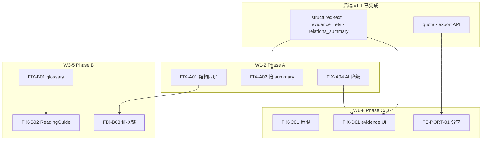

# 浮生 · 统一开发方案（后端 v1.1 + 产品修正 + 全插件工作流）

| 字段 | 内容 |
|------|------|
| **版本** | v1.0 |
| **日期** | 2026-07-12 |
| **合并来源** | [BACKEND-ONLY-PLAN v1.1](./BACKEND-ONLY-PLAN-2026-07-12.md) · [PRODUCT-CORRECTION-PLAN](./PRODUCT-CORRECTION-PLAN-2026-07-12.md) |
| **设计依据** | [`PRODUCT.md`](../../PRODUCT.md) · [`FUSHENG-SONG-DEVELOPMENT.md`](../guides/FUSHENG-SONG-DEVELOPMENT.md) · [`CURSOR-FRONTEND-EXTENSIONS.md`](../guides/CURSOR-FRONTEND-EXTENSIONS.md) |
| **状态** | 🟢 **主执行文档**（后端 Phase 2–3 已结项；**前端+体验修正为主战场**） |

---

## 〇、北极星与问题陈述

### 0.1 产品目标（一句话）

**做「能学会、能核对」的个人档案型命盘册**——不是 AI 算命 App，也不是纯计算器。

### 0.2 用户反馈四痛点（修正主线）

| 痛点 | 根因 | 统一编号 |
|------|------|----------|
| **显示不全** | 结构在 Trust 折叠区；`relations_summary` 后端有、前端未接；大运截断 | **UX-P0-1** |
| **过于 AI 化** | Report AI 面板权重高；Mock 模板；域模块长文无出处 | **UX-P0-2** |
| **看不懂** | L1–L4 / engine 标签；glossary API 未接 UI | **UX-P0-3** |
| **没有讲解** | 无 ReadingGuide；`evidence_chain` 不在主路径 | **UX-P0-4** |

### 0.3 技术基线（后端 v1.1 已就绪）

| 指标 | 数值 |
|------|------|
| Scorecard | 24/24 @ 10.0 |
| 典籍 verified | 20%（100/500） |
| 黄金盘 | GT50 · ZW20 · DV10 |
| 平台 API | quota · structured-text · evidence_refs · archive-bundle · DB 流年队列 |

**结论：** 引擎与 API **领先多数竞品**；下一阶段 **80% 工作量在 `frontend/` + 内容编排**，后端只做残余与契约同步。

---

## 一、竞品差距总表（合并视角）

| 维度 | 文墨 | 测测 | 灵机/天乙 | 浮生现状 | 本方案对策 |
|------|------|------|-----------|----------|------------|
| 盘面完整 | ✅ | 弱 | 中 | 有盘；关系神煞藏深 | FIX-A01/A02 |
| 运限切换 | ✅ | 日运 | 中 | Timeline 与 Report 分裂 | FIX-C01 |
| 术语讲解 | 深 | 课程 | ✅ | glossary 无 UI | FIX-B01 |
| AI 体验 | 无 | 主战场 | 弱 | **反客为主** | FIX-A04/D01 |
| 分享裂变 | 截图 | 金句卡 | 中 | API 有 UI 无 | FE-PORT-01 |
| 双轨/iztro | 弱 | 无 | 无 | ✅ 有；非主路径 | FIX-B03 + 脚注化 |
| 术数超市 | 弱 | 测试 | ✅ | Extension 深埋 | FIX-C03 |
| 原生 App | ✅ | ✅ | ✅ | Web only | Phase E |

---

## 二、统一阶段路线图（10 周）

```
W0      环境 + OpenAPI 同步 + seed 验证
W1–2    Phase A  结构优先 · 接 summary 字段 · AI 降级
W3–5    Phase B  glossary · ReadingGuide · 文案去 AI 化
W6–7    Phase C  运限统一 · 显示补全 · 分享/export UI
W8      Phase D  AI 证据链 UI · structured-text 按钮
W9–10   Phase R  后端残余（OpenAPI/ZW18）+ S6 竞品截图验收
```

### 2.1 任务主表（后端 ID + 产品 FIX + 前端 FE 合一）

| 周 | ID | 任务 | 层 | 状态 | 关键路径 |
|----|-----|------|-----|------|----------|
| W0 | **ENV-01** | OpenAPI export + `sync-frontend-types` | BE | ⏳ | `make export-openapi` |
| W0 | **ENV-02** | `seed_data.py` 验证 + 本地联调 | BE | ✅ | `scripts/seed_data.py` |
| W1 | **FIX-A01** | 结构优先：关系/神煞与盘面同屏 | FE | ⏳ | `NewBaziView.vue` |
| W1 | **FIX-A02** | 接 `relations_summary` / `shensha_summary` | FE | ⏳ | `api/bazi.ts` types |
| W1 | **FIX-A04** | Report AI 默认折叠 + Mock 标「示例稿」 | FE | ⏳ | `ReportView.vue` |
| W2 | **FIX-A03** | Report 默认连续阅读 | FE | ⏳ | `ReportView.vue` |
| W2 | **FIX-A05** | 域模块去生成腔（事实+推断标签） | FE | ⏳ | `buildBaziModuleCards.ts` |
| W2 | **FIX-B05** | 去 L1–L4；用户语言 layer 文案 | FE | ⏳ | 全站 i18n 文案表 |
| W3 | **FIX-B01** | TermHint + glossary API | FE | ⏳ | 新 `TermHint.vue` |
| W3 | **FIX-B02** | ReadingGuide 三步骤 | FE | ⏳ | 新 `ReadingGuide.vue` |
| W4 | **FIX-B03** | evidence_chain / classic_refs 主路径 | FE | ⏳ | `NewBaziView` + Report |
| W4 | **FIX-B04** | 紫微宫位讲解模式 | FE | ⏳ | `FushengZiweiView.vue` |
| W5 | **S2** | 八字母版 A 验收（宋式） | 三角色 | ⏳ | `FUSHENG-SONG-DEVELOPMENT` §3 |
| W6 | **FIX-C01** | 运限 target_date 统一 | FE | ⏳ | Timeline + Report |
| W6 | **FIX-C02** | 大运全量展示 | FE | ⏳ | `ReportView` dayunRows |
| W7 | **FIX-C03** | Extension 主入口 | FE | ⏳ | `NewHomeView` |
| W7 | **FE-PORT-01** | 分享 PNG + share-token UI | FE | ⏳ | 移植 `export.ts` |
| W8 | **FIX-D01** | `evidence_refs` 展示 | FE | ⏳ | `stores/ai.ts` |
| W8 | **FIX-D02** | 「复制结构化命盘」按钮 | FE | ⏳ | `/structured-text` |
| W8 | **FE-PORT-02** | AI 侧栏（追问助手） | FE | ⏳ | `AppRightPanel` 适配 |
| W9 | **BE-R01** | ZW18 iztro 黄金盘复核 | BE/Data | ⏳ | `verify_ziwei_iztro.mjs` |
| W9 | **BE-R02** | CLS source_page spotcheck 批次 | Data | ⏳ | `spotcheck-ctext.md` |
| W10 | **S6** | 竞品 before/after 截图入库 | 三角色 | ⏳ | Playwright |
| 可选 | **FIX-E*** | App/推送/童限 | 产品 |  backlog | Phase E |

### 2.2 后端 v1.1 已结项（不再排期，仅维护）

| 编号 | 产出 |
|------|------|
| BE-P2-01 | `liunian_report_service` DB 队列 |
| BE-P2-03 | `evidence_refs_json` |
| BE-P3-03 | `structured-text` |
| BE-P3-05 | `relations_summary` / `shensha_summary` |
| BE-P3-04 | `quota_service` |
| … | 见 [BACKEND-ONLY-PLAN §二](./BACKEND-ONLY-PLAN-2026-07-12.md) |

---

## 三、内容规范（抗 AI 化 · 全团队遵守）

### 3.1 段落四层标签（强制）

```text
【事实】…     ← pillars / geju，不可改写
【典籍】…     ← classic_refs，带书名
【推算】…     ← engine + relations_summary
【推断】…     ← heuristic，默认折叠，必须带标签
```

### 3.2 禁止

- 无出处大段「您性格外向…」  
- Mock LLM 与引擎结论同款样式  
- AI 填补 `missing_fields`  

### 3.3 AI 仅允许

- 用户点击「追问助手」  
- 展示 `evidence_refs` 可核对  
- 外置对话用 `structured-text` 导出  

---

## 四、22 个插件 · 全量映射（每个阶段怎么用）

> 来源：`.vscode/extensions.json` + [`FUSHENG-FRONTEND-HANDBOOK §5.2`](../guides/FUSHENG-FRONTEND-HANDBOOK.md)

### 4.1 一次性初始化（W0 · 全员）

| 步骤 | 操作 | 插件/工具 |
|------|------|-----------|
| 1 | Cursor 打开仓库根 `c2/` | — |
| 2 | 安装推荐扩展（22 个） | 弹窗 → Install All |
| 3 | `Developer: Reload Window` | — |
| 4 | `make dev-install` + `cd frontend && npm ci` | Ruff/pre-commit（CLI） |
| 5 | `npm run install:e2e`（首次） | Playwright |
| 6 | 验证 | `cursor --list-extensions \| Select-String "volar\|vitest\|eslint\|drawio"` |

### 4.2 扩展全表 + 角色 + 本方案用途

| # | 扩展 ID | 分类 | 美术 | 规划 | 工程 | 本方案典型用途 |
|---|---------|------|:----:|:----:|:----:|----------------|
| 1 | `Vue.volar` | 核心 | | | ✅ | FIX-A/B 改 `.vue`；模板类型检查 |
| 2 | `dbaeumer.vscode-eslint` | 核心 | | | ✅ | 保存自动 fix；`frontend:lint` 前消红 |
| 3 | `yzhang.markdown-all-in-one` | 文档 | | ✅ | ✅ | 编辑本文档；TOC 生成 |
| 4 | `bierner.markdown-mermaid` | 文档 | | ✅ | | §二 路线图 mermaid 预览 |
| 5 | `bpruitt-goddard.mermaid-markdown-syntax-highlighting` | 文档 | | ✅ | | 流程图语法高亮 |
| 6 | `hediet.vscode-drawio` | 线框 | ✅ | ✅ | | FIX-A 线框：`handbook-bazi-layout.drawio` |
| 7 | `DavidAnson.vscode-markdownlint` | 文档 | | ✅ | ✅ | plan/guides 保存时 lint |
| 8 | `naumovs.color-highlight` | 设计 | ✅ | | | 脚注/标签色预览 |
| 9 | `kamikillerto.vscode-colorize` | 设计 | ✅ | | ✅ | `variables.css` Token 调整 |
| 10 | `pranaygp.vscode-css-peek` | 设计 | | | ✅ | 组件样式跳转 |
| 11 | `phoenisx.cssvar` | 设计 | ✅ | | ✅ | `--brand-*` 补全 |
| 12 | `jock.svg` | 资产 | ✅ | | | logo/图标预览 |
| 13 | `ms-vscode.live-server` | 预览 | ✅ | ✅ | | `skin-preview.html` 静态验收 |
| 14 | `PKief.material-icon-theme` | 体验 | | | ✅ | 仓库导航 |
| 15 | `formulahendry.auto-rename-tag` | 效率 | | | ✅ | 改组件标签名 |
| 16 | `formulahendry.auto-close-tag` | 效率 | | | ✅ | 模板编写 |
| 17 | `oderwat.indent-rainbow` | 效率 | | | ✅ | 深嵌套模板可读 |
| 18 | `Gruntfuggly.todo-tree` | 协作 | ✅ | ✅ | ✅ | `FIX-*` / `TODO(fix)` 扫全库 |
| 19 | `ms-playwright.playwright` | 测试 | | | ✅ | S6 竞品截图；E2E 回归 |
| 20 | `vitest.explorer` | 测试 | | | ✅ | 组件单测；`TermHint.spec.ts` |
| 21 | `usernamehw.errorlens` | 体验 | | | ✅ | pytest/TS 行内错；后端改错 |
| 22 | `yoavbls.pretty-ts-errors` | 体验 | | | ✅ | 接 API 新字段类型报错可读 |

### 4.3 VS Code Tasks（`.vscode/tasks.json`）

| Task | 命令 | 用于阶段 |
|------|------|----------|
| `backend:dev` | `start-local.ps1 -Reload` | W0+ 联调；Playwright baseURL |
| `backend:lint` | `make lint` | BE-R* ；Ruff + pyright |
| `backend:format` | `make format` | 提交前 |
| `backend:test-fast` | `make test-fast` | Gate；Error Lens 配合修 |
| `frontend:dev` | `npm run dev` | FIX-A~D 目视 |
| `frontend:lint` | `npm run lint` | 每周五 Gate |
| `frontend:type-check` | `npm run type-check` | ENV-01 后必跑 |
| `frontend:test` | Vitest 全量 | S2/S4 组件完成 |
| `frontend:e2e` | Playwright | S6；连续阅读/TermHint |

### 4.4 Makefile 后端命令（工程 CLI · 无扩展但必用）

| 命令 | 用途 | 阶段 |
|------|------|------|
| `make export-openapi` | OpenAPI 漂移 | ENV-01 |
| `make sync-frontend-types` | `schema.d.ts` | ENV-01 |
| `make scorecard` | 24/24 回归 | 每周 |
| `make verify-classics-ctext` | 典籍 20% | BE-R02 前 |
| `make verify-iztro` | ZW18 诊断 | BE-R01 |
| `make verify-iztro-calibrate` | 校准写入 | BE-R01 |
| `make test` / `test-fast` | pytest | 后端改动 |
| `make quality-gate` | 全量门禁 | W10 |

### 4.5 按阶段 · 插件组合（「把所有插件都用上」）

| 阶段 | 美术 | 规划 | 工程 | 必跑 Tasks/Make |
|------|------|------|------|-----------------|
| **W0 环境** | colorize 看 Token | markdownlint 本文档 | Error Lens + Pretty TS；ESLint | `export-openapi` · `sync-frontend-types` · `seed_data` |
| **W1–2 Phase A** | Draw.io 结构同屏线框 | Mermaid 信息架构；Todo Tree 拆 FIX-A* | Volar 改 View；Vitest 新组件；CSS Peek | `frontend:dev` · `frontend:type-check` |
| **W3–5 Phase B** | Live Server 样稿 TermHint | Markdown 写 glossary 文案规范 | Vitest `TermHint`/`ReadingGuide`；cssvar | `frontend:test` · `frontend:lint` |
| **W6–7 Phase C** | color-highlight 运限色 | Todo Tree FE-PORT-01 | Playwright 分享卡 E2E；Volar Timeline | `frontend:e2e` · `backend:dev` |
| **W8 Phase D** | — | — | Vitest ai store；ESLint | `frontend:test` + `test_llm_*` |
| **W9 后端残余** | — | markdown 更新 spotcheck | Error Lens pytest；Ruff format | `verify-iztro` · `scorecard` |
| **W10 S6 验收** | Live Server 对照竞品截图 | markdown 写验收报告 | **Playwright** 全页截图；Todo Tree 清零 | `frontend:e2e` · `quality-gate` |

### 4.6 保存即触发（`.vscode/settings.json`）

| 文件类型 | 自动行为 | 相关扩展 |
|----------|----------|----------|
| `.vue` / `.ts` | ESLint fix | ESLint + Volar |
| `.md` | markdownlint | #7 |
| `.css` | 行内色预览 | colorize / cssvar |

---

## 五、分角色周计划（三角色 × 插件）

### 5.1 美术（每周 touch 插件：6, 8, 9, 11, 12, 13, 18）

| 周 | 交付 | 插件工作流 |
|----|------|------------|
| W1 | FIX-A 线框：盘+关系同屏 | Draw.io → 导出 PNG → Live Server 对照 `skin-preview.html` |
| W2 | Report 连续阅读静态样 | colorize 调整脚注表色；SVG 图标 |
| W5 | S2 八字母版 sign-off | color-highlight 校验【事实/典籍/推算/推断】四色 |
| W10 | S6 竞品对比板 | 截图拼板入 `docs/design/audit-screenshots/` |

### 5.2 界面规划（每周：3, 4, 5, 6, 7, 18）

| 周 | 交付 | 插件工作流 |
|----|------|------------|
| W1 | FIX-A 模块优先级 | Mermaid 用户旅程；Markdown TOC |
| W3 | glossary Top30 清单 | markdownlint 术语表 |
| W5 | ReadingGuide 文案 | Draw.io 三步骤 |
| W10 | 验收勾选清单 | Markdown All in One 表格 |

### 5.3 前端工程（每周：1, 2, 10, 19, 20, 21, 22 + Tasks）

| 周 | 交付 | 插件工作流 |
|----|------|------------|
| W1–2 | FIX-A* | Volar + ESLint + Vitest；Error Lens 清 TS |
| W3–4 | FIX-B* | 新组件 + spec；CSS Peek 样式 |
| W6–7 | FIX-C* + FE-PORT-01 | Playwright E2E；`test_share_card` 对齐 |
| W8 | FIX-D* + FE-PORT-02 | type-check API 新字段 |
| W10 | 全 Gate | `quality-gate-frontend` |

### 5.4 后端工程（W0/W9 集中 · CLI 为主）

| 周 | 交付 | 工具 |
|----|------|------|
| W0 | ENV-01 OpenAPI | `make sync-frontend-types` |
| W9 | BE-R01 ZW18 | `make verify-iztro-calibrate --case ZW18` |
| 持续 | 契约不破 | `make test-fast` · Error Lens |

---

## 六、Cursor Agent 对话模板（按周复制）

### W1 Phase A

```
@docs/plan/FUSHENG-UNIFIED-DEV-PLAN-2026-07-12.md
@docs/design/FUSHENG-ART-STYLE.md
@frontend/src/views/new/NewBaziView.vue
@frontend/src/utils/buildBaziModuleCards.ts

执行 FIX-A01/A02：结构优先，接 relations_summary/shensha_summary。
禁止 L1-L4 外露；AI 面板不在此页加重。
完成后：Tasks frontend:type-check + frontend:test（Vitest 插件）
对照 docs/design/skin-preview.html（Live Server）
```

### W3 Phase B

```
@docs/plan/FUSHENG-UNIFIED-DEV-PLAN-2026-07-12.md §三
@frontend/src/api/schema.d.ts （glossary 类型）

新增 TermHint.vue + ReadingGuide.vue；接 GET /api/v1/glossary。
段落强制【事实/典籍/推算/推断】标签。
Todo Tree 标记 TODO 清完；markdownlint 通过。
```

### W7 分享 + Extension

```
@docs/plan/FUSHENG-UNIFIED-DEV-PLAN-2026-07-12.md
@routers/export.py
@frontend/src/views/ReportView.vue

FE-PORT-01：分享 PNG + share-token；FIX-C03 Extension 主入口。
Playwright 新增 e2e/share-card.spec.ts；backend:dev 联调。
```

### W10 联合验收

```
@docs/guides/FUSHENG-SONG-DEVELOPMENT.md 第五篇
@docs/plan/FUSHENG-UNIFIED-DEV-PLAN-2026-07-12.md §七

顺序：make quality-gate → frontend:e2e → Playwright 截图竞品对比。
勾选 §七 验收清单；Todo Tree FIX-* 归零。
```

---

## 七、验收 Gate（每周五 · 插件辅助）

| Gate | 命令 | 通过标准 | 失败时用插件 |
|------|------|----------|--------------|
| G0 契约 | `make sync-frontend-types` && `git diff --exit-code docs/openapi.json` | 无漂移 | Pretty TS Errors |
| G1 后端 | `make scorecard` | 24/24 | Error Lens 看 pytest |
| G2 后端快测 | `make test-fast` | 全绿 | Error Lens |
| G3 前端类型 | `Tasks: frontend:type-check` | 0 error | Pretty TS Errors |
| G4 前端单测 | `Tasks: frontend:test` | 全绿 | Vitest Explorer |
| G5 前端 E2E | `Tasks: frontend:e2e` | 关键路径绿 | Playwright Trace |
| G6 产品 | Playwright 截图 | `audit-screenshots/` 更新 | Playwright |
| G7 体验 | 人工 | 首屏 ≥8 结构字段；AI 不占首屏 | Live Server 对照 |

### 7.1 产品体验 KPI（修正成功标准）

| KPI | 目标 |
|-----|------|
| 首屏结构字段 | ≥8 |
| 带标签段落占比 | ≥70% |
| glossary 术语覆盖 | Top 30 |
| AI 面板首屏占用 | 0（默认折叠） |
| 用户定性 | 「命盘册」>「AI算命」 |

---

## 八、页面改造速查（FIX 对照文件）

| 页面 | 文件 | Phase | 插件验收 |
|------|------|-------|----------|
| 八字 | `NewBaziView.vue` | A,B | Vitest `bazi-layer-*` testid |
| 紫微 | `FushengZiweiView.vue` | B,C | Playwright ziwei |
| 报告 | `ReportView.vue` | A,C,D | E2E report-print |
| 域模块 | `buildBaziModuleCards.ts` | A | Vitest 单元 |
| AI | `stores/ai.ts` | D | Vitest mock 标「示例稿」 |
| 术语 | 新 `TermHint.vue` | B | Vitest + glossary API |
| 分享 | 新/移植 `export.ts` | C | Playwright PNG |

---

## 九、依赖关系图



---

## 十、文档索引与修订

| 文档 | 关系 |
|------|------|
| [BACKEND-ONLY-PLAN v1.1](./BACKEND-ONLY-PLAN-2026-07-12.md) | 后端结项详情；残余 BE-R* |
| [PRODUCT-CORRECTION-PLAN](./PRODUCT-CORRECTION-PLAN-2026-07-12.md) | UX 诊断原文 |
| [FUSHENG-SONG-DEVELOPMENT](../guides/FUSHENG-SONG-DEVELOPMENT.md) | 宋式美术/母版 |
| [CURSOR-FRONTEND-EXTENSIONS](../guides/CURSOR-FRONTEND-EXTENSIONS.md) | 插件详解 |
| [CURSOR-BAZI-ZIWEI-PLAYBOOK](../guides/CURSOR-BAZI-ZIWEI-PLAYBOOK.md) | 分场景对话 |

| 版本 | 日期 | 说明 |
|------|------|------|
| v1.0 | 2026-07-12 | 合并后端 v1.1 + 产品修正 + 22 插件全映射 + 10 周排期 |
