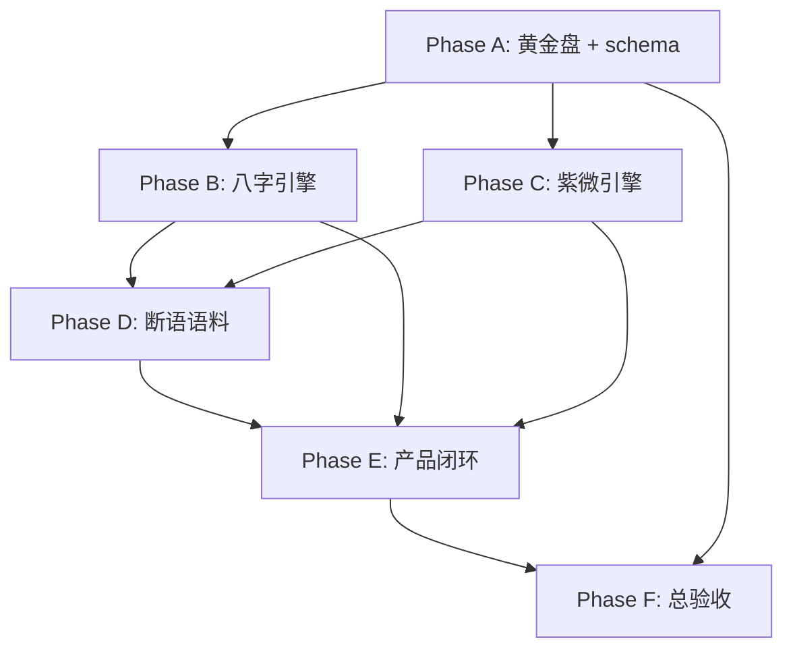

# 浮生命理 · 全项 9.5 目标计划

| 字段 | 内容 |
|------|------|
| **版本** | v1.0 |
| **制定日期** | 2026-07-11 |
| **计划周期** | 2026-07-14 → 2026-11-28（20 周） |
| **基线评审** | 命理师严厉评分（2026-07-11） |
| **北极星目标** | **24 个评分项全部 ≥ 9.5 / 10** |
| **关联** | [整改总纲](./MASTER-9.5-REMEDIATION-PLAN.md) · [八字 Gap](../design/bazi/bazi-gap-audit.md) · [紫微 Gap](../design/ziwei/ziwei-gap-audit.md) · [PRODUCT.md](../../PRODUCT.md) |

---

## 一、愿景与产品定位

### 1.1 愿景陈述

**浮生** 要成为「**可验证、可溯源、可执业参考**」的八字与紫微分析产品——不是花哨玄学 UI，而是：

> 盘面稳定可用 · 典籍可对照 · 引擎可回归 · 缺失必明示

与 [PRODUCT.md](../../PRODUCT.md) 设计原则一致：**先骨架清晰，再解释延伸；缺失字段显式呈现，不静默隐藏。**

### 1.2 本计划要解决的问题

| 现状痛点 | 目标状态 |
|----------|----------|
| 八字引擎强、流年/断语弱 | 大运流年与格局用神联动，断语有典籍句 |
| 紫微安星成熟、格局/黄金盘薄弱 | 8 盘黄金回归 + top-20 格局全书口径 |
| 后端算得多、前端看得少 | Fusheng 主路径展示核心字段 ≥85% |
| 启发式分数像「真断语」 | 全 API `layer` 分层，Report 主文案仅典籍层 |
| 古籍标签与引擎 86% 对齐 | ≥95% 对齐或双轨透明 |

### 1.3 范围界定

**In Scope（本计划内）**

- `services/bazi_engine/`、`services/ziwei_engine/` 全模块
- `data/ground_truth_cases.json`、`data/ziwei_ground_truth.json`、`data/classics.json`
- Fusheng 主路径 + Report 打印链路
- CI 回归、审计脚本、`docs/design/*` 同步

**Out of Scope（本计划外）**

- LLM 生成断语的主路径替代
- 风水/择日/姓名学新模块
- 移动端独立 App
- 用户社区、付费体系

---

## 二、基线与目标仪表盘

### 2.1 综合得分（2026-07-11 基线）

| 板块 | 基线 | 目标 | 缺口 |
|------|------|------|------|
| 八字（10 项均分） | 7.2 | **9.5** | −2.3 |
| 紫微（10 项均分） | 6.4 | **9.5** | −3.1 |
| 交叉（4 项均分） | 6.5 | **9.5** | −3.0 |
| **全项目加权** | **6.8** | **9.5** | **−2.7** |

### 2.2 二十四项评分明细

#### 八字

| ID | 项目 | 基线 | 目标 | 阶段 | 优先级 |
|----|------|------|------|------|--------|
| B-01 | 四柱排盘与历法边界 | 8.0 | 9.5 | B | P1 |
| B-02 | 五行旺衰 / 日主强弱 | 7.5 | 9.5 | B | P1 |
| B-03 | 格局判定 | 7.8 | 9.5 | B | **P0** |
| B-04 | 用神喜忌 | 7.6 | 9.5 | B | P1 |
| B-05 | 大运流年 | 6.5 | 9.5 | B | **P0** |
| B-06 | 合冲刑害 / 神煞 | 7.0 | 9.5 | B | P2 |
| B-07 | 古籍语料 | 7.8 | 9.5 | D | P1 |
| B-08 | 黄金用例 | 8.2 | 9.5 | B | P1 |
| B-09 | 分析断语层 | 5.5 | 9.5 | D | **P0** |
| B-10 | 八字产品呈现 | 6.8 | 9.5 | E | P1 |

#### 紫微

| ID | 项目 | 基线 | 目标 | 阶段 | 优先级 |
|----|------|------|------|------|--------|
| Z-01 | 安星诀 | 8.3 | 9.5 | A/C | P1 |
| Z-02 | 宫位 / 命宫身宫 / 五行局 | 8.5 | 9.5 | E | P2 |
| Z-03 | 四化体系 | 8.0 | 9.5 | E | P1 |
| Z-04 | 大限流年流月流日 | 7.5 | 9.5 | C/E | **P0** |
| Z-05 | 格局判定 | 5.8 | 9.5 | C | **P0** |
| Z-06 | 飞星 / 叠宫 | 6.0 | 9.5 | C | P1 |
| Z-07 | 断语与分析层 | 4.8 | 9.5 | D | **P0** |
| Z-08 | 黄金用例 | 4.5 | 9.5 | A | **P0** |
| Z-09 | 流派参数 / 真太阳时 | 7.2 | 9.5 | E | P1 |
| Z-10 | 紫微产品呈现 | 5.0 | 9.5 | E | **P0** |

#### 交叉

| ID | 项目 | 基线 | 目标 | 阶段 |
|----|------|------|------|------|
| X-01 | 八字 × 紫微体系统合 | 6.5 | 9.5 | F |
| X-02 | 可信度分层标注 | 5.0 | 9.5 | A |
| X-03 | 执业就绪度（声明/漂移清单） | 6.8 | 9.5 | F |
| X-04 | 学术严谨度（自动审计） | 7.5 | 9.5 | A/F |

---

## 三、成功指标（KPI）

### 3.1 硬性 KPI（Phase F 必须全部达成）

| 编号 | KPI | 基线 | 目标 |
|------|-----|------|------|
| K1 | 24 项评分（`audit_scorecard.py`） | 6.8 均分 | **每项 ≥9.5** |
| K2 | 八字黄金用例 CI | 36 PASS | **≥48 PASS**（+ZIP17–22 等） |
| K3 | 紫微黄金用例 CI | 1 盘 | **≥8 盘 ZW01–08** |
| K4 | `recorded_geju` 与 `engine_geju` 一致率 | 86% | **≥95%**（或 100% 双轨标注） |
| K5 | API 响应含 `confidence` + `layer` | 部分 | **100%** 八字/紫微 full |
| K6 | Fusheng 核心字段展示率 | ~15%（紫微） | **≥85%** |
| K7 | 典籍断语覆盖率（八正格+top20紫微格） | <30% | **100%** 有典籍句或标注缺失 |
| K8 | CI 核心引擎测试 | ~471 PASS | **≥600 PASS**，0 regressions |

### 3.2 过程 KPI（每阶段 Gate）

| Gate | 条件 |
|------|------|
| **G-A** | ZW01–04 入库 + X-02 schema 落地 + scorecard v0 可运行 |
| **G-B** | B-03/B-05/B-08 三项 ≥9.0；ZIP17–20 入库 |
| **G-C** | Z-05/Z-08 ≥9.0；patterns top-10 重写完成 |
| **G-D** | B-09/Z-07 ≥9.0；`layer: heuristic` 前端默认折叠 |
| **G-E** | B-10/Z-10 ≥9.0；Report PDF 截图 QA 通过 |
| **G-F** | 24/24 项 ≥9.5；`PRODUCT.md` 执业声明发布 |

---

## 四、统一验收标准（9.5 分定义）

每一项达标须 **五条齐备**（详见 [MASTER-9.5 §0](./MASTER-9.5-REMEDIATION-PLAN.md#0-95-分的统一验收标准)）：

1. **典籍对齐** — 指定典籍口径一致，或 `recorded_*` / `engine_*` 双轨 + UI 说明  
2. **黄金回归** — ≥3 条独立用例，CI 100% PASS  
3. **边界覆盖** — 子时 / 闰月 / 真太阳时 / 流派 ≥1 边界用例  
4. **可信度标注** — `confidence` + `method_registry_id`；启发式 `layer: heuristic`  
5. **产品可见** — Fusheng 或 Report 展示该项核心输出  

---

## 五、阶段总览（20 周）

```
2026-07-14 ────────────────────────────────────────────── 2026-11-28
│ Phase A │ Phase B      │ Phase C       │ Phase D    │ Phase E   │F│
│ 地基    │ 八字引擎     │ 紫微引擎      │ 断语语料   │ 产品闭环  │验│
│ W1–W3   │ W4–W8        │ W9–W13        │ W14–W16    │ W17–W19   │W20│
```

| 阶段 | 周次 | 主题 | 负责重心 | 出口 Gate |
|------|------|------|----------|-----------|
| **A** | 1–3 | 地基与度量 | 黄金盘、schema、审计 | G-A |
| **B** | 4–8 | 八字引擎深化 | geju/yongshen/dayun/relations | G-B |
| **C** | 9–13 | 紫微引擎深化 | patterns/叠宫/黄金盘满编 | G-C |
| **D** | 14–16 | 断语与语料 | narrative、语料软链、autogen | G-D |
| **E** | 17–19 | 产品闭环 | Fusheng + Report + Profile | G-E |
| **F** | 20 | 总验收 | 24 项复检、文档、发布说明 | G-F |

**总工时**：约 **145 人日**（1 人 × 7 月 / 2 人 × 3.5 月 / 3 人 × 2.5 月）

---

## 六、周计划（Week-by-Week）

### Phase A — 地基（W1–W3）

| 周 | 目标 | 关键交付 | 拉升项 |
|----|------|----------|--------|
| **W1** | 度量体系落地 | `scripts/audit_scorecard.py` v0；API `layer`/`confidence` schema 草案；删 `stars_aux` debug | X-02, X-04, Z-01 |
| **W2** | 紫微黄金盘 1–4 | `data/ziwei_ground_truth.json` ZW01–ZW04；`test_ziwei_golden_regression.py` 骨架 | Z-08 → 7.0 |
| **W3** | 紫微黄金盘 5–8 + 八字边界 | ZW05–ZW08（闰月/晚子/庚干）；`test_solar_zi_boundary.py` 草案；ZIP autogen 门槛收紧 | Z-08 → 8.5, B-01 → 8.5 |

### Phase B — 八字引擎（W4–W8）

| 周 | 目标 | 关键交付 | 拉升项 |
|----|------|----------|--------|
| **W4** | 外格结构（火/水） | `_check_yanshang` `_check_runxia`；ZIP17–ZIP18 pillar 用例 | B-03 → 8.5 |
| **W5** | 外格结构（土/金）+ 从格 | `_check_jiaxu` `_check_congge`；三合/结构从格回归 | B-03 → 9.0 |
| **W6** | 格局命名层 + 破格救应 | 伤官佩印等 4 格；`check_po_geju` 救应 +8 tests | B-03 → 9.5, B-06 → 8.5 |
| **W7** | 强弱 + 用神 | 人元司令；真假从；`primary`/`secondary` yongshen | B-02 → 9.0, B-04 → 9.0 |
| **W8** | 大运流年 | `yongshen_shift` `geju_impact`；liuri 三层 flow；ZIP19–ZIP22 | B-05 → 9.0, B-08 → 9.5 |

**W8 Gate G-B**：B-03/B-05/B-08 ≥9.0

### Phase C — 紫微引擎（W9–W13）

| 周 | 目标 | 关键交付 | 拉升项 |
|----|------|----------|--------|
| **W9** | patterns top-10 重写 | ZRULE_001–010 庙旺+煞星+宫位；误报率基线测试 | Z-05 → 7.5 |
| **W10** | patterns top-20 + 新格 | 火贪/铃贪/杀破狼 ZRULE_043–050 | Z-05 → 8.5 |
| **W11** | 叠宫引擎 | `overlay_palace_map`；`forecast` 叠宫驱动 | Z-06 → 8.5, Z-04 → 8.5 |
| **W12** | 起运精度 + 流月深度 | `start_age_exact`；斗君 3 例对照 | Z-04 → 9.0 |
| **W13** | 安星满测 + 空宫借星 | 8 盘 × 辅煞坐标全测；借星逻辑 | Z-01 → 9.5, Z-02 → 9.0 |

**W13 Gate G-C**：Z-05/Z-08 ≥9.0

### Phase D — 断语与语料（W14–W16）

| 周 | 目标 | 关键交付 | 拉升项 |
|----|------|----------|--------|
| **W14** | 八字典籍 narrative | `classical_narrative.py`；八正格+从化外格句式 | B-09 → 8.0 |
| **W15** | 紫微典籍 narrative | `analysis.py` 组合表；forecast tier 化；compat 标注 | Z-07 → 8.0 |
| **W16** | 语料软链 + ctext | `geju_candidates` 提示；ctext CI optional；ZIP11–16 人工再审 | B-07 → 9.5, B-09 → 9.5, Z-07 → 9.5 |

**W16 Gate G-D**：B-09/Z-07 ≥9.0

### Phase E — 产品闭环（W17–W19）

| 周 | 目标 | 关键交付 | 拉升项 |
|----|------|----------|--------|
| **W17** | 八字 UI | Report 典籍链；用神双层；边界 warning 条 | B-10 → 9.0, B-01 → 9.5 |
| **W18** | 紫微 UI | 四化色+图例；身宫徽标；`/new/ziwei/timeline` 子路由 | Z-03 → 9.5, Z-10 → 8.5 |
| **W19** | 集成与设置 | AlgoSettings 入 Profile；solarTime↔longitude 统一；Report PDF QA | Z-09 → 9.5, Z-10 → 9.5, B-10 → 9.5 |

**W19 Gate G-E**：B-10/Z-10 ≥9.0

### Phase F — 总验收（W20）

| 任务 | 交付 |
|------|------|
| 全量回归 | `pytest` 核心套件 ≥600；Playwright 截图 QA |
| 24 项复检 | `audit_scorecard.py` 输出 ≥9.5 × 24 |
| 文档 | 更新 gap-audit v2；`PRODUCT.md` 执业声明；发布说明 |
| 双验档案 | `dual_verify_cases.json` 3 人八字+紫微对照 |

---

## 七、Sprint  backlog（12 × 2 周）

与周计划对齐，便于敏捷跟踪：

| Sprint | 周期 | 主题 | 用户故事（摘要） |
|--------|------|------|------------------|
| S1 | W1–W2 | 可度量 | 作为开发者，我能看到 24 项实时评分 |
| S2 | W3–W4 | 黄金+外格 | 作为命理师，我能用 8 盘紫微+炎上/润下用例回归 |
| S3 | W5–W6 | 格局完备 | 作为用户，我看到的格局与《子平/滴天》可对照 |
| S4 | W7–W8 | 运势深度 | 作为用户，我能看到大运对用神/格局的影响 |
| S5 | W9–W10 | 紫微格局 | 作为命理师，top-20 格局误报 <5% |
| S6 | W11–W12 | 叠宫运限 | 作为用户，流年叠宫有明确入宫关系 |
| S7 | W13 | 安星封板 | 作为 CI，8 盘主星+辅煞坐标全锁定 |
| S8 | W14–W15 | 典籍断语 | 作为用户，Report 主文案来自典籍层 |
| S9 | W16 | 语料质量 | 作为研究者，子平章节可精确检索 |
| S10 | W17–W18 | 盘面 UI | 作为用户，Fusheng 展示四化/身宫/典籍出处 |
| S11 | W19 | 设置统一 | 作为用户，八字紫微共用真太阳时与流派设置 |
| S12 | W20 | 发布验收 | 作为产品负责人，24 项 ≥9.5 有审计报告 |

---

## 八、依赖关系



**硬依赖说明**

| 前置 | 后置 | 原因 |
|------|------|------|
| ZW01–08 | Z-05 patterns 收紧 | 无多盘无法测误报率 |
| B-03 外格结构 | B-08 ZIP17–22 | 用例依赖规则存在 |
| `layer` schema (A) | D 断语层、E UI | 前端需先消费字段 |
| Z 叠宫 (C) | Z-07 forecast 改写 | 叠宫是断语输入 |
| B/Z narrative (D) | E Report 典籍链 | UI 展示依赖文案源 |

---

## 九、资源与角色

### 9.1 推荐配置

| 角色 | 人数 | 职责 |
|------|------|------|
| **引擎开发** | 1–2 | geju/patterns/dayun/叠宫 |
| **前端** | 1 | Fusheng、Report、Profile 设置 |
| **命理顾问** | 0.5（兼职） | 黄金盘核验、ZIP/ZW 用例、top-20 格局 |
| **QA** | 0.5 | 边界用例、截图 QA、发布验收 |

### 9.2 关键文件清单

| 类型 | 路径 |
|------|------|
| 八字引擎 | `services/bazi_engine/*.py` |
| 紫微引擎 | `services/ziwei_engine/*.py` |
| 黄金用例 | `data/ground_truth_cases.json`, `data/ziwei_ground_truth.json` |
| 语料 | `data/classics.json`, `scripts/import_github_classics.py` |
| 测试 | `tests/test_golden_regression.py`, `tests/test_ziwei_golden_regression.py`（待建） |
| 审计 | `scripts/audit_scorecard.py`（待建） |
| 前端 | `frontend/src/views/new/Fusheng*.vue`, `fushengReport.ts` |
| 方法注册 | `docs/design/bazi/ENGINE-METHOD-REGISTRY.md`, `docs/design/ziwei/ENGINE-METHOD-REGISTRY.md` |

---

## 十、风险登记册

| ID | 风险 | 概率 | 影响 | 缓解措施 |
|----|------|------|------|----------|
| R1 | 9.5 标准过高导致工期翻倍 | 中 | 高 | 分阶段 Gate；允许「双轨标注」达 9.5 |
| R2 | 紫微 8 盘人工核验不足 | 高 | 高 | 命理顾问 sign-off；可选 iztro diff |
| R3 | patterns 收紧引发大量回归失败 | 中 | 中 | 先 top-10；误报率指标；渐进发布 |
| R4 | 外格结构规则与 ZIP 基线冲突 | 中 | 高 | 先加用例再改阈值；feature flag |
| R5 | 前端工时低估 | 中 | 中 | S10 专 Sprint；可降级 timeline 为 v1.1 |
| R6 | ctext API 不可用 | 低 | 低 | 殆知阁 fallback 已存在；B-07 仍可 9.5 |
| R7 | 流派分歧无法「一统」 | 高 | 中 | 用户可配置 + 文档化；计入 9.5 验收 |

---

## 十一、交付物总清单

### 11.1 代码交付

- [ ] `zi_day_rule` 三派可切换（B-01）
- [ ] 人元司令 + weight_profile（B-02）
- [ ] 炎上/润下/稼穑/从革结构规则（B-03）
- [ ] 四柱复合格局命名 + 破格救应（B-03/B-06）
- [ ] 真假从 + 用神 primary/secondary（B-04）
- [ ] 大运 `geju_impact` / 流年 `yongshen_shift`（B-05）
- [ ] 天干合化 + 三会 + 神煞破格联动（B-06）
- [ ] `classical_narrative.py`（B-09）
- [ ] ZIP17–ZIP22 + GT 标签统一（B-08）
- [ ] ZW01–ZW08 + `test_ziwei_golden_regression.py`（Z-08）
- [ ] patterns top-20 重写 + ZRULE_043–050（Z-05）
- [ ] `overlay_palace_map` + forecast 叠宫化（Z-04/Z-06）
- [ ] 紫微 `analysis` 组合表 + forecast tier（Z-07）
- [ ] API 全响应 `confidence`/`layer`/`method_registry_id`（X-02）
- [ ] `scripts/audit_scorecard.py`（X-04）
- [ ] Fusheng 四化/时间轴/典籍链/设置面板（B-10/Z-10/Z-03/Z-09）

### 11.2 数据交付

- [ ] `data/ziwei_ground_truth.json`（8 盘）
- [ ] `data/dual_verify_cases.json`（3 人双验）
- [ ] `ground_truth_cases.json` 扩充至 ≥48 例
- [ ] `classics.json` ctext 精确章节（可选 ≥80）

### 11.3 文档交付

- [ ] `bazi-gap-audit.md` v2.0
- [ ] `ziwei-gap-audit.md` v3.0
- [ ] `PRODUCT.md` 执业声明与漂移清单（X-03）
- [ ] `docs/reports/SCORECARD-2026-11-28.md`（F 阶段审计报告）
- [ ] 修复 `docs/design/ziwei/00-项目总览.md` 错贴内容

---

## 十二、治理与评审节奏

| 节奏 | 内容 | 参与者 |
|------|------|--------|
| **每日** | CI 绿灯；scorecard 局部项更新 | 引擎开发 |
| **每周五** | 周计划复盘；Gate 预检 | 全员 |
| **每 Phase 末** | Gate 评审；未达标项不入下 Phase | 产品 + 命理顾问 |
| **W20** | 发布评审；24 项签字确认 | 产品负责人 |

---

## 十三、口径争议处置原则

以下不计为「未达标」，但必须在产品与文档中 **显式双轨**：

| 争议点 | 9.5 达标方式 |
|--------|--------------|
| ZIP09 从杀 vs 七杀 | `recorded_geju` + `engine_geju` + Report 说明 |
| GT03/05/07/08 正偏财 | 统一标签 **或** `legacy_ref_stem` 模式 |
| 早子时换日三派 | `zi_day_rule` 用户可选 + 各派用例 |
| 庚辛壬癸四化 | Profile 选派 + registry 文档 |
| 紫微余格（top-20 外） | `pattern_status: partial` 标注 |

---

## 十四、立即行动（Sprint S1，W1）

| # | 任务 | 负责人 | 完成定义 |
|---|------|--------|----------|
| 1 | 创建 `scripts/audit_scorecard.py` | 引擎 | 输出 24 项基线分 JSON |
| 2 | 定义 `layer`/`confidence` OpenAPI 字段 | 引擎 | schema PR + 1 endpoint 样例 |
| 3 | 创建 `data/ziwei_ground_truth.json` 骨架 | 引擎 | ZW01 字段结构 + 1 盘 |
| 4 | 删 `stars_aux.py` debug | 引擎 | PR merged |
| 5 | ZIP autogen：`comment` 须含从/化/斯真 | 引擎 | import 脚本 + test |
| 6 | 本计划入 `docs/plan/README.md` 索引 | 文档 | 链接可点 |

---

## 十五、文档索引

| 文档 | 用途 |
|------|------|
| **本文** | 完整目标计划（愿景/KPI/周计划/Sprint/风险） |
| [MASTER-9.5-REMEDIATION-PLAN.md](./MASTER-9.5-REMEDIATION-PLAN.md) | 24 项技术整改清单与工时 |
| [ENGINE-CORE-FIX-PLAN-2026-07-11.md](./ENGINE-CORE-FIX-PLAN-2026-07-11.md) | 已完成引擎修复（Phase 0–4） |
| [ENGINE-CORE-PROGRESS-2026-07-11.md](../reports/ENGINE-CORE-PROGRESS-2026-07-11.md) | 当前进度快照 |

---

**计划批准栏**（待填）

| 角色 | 姓名 | 日期 | 签字 |
|------|------|------|------|
| 产品负责人 | | | |
| 引擎负责人 | | | |
| 命理顾问 | | | |
