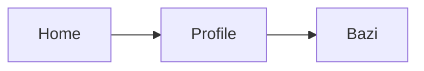

# Cursor 前端扩展使用说明

> **已并入 [`FUSHENG-DEV-HANDBOOK.md`](../FUSHENG-DEV-HANDBOOK.md) §三–§四。** 下文保留逐扩展操作说明作备查。

| 字段 | 内容 |
|------|------|
| **适用** | 浮生 c2 仓库 · 前端 / 设计 / 规划 |
| **更新** | 2026-07-12 |
| **配置** | `.vscode/extensions.json` · `.vscode/settings.json` |

> 安装后若功能未生效：`Ctrl+Shift+P` → **Developer: Reload Window**

---

## 零、如何让扩展「自动」生效（先看这里）

扩展**不会自己跑命令**，但仓库已写好配置，你只需做一次初始化，之后大部分能力会在**打开文件 / 保存 / 编辑对应目录**时自动触发。

### 0.1 一次性初始化（约 2 分钟）

| 步骤 | 操作 | 说明 |
|------|------|------|
| 1 | 用 Cursor **打开仓库根目录** `c2/`（不要只开 `frontend/` 子文件夹） | Vitest、Tasks、ESLint 都指向 monorepo 根 |
| 2 | 若提示 **Trust Workspace / 信任工作区** → 选 **Trust** | 不信任时扩展可能被禁用 |
| 3 | 右下角或扩展面板弹 **「此工作区有推荐扩展」** → **Install All / 全部安装** | 列表来自 `.vscode/extensions.json` |
| 4 | `Ctrl+Shift+P` → **Developer: Reload Window** | 让 settings 与扩展加载 |
| 5 | `cd frontend && npm ci` | Vitest / ESLint / Playwright 依赖 Node 包 |
| 6 | （可选）Cursor **Settings** → 搜 `extensions.autoUpdate` → 开启 | 扩展自动更新 |

### 0.2 已写入仓库、保存即生效的行为

配置文件：`.vscode/settings.json` · `.vscode/tasks.json` · `.vscode/launch.json` · `.cursor/rules/02-frontend-tooling.mdc`

| 触发时机 | 自动发生什么 | 依赖扩展 |
|----------|--------------|----------|
| 打开 `.vue` / `.ts` | Volar 高亮、跳转、类型提示 | Vue - Official |
| **保存** Vue/TS | ESLint 自动 fix + 格式化 | ESLint + Volar |
| **保存** Markdown | markdownlint 检查 | markdownlint |
| **保存** Python | Ruff format + fix | Ruff（后端，已有） |
| 编辑 `variables.css` / `.vue` 里的颜色 | 行内色块预览 | colorize + Color Highlight |
| 输入 `var(--fs-` | CSS 变量补全 | CSS Var Complete |
| 侧边栏 | Material 文件图标、Todo Tree 扫 TODO/DESIGN/UX | 对应扩展 |
| 打开 `frontend/**/*.spec.ts` | Vitest 侧边栏出现测试树，可点 Run | Vitest |
| 编辑 `docs/design/mockups/*.drawio` | 默认识别为 Draw.io 图 | Draw.io Integration |
| **任意对话**（已设 `alwaysApply: true`） | **Cursor Agent** 默认读取规则，按 Trust/组件/测试约定回答与改代码 | `.cursor/rules/02-frontend-tooling.mdc` |

### 0.3 仍需你点一下的操作（扩展无法全自动）

| 你想做 | 操作 |
|--------|------|
| 预览静态 HTML 线框 | 右键 HTML → **Open with Live Server** |
| 编辑 Draw.io | 右键 `.drawio` → **Open With → Draw.io Integration** |
| 跑 E2E | `Ctrl+Shift+P` → **Tasks: Run Task** → `frontend:e2e`，或终端 `npm run test:e2e` |
| 调试单个 Vitest | 打开 spec 文件 → **Run and Debug** → `Vitest: 当前文件` |
| 调试 Playwright | **Run and Debug** → `Playwright: 当前 E2E 文件` |

### 0.4 让 Cursor **Agent** 自动按工具链干活

1. 规则文件 `.cursor/rules/02-frontend-tooling.mdc` 已设为 **`alwaysApply: true`**：每次对话 Agent 都会默认遵循 Trust 组件、测试、Token 等约定。  
2. **功能对照表**：见 [`CURSOR-AGENT-USAGE.md`](./CURSOR-AGENT-USAGE.md) — 做什么功能该 @ 哪份方案、怎么说、怎么验收。  
3. **八字/紫微专项**：见 [`CURSOR-BAZI-ZIWEI-PLAYBOOK.md`](./CURSOR-BAZI-ZIWEI-PLAYBOOK.md) — 后端 + 前端设计分场景对话与插件用法。  
4. 在对话里可直接说：**「按 v3 方案改 XXX」** 或 **「改完跑 frontend:test」**。  
5. Agent 不能替你「打开 Live Server」或「点 Draw.io 画布」，但可以改 drawio 源文件、跑 `npm run test`、更新文档。

### 0.5 验证是否配置成功

```powershell
# 1. 扩展是否齐（应看到 Vue.volar、vitest.explorer 等）
cursor --list-extensions | Select-String "volar|vitest|eslint|drawio"

# 2. 打开 frontend/src/components/fusheng/AnalysisPanel.vue，故意多一个空格后 Ctrl+S → 应自动格式化

# 3. 侧边栏 Vitest 图标 → 应列出 frontend 下 spec

# 4. Ctrl+Shift+P → Tasks: Run Task → 应有 frontend:dev / frontend:test / frontend:lint
```

---

## 一、扩展总览

### 1.1 本次为前端/design 安装的扩展（21 个）

| 分类 | 扩展 ID | 中文名 |
|------|---------|--------|
| 前端核心 | `Vue.volar` | Vue - Official |
| 前端核心 | `dbaeumer.vscode-eslint` | ESLint |
| 规划 | `yzhang.markdown-all-in-one` | Markdown All in One |
| 规划 | `bierner.markdown-mermaid` | Markdown Preview Mermaid |
| 规划 | `bpruitt-goddard.mermaid-markdown-syntax-highlighting` | Mermaid 语法高亮 |
| 规划 | `hediet.vscode-drawio` | Draw.io Integration |
| 规划 | `DavidAnson.vscode-markdownlint` | markdownlint |
| 规划 | `Gruntfuggly.todo-tree` | Todo Tree |
| 设计 | `naumovs.color-highlight` | Color Highlight |
| 设计 | `kamikillerto.vscode-colorize` | colorize |
| 设计 | `pranaygp.vscode-css-peek` | CSS Peek |
| 设计 | `phoenisx.cssvar` | CSS Var Complete |
| 设计 | `jock.svg` | SVG Preview |
| 设计 | `ms-vscode.live-server` | Live Server |
| 设计 | `PKief.material-icon-theme` | Material Icon Theme |
| 设计 | `oderwat.indent-rainbow` | indent-rainbow |
| 设计 | `formulahendry.auto-rename-tag` | Auto Rename Tag |
| 设计 | `formulahendry.auto-close-tag` | Auto Close Tag |
| 测试 | `ms-playwright.playwright` | Playwright Test |
| 测试 | `vitest.explorer` | Vitest |
| 体验 | `usernamehw.errorlens` | Error Lens |
| 体验 | `yoavbls.pretty-ts-errors` | Pretty TS Errors |

### 1.2 环境原有（非本次安装，但可用）

| 扩展 ID | 用途 |
|---------|------|
| `ms-ceintl.vscode-language-pack-zh-hans` | 中文语言包 |
| `anysphere.remote-ssh` | 远程 SSH 开发 |

### 1.3 市场未提供（未安装）

| 扩展 | 替代 |
|------|------|
| Figma for VS Code | Figma 桌面版 / 浏览器 |
| Live Preview (Microsoft) | Live Server |
| Highlight Matching Tag | Auto Rename Tag |

---

## 二、按角色怎么用

### 2.1 规划师 / PM — 写方案、排期、流程图

#### Markdown All in One

**用途**：编辑 `docs/design/`、`docs/plan/`、`PRODUCT.md`

| 操作 | 快捷键 |
|------|--------|
| 预览 Markdown | `Ctrl+Shift+V` |
| 侧边预览 | `Ctrl+K V` |
| 自动生成目录 | `Ctrl+Shift+P` → `Markdown All in One: Create Table of Contents` |
| 格式化表格 | 选中表格 → 右键格式化 |

**本项目**：写 v3 方案、评分矩阵、Phase A/B/C 任务清单。

---

#### Markdown Preview Mermaid + Mermaid 语法高亮

**用途**：预览方案里的流程图（如用户旅程 mermaid）

1. 在 `.md` 里写：

````markdown

````

2. `Ctrl+Shift+V` 预览，图表会渲染成图  
3. 主题已在 settings 设为 `neutral`，与浮生文档风格接近

---

#### Draw.io Integration

**用途**：低保真线框、信息架构图

1. 打开 `docs/design/mockups/*.drawio`  
2. 双击或 **Open With → Draw.io**  
3. 编辑区块、导出 PNG 用于评审  

**已有模板**：

- `01-profile-tabs.drawio` — 档案 Tab  
- `02-bazi-trust.drawio` — 八字四层语法  
- `03-report-cross.drawio` — 报告互证章  

---

#### markdownlint

**用途**：Markdown 规范检查（标题层级、空行、列表）

- 保存时若有波浪线，悬停看规则说明  
- 规划文档建议保持 **一级标题只有一个**、列表前后空行  

---

#### Todo Tree

**用途**：扫全仓库设计/开发待办

**已配置标签**（见 `.vscode/settings.json`）：

| 标签 | 颜色 | 场景 |
|------|------|------|
| `DESIGN` | 铜金 | 线框、视觉待办 |
| `UX` | 蓝 | 交互待优化 |
| `A11Y` | 绿 | 无障碍 |
| `TODO` / `FIXME` | 默认 | 工程待办 |

**用法**：

1. 代码或文档写：`// DESIGN: Trust 层简洁模式`  
2. 左侧活动栏 **Todo Tree** 图标 → 按标签过滤  

---

### 2.2 设计师 / 美术 — Token、配色、静态稿

#### colorize + Color Highlight

**用途**：在 CSS / Vue 里**直观看到颜色**

- 打开 `frontend/src/assets/variables.css`  
- `#b8894d`、`rgba(...)`、`--brand-gold` 引用处会显示色块  
- 改 Token 时立即肉眼对比，避免玄学紫/廉价金  

**推荐工作流**：

1. 改 `--brand-*` / `--layer-*`  
2. 保存 → 浏览器刷新 `/new/bazi` 看实机  
3. 或用 Live Server 预览 HTML 样稿  

---

#### CSS Var Complete（phoenisx.cssvar）

**用途**：输入 `var(--` 时自动补全品牌变量

**数据来源**：`.vscode/css-custom-data.json`（已录入浮生 Token 说明）

```
--brand-gold        铜金
--brand-cinnabar    预警/缺失
--layer-classical-* 典籍层
--wx-wood …         五行色
```

在 `.vue` 的 `<style>` 里写 `color: var(--brand-` 即可补全。

---

#### CSS Peek

**用途**：从 Vue 模板跳到样式定义

1. 在 `class="fs-card"` 上 **Ctrl+点击**（或右键 Peek Definition）  
2. 跳到 `fusheng-page.css` 或组件 scoped 样式  
3. 改 spacing / 边框时不盲目全局搜索  

---

#### Live Server

**用途**：本地预览静态 HTML 设计稿（无需起 Vite）

1. 打开 `docs/design/pdf-template-preview.html`  
2. 右键 → **Open with Live Server**  
3. 浏览器自动打开，保存 HTML/CSS 热刷新  

**适合**：PDF 视觉、报告排版、打印样式调试。

---

#### SVG Preview

**用途**：预览矢量资源

- 打开 `frontend/src/assets/brand/fusheng-logo.png` 以外的 `.svg`（若有）  
- 或 `docs/design/` 下 SVG 导出物  
- 侧边预览，检查描边/尺寸  

---

#### Material Icon Theme

**用途**：文件树图标化，快速区分 `.vue` / `.ts` / `.css` / `.drawio`

- 已在 settings 设为默认 `workbench.iconTheme`  
- 无需额外配置  

---

#### indent-rainbow

**用途**：Vue 模板多层 `<div>` 缩进彩色线，检查嵌套是否过深

- Trust 层 + AnalysisPanel 同页时，用缩进判断 DOM 深度  
- 若彩虹线超过 6 层，考虑拆组件  

---

#### Auto Rename Tag / Auto Close Tag

**用途**：改 HTML/Vue 标签名自动同步闭合标签；输入 `<section` 自动补 `>`

- 写 `ReportView.vue` 章节结构、`EngineTrustPanel` 区块时省时  

---

### 2.3 前端工程师 — Vue / TS / 质量

#### Vue - Official (Volar)

**用途**：Vue 3 单文件组件核心支持

| 能力 | 说明 |
|------|------|
| 语法高亮 | `.vue` template/script/style |
| 类型检查 | 与 `vue-tsc` 配合 |
| 跳转定义 | 组件、composable、props |
| 格式化 | `[vue]` 默认 formatter 已设为 Volar |

**常用**：

- `F12` 跳到 `useFushengReport` 等 composable  
- 组件 props 悬停看类型  

**注意**：不要同时启用旧版 **Vetur**（已在 unwantedRecommendations 屏蔽）。

---

#### ESLint

**用途**：与 `npm run lint` 同一套规则

- 保存后问题显示在「问题」面板  
- 终端修复：`cd frontend && npm run lint:fix`  
- settings 已启用对 `.vue` 的 validate  

---

#### Error Lens + Pretty TS Errors

**用途**：行内显示 TS/ESLint 错误，长类型错误可读化

- 改 `buildEngineTrustDisplay.ts` 等复杂类型时减少切面板  
- 红色行内摘要 → 点进详情  

---

#### Vitest

**用途**：单元测试 IDE 集成

1. 打开 `frontend/src/**/*.spec.ts`  
2. 侧边 **Testing** 图标（烧杯）或 Vitest 面板  
3. 文件/用例旁 ▶ 运行；支持 debug  

**常用命令**（终端）：

```powershell
cd frontend
npm run test              # 全量
npm run test:watch        # 监听
npm run test:coverage     # 覆盖率
```

**本项目重点套件**：

- `buildEngineTrustDisplay.spec.ts`  
- `buildChartRequests.spec.ts`  
- `profileReadiness` / `fushengFlow`  

---

#### Playwright

**用途**：E2E 调试、录屏、Trace

1. 打开 `frontend/e2e/fusheng-flow.spec.ts`  
2. 行号旁 **Debug Test**（需先 `npm run install:e2e`）  
3. `Ctrl+Shift+P` → `Playwright: Show Trace` 看失败步骤  

**终端**：

```powershell
cd frontend
npm run install:e2e   # 首次装 Chromium
npm run test:e2e
npx playwright test --ui   # UI 模式（可选）
```

**v3 计划 E2E**：双轨表、ZW03、右弼 preset。

---

### 2.4 全员 — 日常协作

#### 中文语言包

- 界面已为中文时无需操作  
- 扩展市场搜「Chinese」可更新  

#### Remote SSH

- 远程机器开发时，扩展在远端同样建议装一遍（或同步 `extensions.json` 提示安装）  

---

## 三、与本仓库文件的对应关系

| 你想… | 扩展 | 文件/路径 |
|--------|------|-----------|
| 写 v3 方案 | Markdown + Mermaid | `docs/design/FUSHENG-DESIGN-MASTERPLAN.md` |
| 画线框 | Draw.io | `docs/design/mockups/*.drawio` |
| 改品牌色 | colorize + cssvar | `frontend/src/assets/variables.css` |
| 改页面样式 | CSS Peek | `frontend/src/assets/fusheng-page.css` |
| 预览 PDF 视觉 | Live Server | `docs/design/pdf-template-preview.html` |
| 写 Vue 页 | Volar + ESLint | `frontend/src/views/` |
| 跑单测 | Vitest | `frontend/src/**/__tests__/` |
| 跑 E2E | Playwright | `frontend/e2e/` |
| 扫设计 TODO | Todo Tree | 全仓库 `DESIGN:` / `UX:` |

---

## 四、推荐工作流（按任务）

### 4.1 新做一页 UI（如 BaziRelationsCard）

```
1. Draw.io 改 mockups/02-bazi-trust.drawio
2. variables.css 确认 Token（colorize 预览）
3. 新建 .vue 组件 + Volar 类型
4. vitest 写空态/缺失态
5. 浏览器 + Playwright 补一条 E2E
6. markdown 更新 v3 方案 §6 验收项
```

### 4.2 调整报告打印样式

```
1. Live Server 打开 pdf-template-preview.html
2. 同步改 report-print.css
3. ReportView.vue 实机打印预览（Ctrl+P）
4. 服务端 PDF API 抽测一份
```

### 4.3 评审方案文档

```
1. Markdown 预览（Mermaid 流程图）
2. Draw.io 导出 PNG 插入 PR 描述（可选）
3. markdownlint 清警告
```

---

## 五、终端命令速查（npm，非扩展）

扩展不能替代 Node 依赖，前端工程仍需：

```powershell
cd frontend
npm ci                      # 安装依赖
npm run dev                 # 开发服务器
npm run type-check          # TS
npm run lint                # ESLint CLI
npm run test                # Vitest
npm run install:e2e         # Playwright 浏览器
npm run test:e2e            # E2E
npm run build               # 生产构建
npm run gen:types           # 从 openapi 生成 schema.d.ts
```

仓库根目录：

```powershell
make sync-frontend-types    # 导出 OpenAPI + gen:types
make quality-gate-frontend  # CI 同级检查
```

---

## 六、故障排除

| 现象 | 处理 |
|------|------|
| Vue 无高亮/跳转 | 确认禁用了 Vetur；Reload Window |
| ESLint 不生效 | 打开 `frontend/` 文件夹；看输出面板 ESLint |
| colorize 不着色 | 确认文件在 `colorize.include`  glob 内 |
| Draw.io 打不开 | 右键 → Open With → Draw.io Integration |
| Playwright 报错缺浏览器 | `npm run install:e2e` |
| Vitest 找不到测试 | 测试文件需 `*.spec.ts` 且在 `frontend/` 下 |
| Mermaid 预览空白 | 代码块语言必须是 `mermaid`，且闭合正确 |

---

## 七、团队同步

新成员克隆仓库后：

1. 打开 Cursor → 弹「推荐扩展」→ **全部安装**  
2. **信任工作区**（Trust Workspace）  
3. `Ctrl+Shift+P` → Reload Window  
4. `cd frontend && npm ci`  
5. 阅读本文 **§零**（自动启用）+ `docs/design/mockups/README.md`  

维护者更新扩展列表时，请同时改：

- `.vscode/extensions.json`  
- `.vscode/settings.json`（自动行为）  
- `.cursor/rules/02-frontend-tooling.mdc`（Agent 约定）  
- 本文 §1.1 与 §零  

---

## 八、变更记录

| 日期 | 说明 |
|------|------|
| 2026-07-12 | 初版：21 个扩展 + mockups 线框 + workspace 设计向 settings |
| 2026-07-12 | §零 自动启用；save 时 ESLint/markdownlint；Vitest/Playwright launch；frontend tasks；Agent 规则 02-frontend-tooling |
