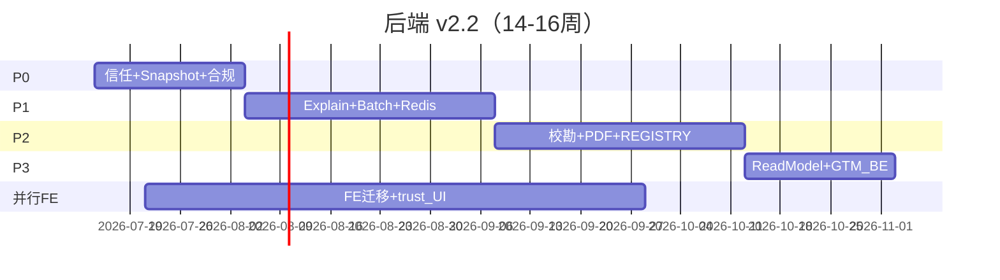

# 浮生 · 后端内容与能力精确规划

| 字段 | 内容 |
|------|------|
| **版本** | **v2.2**（专章 · 主执行见集成文档） |
| **主执行** | [**FUSHENG-INTEGRATED-DEV-PLAN**](./FUSHENG-INTEGRATED-DEV-PLAN-2026-07-12.md) |
| **日期** | 2026-07-12 |
| **定位** | **差距分析（§二–§六）** + **可执行处方（§七–§十三）** + **跨团队契约（§十四–§十六）** |
| **基线** | Scorecard 24/24 · classics verified 20% · GT50/ZW20/DV10 |
| **v2.2 并入** | ChartSnapshot · batch explain · RACI · SLO · disclaimer · FE 迁移 · BOOK-GTM 改期 · scope cut |
| **前版废止** | v2.0 CE 路线 · v2.1 缺 DRI/FE/合规/缓存矩阵 |

---

## 〇、文档怎么用

| 章节 | 性质 | 用途 |
|------|------|------|
| §一–§六 | **病历** | 现状、字段、痛点 |
| §七–§十三 | **处方** | P0→P3 + 内部架构 |
| §十四–§十六 | **跨团队契约** | FE / GTM / 合规 / 校勘 — **v2.2 新增** |
| 附录 A–F | 速查 | 字段、RACI、回归矩阵、砍 scope |

**一句话：**

> **Compute 瘦、Explain 厚、Content 有版本；ChartSnapshot 只算一次；典籍未校勘不冒充依据；前后端与 GTM 同一张列车时刻表。**

---

## 一、设计原则（v2.2）

| # | 原则 | v2.2 落地 |
|---|------|-----------|
| **D1** | 引擎与 HTTP 分离 | `services/*_engine/` |
| **D2** | 事实 / 讲解 / 推断 分层 | Compute + Explain；**非**焊死 full |
| **D3** | 缺失显式 | `missing_fields` |
| **D4** | 典籍严肃性 | 仅 **verified** 可标「典籍依据」 |
| **D5** | 术数分轨 | `bazi_reading_guide` ≠ `ziwei_reading_guide` |
| **D6** | 口径可追 | REGISTRY 先于 Schema |
| **D7** | 只算一次（新增） | 内部 **`ChartSnapshot`**，Explain 禁止重复 HTTP 级 compute |
| **D8** | 可观测（新增） | 每阶段必有 metrics + SLO |
| **D9** | 合规默认（新增） | report/explain 必带 **`disclaimer_block`** |

### 1.1 目标架构

```
                         Content（classics@glossary@ + 校勘 RACI）
                                    │ 只读
    ┌───────────────────────────────┼───────────────────────────────┐
    ▼                               ▼                               ▼
 ChartSnapshot                  Explain Service                 Read Model
 (内部 DTO，一次计算)            POST .../explain               GET .../volumes
      │                          POST .../explain/batch          SQLite JSON v0
      │                               │                         + explain 缓存
      ▼                               ▼
 Compute API                    explain_cache
 POST .../full（瘦）             Redis 可选 P1+
```

### 1.2 `chart_hash` 定义（v2.2 封口）

```
chart_hash = SHA256( canonical_json({
  discipline: "bazi"|"ziwei",
  birth_input: { 与 FullRequest 同序字段 },
  rule_version,
  engine_params: { ziwei *_method 等 },
}) )
```

- 用途：Explain 缓存键、Read Model 快照 ID、审计对齐  
- **禁止**用完整 response JSON 做 hash（非确定性字段会污染）

### 1.3 缓存失效矩阵

| 变更类型 | 失效范围 | 动作 |
|----------|----------|------|
| `rule_version` bump | 该盘全部 explain + snapshot | 删 `explain_cache:{chart_hash}:*` |
| `content_version` bump | 含 citation 的 section | 删 `*:{content_version_old}:*` 或全 hash |
| verified 条目修改 | 引用该 `classic_id` 的 section | `content_policy` 发失效事件 |
| 仅 glossary 变更 | 含 `glossary_refs` 的 section | 按 `glossary@` 前缀失效 |

**击穿策略：** 单 flight（mutex per `chart_hash`）；miss 时 **只建一次 Snapshot**。

### 1.4 响应体积与 SLO（v2.2）

| API | p95 体积 (gzip) | p95 延迟 | 可用性 |
|-----|-----------------|----------|--------|
| `POST /bazi/full` | ≤ 80KB | ≤ 800ms（GT01 单线程） | 99.5% |
| `POST /bazi/explain` 单 section | ≤ 40KB | ≤ 500ms（缓存 hit ≤ 50ms） | 99.5% |
| `POST /bazi/explain/batch` ≤4 sections | ≤ 120KB | ≤ 1200ms | 99.5% |
| `GET /life/volumes` | ≤ 120KB | ≤ 600ms（快照 hit） | 99.0% |

**可观测指标（每阶段上线必接）：**

`explain_cache_hit_ratio` · `content_policy_reject_total` · `trust_level_degraded_ratio` · `bazi_full_duration_ms` · `chart_snapshot_build_ms`

---

## 二、现有能力清单（摘要 · 同 v2.1）

Compute：`bazi/full` · `ziwei/full` · `structured-text` · `archive-bundle` · glossary/classics/concepts。  
平台债：ZW18 · OpenAPI CI · v2 501 · liunian worker · quota 内存 · payment/notifications stub。

字段全景见 **§三–§四**（与 v2.1 同，不重复展开）。

---

## 三、`BaziFullResponse` 字段全景

### 3.1 L1 事实层 ✅

pillars · ten_gods · geju · yongshen · relations_summary · shensha_summary · dayun · liunian · liuri · evidence_chain · missing_fields 等（引擎可信）。

### 3.2 L2 讲解层 → Explain API ❌

### 3.3 L3 推断层

保留 `bazi_summary` + 段级 `evidence_ids`；7 域长 `interpretation_text` 迁 Explain；Compute 默认瘦身。

### 3.4 空洞

`palace.twelve_palaces[].tiangan/shishen` 空串（P2，先 B-07 REGISTRY）。

---

## 四、`ZiweiResponse` 字段全景

L1 有条件 ✅（**ZW18 未决 → trust_level: degraded**）。童限 Schema P2；右弼 P0 写入 REGISTRY 用户说明。

---

## 五、Content Pipeline

### 5.1 资产版本

`classics@` · `glossary@` · `concepts@` — 响应带 `content_versions`。

### 5.2 引用白名单

| status | Explain 自动引用 | 展示标签 |
|--------|------------------|----------|
| verified | ✅ | 典籍依据 |
| unverified | ❌ | 待校勘语料 |
| rejected | ❌ | — |

### 5.3 最小可售卖引文库 MVP-20（v2.2 · 产品对齐）

**抖音/付费卷可引用典籍的前提** — 不要求全库 35%，但 **这 20 条必须 verified + 有页码**：

| 类别 | 数量 | 示例 |
|------|------|------|
| 格局 | 8 | 正官格、七杀格、食神格、伤官格、正财、偏财、正印、偏印 |
| 用神 | 4 | 官印相生、食神生财、制杀、调候 |
| 运限 | 4 | 大运起运、流年太岁、交节、大运交接 |
| 紫微 | 4 | 命宫主星、三方四正、化禄权科忌、 canonical 格局 2 条 |

- **P1 结束** MVP-20 齐 → 允许 BOOK-GTM **卷一~二** 对外试投  
- **P2 结束** verified ≥ 35% → 允许 **卷三~五** 付费叙事  

### 5.4 校勘 RACI（v2.2）

| 活动 | R（执行） | A（批准） | C（咨询） | I（知会） |
|------|-----------|-----------|-----------|-----------|
| spotcheck 批次 | 校勘编辑 | 命理顾问 | 后端 | 产品 |
| verification_status 变更 | 校勘编辑 | 命理顾问 | — | 全员 |
| MVP-20 定稿 | 命理顾问 | 产品 | 后端 | — |
| citation 争议裁决 | 命理顾问 | 产品负责人 | 校勘编辑 | 后端 |
| content version bump | 后端 | 命理顾问 | 校勘编辑 | FE |

**吞吐假设：** 1 条 verified 含页码 ≈ **45–90 分钟**；每周固定 **8h 校勘块**（不是「间歇」）。

**verified 必填字段：** `classic_id` · `text` · `source` · `source_page` · `edition` · `verifier_id` · `verified_at`

---

## 六、痛点 × 后端责任（保持）

显示不全 / 看不懂 / 没有讲解 / 过于 AI 化 — 处方仍为 Compute + Explain + Content；**v2.2 要求 FE 同步列车（§十四）**。

---

## 七、内部核心：`ChartSnapshot`（v2.2 · P0-07）

**先于 Explain 实现。**

| 项 | 说明 |
|----|------|
| 文件 | `app/schemas/chart_snapshot.py` · `services/chart_snapshot_service.py` |
| 输入 | BaziFullRequest / ZiweiRequest |
| 输出 | `BaziChartSnapshot` / `ZiweiChartSnapshot`（纯事实 DTO，无散文） |
| 调用链 | `full` router → snapshot service → engine；**explain** → 只读 snapshot |
| 存储 v0 | 内存 LRU；P3 Read Model 落 `chart_snapshots` 表（`case_id`, `chart_hash`, `json`, `built_at`） |

**验收：** 同输入 `full` 与 `explain` 内引擎 `calculate` 调用次数 = **1**（mock 计数测试）。

---

## 八、执行路线图 P0–P3（v2.2）

> **总工期：14–16 周**（含 **20% 缓冲** + 并行 FE/校勘）  
> **人天：65–80**（后端 45–55 + 校勘 20–25）  
> **DRI 默认：** 后端负责人，除非表中另有注明

---

### Phase P0 · 信任与契约（W1–W3，含缓冲）

| ID | 任务 | DRI | 验收 |
|----|------|-----|------|
| **P0-01** | ZW18 裁决 + REGISTRY Z-11 | 后端+命理 | 书面结论；`test_zw18_trust` CI |
| **P0-02** | OpenAPI CI 阻断 | 后端 | PR schema 必须 sync openapi.json |
| **P0-03** | 删 v2 501 或实现 | 后端 | 无 501 暴露 |
| **P0-04** | `trust_level` + **UI 契约**（§十四） | 后端+FE | OpenAPI 含 `TrustLevel` enum |
| **P0-05** | Content `meta.version` | 后端 | classics 响应含 version |
| **P0-06** | `content_policy.py` | 后端 | unverified → citation 拒绝 |
| **P0-07** | **ChartSnapshot** 骨架 | 后端 | snapshot 单测 + 只算一次测试 |
| **P0-08** | **`disclaimer_block`** 全 report/explain | 后端 | `BaziFullResponse` + Explain 均含 |
| **P0-09** | **JSON 快照规范化** | 后端 | `tests/utils/canonical_json.py` |
| **P0-10** | **可观测 baseline** | 后端+SRE | metrics 端点或 log 结构化字段 |

**P0 Gate：** scorecard · zw18 · openapi diff · disclaimer 存在 · snapshot 测试绿

---

### Phase P1 · Explain + 生产底线（W4–W8）

#### P1-01 API

```
POST /api/v1/bazi/explain
POST /api/v1/ziwei/explain
POST /api/v1/bazi/explain/batch    # v2.2 新增，一次 ≤4 sections
POST /api/v1/ziwei/explain/batch
```

**batch 请求体：**

```json
{
  "...inputs...": "...",
  "sections": ["geju", "relations", "reading", "summary"]
}
```

**响应：** `{ "chart_hash", "content_versions", "disclaimer_block", "sections": { "geju": ExplainedSection, ... } }`

#### P1-02 Schema（`app/schemas/explain.py`）

- `CitationModel`：`source_page` **verified 必填**  
- `ExplainedSectionModel` · 分轨 `BaziReadingGuideModel` / `ZiweiReadingGuideModel`  
- `ExplainBatchResponse`  
- `DisclaimerBlockModel`（与 report 共用）

**reading_guide 变体（v2.2）：** 除默认步骤外，支持 `variant: standard|cong_ge|hua_qi`（子平）；紫微 `variant: standard|kong_gong` — **禁止**一套五步打天下。

#### P1-03 实现

| 文件 | 职责 |
|------|------|
| `chart_snapshot_service.py` | 已 P0；Explain 唯一数据源 |
| `explain_service.py` | 编排 sections |
| `explain_bazi.py` / `explain_ziwei.py` | section 生成 |
| `explain_cache.py` | Redis **P1 若公测/内测**；否则内存 + 接口一致 |
| `routers/explain.py` | 含 batch |

#### P1-04 Compute 瘦身 + 废弃窗口

| 项 | 说明 |
|----|------|
| 默认 | `bazi/full` 7 域无长 `interpretation_text` |
| 兼容 | `?legacy_domains=1` 保留至 **2026-11-01**（W10） |
| 遥测 | 记录 `legacy_domains` 调用占比，<5% 时删 |

#### P1-05 测试矩阵（v2.2 扩展）

| 类型 | 数量/标准 |
|------|-----------|
| 黄金 explain fixtures | **24** = 8 盘 × 3 sections（geju, relations, summary） |
| 回归矩阵 | 见 **附录 E** |
| 确定性 | `canonical_json` 后字节一致 |
| citation | 仅 verified；MVP-20 全覆盖测试 |
| 契约 | schemathesis 或 openapi diff + 抽样 contract test |

#### P1-06 生产（v2.2 前移）

| 项 | 说明 |
|----|------|
| **quota Redis** | 任何对外 beta **必须** P1 完成，不得等 P3 |
| liunian worker | 仍 P3，但 P1 文档化单进程限制 |

**P1 Gate：** batch explain 绿 · MVP-20 verified 齐 · cache hit 可观测 · **用户里程碑 U2**（§十五）

**工时：** 18–24 人天

---

### Phase P2 · Content + PDF + 口径（W9–W13）

| ID | 任务 | 说明 |
|----|------|------|
| P2-01 | classics 20%→**35%** | 校勘 RACI 每周 8h |
| P2-02 | glossary 68→120 | `school_note` 必填 |
| P2-03 | concepts 分轨阅读序 | |
| P2-04 | B-07 宫位 + 填 tiangan/shishen | |
| P2-05 | Z-11 童限 / Z-12 右弼 Schema | REGISTRY 先行 |
| P2-06 | liunian-domain 结构化 | |
| P2-07 | PDF 消费 Explain | **HTML 快照进 CI** |
| P2-08 | bazi_summary + evidence_ids | |
| P2-09 | **七域改名**（可选） | UI 标「生活域推断」，非「命理定论」 |

**P2 Gate：** verified≥35% · PDF 快照 CI · **用户里程碑 U4**

**工时：** 22–28 人天（校勘占 40%）

---

### Phase P3 · Read Model + GTM 后端（W14–W16）

| ID | 任务 | 说明 |
|----|------|------|
| P3-01 | `GET /life/volumes/{case_id}` | 读 `chart_snapshots` + explain 缓存 |
| P3-02 | `GET /life/snippets` | fact_lines only |
| P3-03 | liunian Redis worker | 幂等 + 毒消息 spec |
| P3-04 | archive-bundle 扩展 | name/zeri 可选 |
| P3-05 | GTM 归因/埋点 | 见 BOOK-GTM v2.1 对齐节 |

**六卷 IA：** 同 v2.1；**卷四** 透传 `trust_level` + iztro 脚注必显。

**P3 Gate：** life/volumes 集成 · worker 双实例 · **用户里程碑 U5**

---

## 九、排期（v2.2 · 含并行）



| 轨道 | 周次 | 交付 |
|------|------|------|
| 后端 P0 | W1–W3 | Snapshot · disclaimer · ZW18 |
| 后端 P1 | W4–W8 | explain/batch · MVP-20 · quota Redis |
| 校勘 | W4 起每周 8h | MVP-20 → 35% |
| FE | W2 起 | §十四 迁移表 |
| P2–P3 | W9–W16 | PDF · volumes · GTM 后端 |

---

## 十、验收总表（v2.2）

| # | 项 | 标准 |
|---|-----|------|
| 1 | ChartSnapshot | explain 不二次 calculate |
| 2 | batch explain | 八字页 ≤2 往返（full + batch） |
| 3 | 典籍 | citation 仅 verified；MVP-20 100% 有页码 |
| 4 | disclaimer | full / explain / volumes 均有 |
| 5 | 黄金 fixtures | **24** 个 canonical 快照绿 |
| 6 | trust_level | degraded 时 UI 契约满足 §十四 |
| 7 | SLO | p95 延迟采样进 CI 或周报 |
| 8 | legacy_domains | W10 前 <5% 或强制移除 |
| 9 | PDF | HTML 快照 CI |
| 10 | Scorecard | 24/24 |

---

## 十一、安全与合规（v2.2）

| 项 | 要求 |
|----|------|
| **disclaimer_block** | 固定文案 + `version`；所有 explain/report/volumes |
| **PII** | `case_id` 路径审计日志；日志禁止打印完整出生时间 |
| **LLM 卷六** | 输入仅 structured-text；prompt 注入过滤；草稿留存 30d 可删 |
| **iztro** | 对照结果仅存响应 JSON，不上传第三方 |
| **埋点** | 事件不含姓名/生日；见 BOOK-GTM 更新节 |

---

## 十二、延期砍 Scope 清单（v2.2）

**若 W8 未达 P1 Gate，按序砍：**

1. `domains` explain section（保留 score/tier）  
2. reading_guide `variant` 变体（仅 standard）  
3. ziwei explain batch（保留单次 explain）  
4. P2 glossary 120→90  
5. P3 life/snippets（保留 volumes）  
6. **绝不砍：** Snapshot · content_policy · disclaimer · MVP-20 · ZW18 结论 · batch geju+relations  

---

## 十三、单 PR 模板（v2.2）

```markdown
## P{x}-{yy}：<标题>  DRI：@name

### 类型
Compute / Explain / Content / Read Model / FE-contract

### 契约
- OpenAPI + FE types（若破坏 §十四 须同步）
- Explain：更新 canonical fixture（附录 E 矩阵格）
- citation：verified + source_page

### 观测
- 新 metrics？SLO 影响？

### 验证
pytest · scorecard · canonical_json 快照 · contract test

### 禁止
unverified citation · 二次 calculate · full 热路径加 explain
```

---

## 十四、前端联合契约（v2.2 新增）

### 14.1 请求策略（避免 N+1）

| 页面 | 请求 | 说明 |
|------|------|------|
| 八字页 | `full` + `explain/batch` sections=geju,relations,reading | **2 往返** |
| 紫微页 | `full` + `explain/batch` sections=palaces,reading | 2 往返 |
| 报告页 | 优先 `life/volumes`（P3）或 batch | P1–P2 用 batch |

### 14.2 破坏性变更迁移表

| 阶段 | 后端变更 | 前端动作 | 截止 |
|------|----------|----------|------|
| P1 | full 默认无长 `interpretation_text` | 改读 explain batch | W8 |
| P1 | 新增 `disclaimer_block` | 页脚展示 | W6 |
| P1 | `trust_level` on ziwei | 见 14.3 | W6 |
| P2 | PDF 改 Explain | Report 组件接 batch | W12 |
| P3 | `life/volumes` | BookToc 切 API | W16 |

**types 同步：** 每个 P Gate 后 `npm run gen:types` 进 CI（与 openapi 并列）。

### 14.3 `trust_level` UI 状态机

| trust_level | 卷四宫图 | 运限付费墙 | 必显元素 |
|-------------|----------|------------|----------|
| `full` | 正常 | 按 entitlement | iztro 脚注可折叠 |
| `degraded` | 展示但标「命宫待校勘」 | **锁卷三~五** | **命宫 iztro 对照条** + 链接跋 |

---

## 十五、用户可见里程碑 × BOOK-GTM 改期（v2.2）

| 里程碑 | 周次 | 用户能感知 | BOOK-GTM 对齐 |
|--------|------|------------|---------------|
| **U1** | W3 | 紫微 degraded 透明展示 | 暂停「全功能紫微」话术 |
| **U2** | W8 | 八字卷一~二：格局+关系+典籍脚注（MVP-20） | 抖音可试 **卷首+卷一二**；非六卷全量 |
| **U3** | W8 | batch 页面 2 往返、术语可点 | 钩子句可从 fact_lines 抽 |
| **U4** | W13 | PDF 章三含 relations+citation | 全书 PDF **内测** |
| **U5** | W16 | 人生六卷 API | 付费卷三~五 **正式上线** |
| **U6** | W16+ | 埋点/归因/支付 | BOOK-GTM 增长后端 |

**BOOK-GTM 修订要点（须在 GTM 文档同步）：**

- 原「W5 落地页 + 六卷」→ 改为 **W8 卷一二试投、W16 六卷+付费**  
- 抖音全量_campaign **不得早于 U2**  
- 对外话术：**W8 前** 称「命盘结构册（试读卷）」，**W16 后** 称「人生六卷」

---

## 十六、与竞品差距（v2.2）

同 v2.1，补充：**batch explain** 对标多 tab 往返；**MVP-20** 对标文墨「有据可依」最小集。

---

## 附录 A · 字段 → API 速查

| 需求 | Compute | Explain |
|------|---------|---------|
| 格局 | geju | batch: geju |
| 关系 | relations_summary | relations |
| 大运 | dayun | dayun |
| 总评 | bazi_summary（短） | summary |
| 读盘 | — | reading |

---

## 附录 B · 任务 DRI 汇总

| Phase | 后端 DRI | 校勘 DRI | FE DRI | 命理顾问 A |
|-------|----------|----------|--------|------------|
| P0 | BE-Owner | — | FE-Owner（trust UI） | 命理-A |
| P1 | BE-Owner | 校勘-R | FE-Owner | 命理-A |
| P2 | BE-Owner | 校勘-R | FE-Owner | 命理-A |
| P3 | BE-Owner | — | FE-Owner | 产品-A |

---

## 附录 C · `ChartSnapshot` 字段（内部）

**BaziChartSnapshot（节选）：** pillars_primary · geju · yongshen · relations_summary · shensha_summary · dayun · liunian · rule_matches · missing_fields · rule_version · chart_hash  

**禁止包含：** bazi_summary 长文 · domain interpretation_text · LLM drafts

---

## 附录 D · Read Model 存储 v0

| 表 | 字段 |
|----|------|
| `chart_snapshots` | id, case_id, discipline, chart_hash, snapshot_json, rule_version, created_at |
| `explain_cache` | chart_hash, section, content_version, response_json, created_at（Redis 或 DB） |

重建：`GET /life/volumes` miss → 读 snapshot → 调 explain batch → 持久化缓存。

---

## 附录 E · Explain 回归矩阵（24 fixtures）

| 盘 | geju | relations | summary | ziwei palaces |
|----|------|-----------|---------|---------------|
| GT01 | ✓ | ✓ | ✓ | — |
| GT02 | ✓ | ✓ | ✓ | — |
| … GT08 | ✓ | ✓ | ✓ | — |
| ZW01 | — | — | — | ✓ |
| … ZW04 | — | — | — | ✓ |

每格：`tests/fixtures/explain/{case}_{section}.canonical.json`

---

## 附录 F · 文档关系

| 文档 | 关系 |
|------|------|
| **本文 v2.2** | 主执行蓝图 |
| [BOOK-GTM](./FUSHENG-BOOK-GTM-DEV-PLAN-2026-07-12.md) | **须按 §十五 改期** |
| [PRODUCT-CORRECTION](./PRODUCT-CORRECTION-PLAN-2026-07-12.md) | 四痛点 |
| METHOD-REGISTRY ×2 | 口径 |

---

## 附录 G · 修订记录

| 版本 | 日期 | 说明 |
|------|------|------|
| v2.0 | 2026-07-12 | CE 路线（废止） |
| v2.1 | 2026-07-12 | Compute/Explain/Content 三分 |
| **v2.2** | **2026-07-12** | **十角色评审并入：ChartSnapshot、batch explain、RACI、SLO、disclaimer、FE§十四、MVP-20、14–16周、砍scope、BOOK-GTM改期** |
