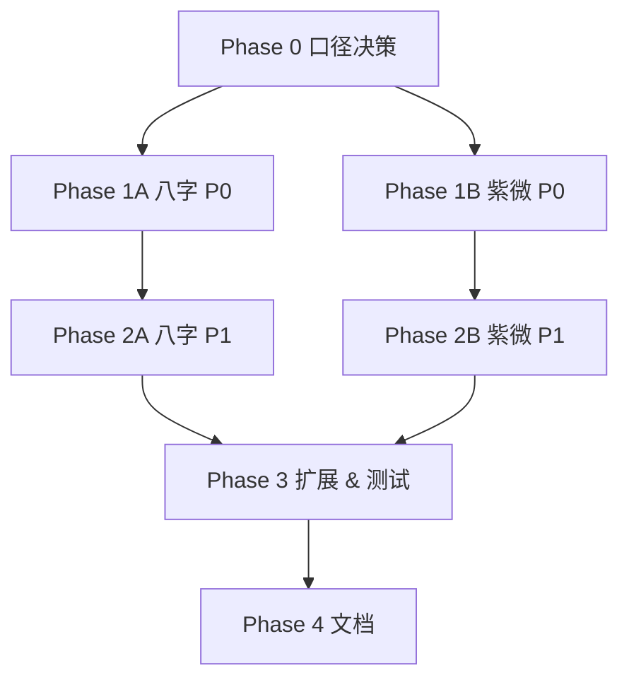

# 八字 & 紫微底层核心修复计划

版本：v1.0  
日期：2026-07-11  
范围：仅后端命理引擎（`services/bazi_engine/`、`services/ziwei_engine/` 及相关服务），不含前端  
状态：**主体已完成**（Phase 0–4 + P4–P6 延伸；见 [进度报告](../reports/ENGINE-CORE-PROGRESS-2026-07-11.md)）
关联文档：
- [紫微缺口审计](../design/ziwei/ziwei-gap-audit.md)
- [项目计划 v1.1](./PROJECT-PLAN-2026-06-15-v1.1.md)
- [ground_truth_cases.json](../../data/ground_truth_cases.json)

---

## 1. 背景与目标

### 1.1 现状摘要

| 模块 | 成熟度 | 主要风险 |
|------|--------|----------|
| 八字 | 分析层较完整 | legacy 与新引擎双轨；`liuri.py` 损坏；字段占位 |
| 紫微 | 本命盘主干可用 | 运限算法与设计文档偏差；辅星安法口径不一；结构不统一 |

### 1.2 本计划目标

1. **消除算法双轨与损坏模块**，保证同一响应内字段自洽。
2. **对齐设计文档口径**（或显式标注流派/简化方法），避免「静默算错」。
3. **建立可跟踪的缺口机制**（缺失字段、方法来源、置信度）。
4. **补齐回归测试**，使设计文档案例可自动校验。

### 1.3 原则

- 优先增量修复，不做引擎大一统重写。
- 每个修复必须有 **验收标准 + 测试**。
- 暂时无法实现的字段，必须 **显式标注 `missing`**，不能硬编码空值或 `"缺失"` 占位而不说明原因。
- API/路由层 bug 若影响引擎结果展示，纳入同期修复。

---

## 2. 阶段总览

```
Phase 0 ─ 口径决策 & 基线锁定          （1–2 天）
Phase 1 ─ P0 正确性修复               （5–7 天）
Phase 2 ─ P1 结构与接入补齐           （5–7 天）
Phase 3 ─ P2 功能扩展 & 测试矩阵       （7–10 天）
Phase 4 ─ 文档 & 长期维护机制          （2–3 天）
```

预估总工期：**3–4 周**（单人全职；可并行时缩短）

---

## 3. Phase 0：口径决策 & 基线锁定

> 阻塞后续所有算法修复。必须先定「以谁为准」。

### 0.1 紫微安星口径确认表

| 编号 | 争议点 | 选项 A（设计文档） | 选项 B（当前实现） | 决策 |
|------|--------|-------------------|-------------------|------|
| Z-01 | 流年命宫 | 太岁直落（子年→子宫） | 寅宫起 `(2+branch)%12` | ☐ 待定 |
| Z-02 | 流月 | 斗君法（流年支→逆生月→顺生时） | 流年命宫 + month-1 | ☐ 待定 |
| Z-03 | 右弼 | 戌起正月逆数月 | 戌起子时逆数时辰 | ☐ 待定 |
| Z-04 | 文昌/文曲 | 按时辰安星 | 按年支安星 | ☐ 待定 |
| Z-05 | 小限起点 | 文档辰宫起（寅午戌组） | 男寅/女申 | ☐ 待定 |

**交付物**：`docs/design/ziwei/ENGINE-METHOD-REGISTRY.md`（方法注册表，含默认值与可选流派参数）

### 0.2 八字算法口径确认

| 编号 | 争议点 | 决策 |
|------|--------|------|
| B-01 | wuxing/strength/yongshen 以哪套为准 | 统一为 `bazi_engine/*`，legacy 标记 deprecated |
| B-02 | self_seat 定义 | 天干坐地支十二长生（与 xingyun 同规则） |
| B-03 | wealth 估算 | 接入 `estimate_wealth` 或删除 dead module（二选一） |
| B-04 | ENGINE_V2 | 暂保留 flag，文档标注「未实现」 |

### 0.3 基线测试快照

- [ ] 跑通核心回归：`test_golden_regression.py`、`test_golden.py`、`test_ziwei_engine.py`、`test_geju_v2.py`
- [ ] 记录当前 pass/fail 基线到 `docs/reports/ENGINE-CORE-BASELINE-2026-07-11.md`
- [ ] 确认 `python -c "import services.bazi_engine.liuri"` 预期失败（记录为已知问题）

**Phase 0 完成标准**：口径表签字确认；基线报告落盘。

---

## 4. Phase 1：P0 正确性修复

### 1A. 八字 — 算法统一（B-P0-01 ~ B-P0-03）

#### B-P0-01 修复 `liuri.py` 损坏文件 ✅ 已完成（2026-07-11）

| 项 | 内容 |
|----|------|
| 问题 | `services/bazi_engine/liuri.py:64` 语法错误，混入玄空飞星代码 |
| 方案 | 删除 `@'` 及混入内容；玄空飞星若需保留，迁至 `services/fengshui_engine/` |
| 文件 | `services/bazi_engine/liuri.py` |
| 验收 | 模块可 import；无语法错误；CI 不回归 |
| 估时 | 0.5 天 |

#### B-P0-02 统一五行/强弱/用神计算路径 ✅ 已完成（2026-07-11）

| 项 | 内容 |
|----|------|
| 问题 | `_calculate_v1` 首段用 legacy `compute_wuxing/compute_strength`，与 `_enrich_v2_analysis` 新引擎不一致 |
| 方案 | `_calculate_v1` 直接调用 `bazi_engine.wuxing`、`strength`、`yongshen`；legacy 函数加 `@deprecated` 注释 |
| 文件 | `services/bazi_engine_service.py`、`services/bazi_full_service.py` |
| 验收 | 同一请求 wuxing_score / day_master_strength / yongshen 来源一致；收紧 `test_golden.py` 强弱 tier 断言 |
| 估时 | 1.5 天 |

#### B-P0-03 `/bazi/full` 传入 gender ✅ 已完成（2026-07-11）

| 项 | 内容 |
|----|------|
| 问题 | `bazi_full()` 硬编码 `gender=None`，大运顺逆错误 |
| 方案 | `BaziFullRequest` 增加 `gender`；`bazi_full()` 透传 |
| 文件 | `app/schemas/bazi.py`、`services/bazi_full_service.py` |
| 验收 | 男女同盘大运 direction 不同；新增回归用例 |
| 估时 | 0.5 天 |

---

### 1B. 紫微 — 安星 & 运限（Z-P0-01 ~ Z-P0-05）

#### Z-P0-01 补全 `LunarInfo.day_branch_idx` ✅ 已完成（2026-07-11）

| 项 | 内容 |
|----|------|
| 问题 | 三台/八座/恩光/天贵 fallback `day_branch=0` |
| 方案 | `LunarInfo` 增加 `day_branch_idx`；`solar_to_lunar()` 写入 |
| 文件 | `services/ziwei_engine/lunar.py`、`stars_aux.py` |
| 验收 | 黄金案例 2002-03-13 14:55 女：四星落宫与手工核算一致 |
| 估时 | 0.5 天 |

#### Z-P0-02 修正文昌/文曲/右弼（按 Phase 0 决策） ✅ 已完成（2026-07-11）

| 项 | 内容 |
|----|------|
| 问题 | 安星依据与设计文档不符 |
| 方案 | 按口径表实现；保留 `aux_star_method` 参数支持旧行为 |
| 文件 | `services/ziwei_engine/stars_aux.py` |
| 验收 | 设计文档 §05 至少 3 个案例通过；旧行为可通过参数切换 |
| 估时 | 1 天 |

#### Z-P0-03 修正流年命宫（按 Phase 0 决策） ✅ 已完成（2026-07-11）

| 项 | 内容 |
|----|------|
| 问题 | `(2+branch_idx)%12` 与太岁直落不符 |
| 方案 | 实现 `liunian_life_method: "taisui" \| "yin_start"` |
| 文件 | `services/ziwei_engine/liunian.py` |
| 验收 | 子年→子宫（taisui 模式）；回归不破坏现有 API 默认行为或显式 breaking change |
| 估时 | 1 天 |

#### Z-P0-04 实现斗君流月或显式标注简化法 ✅ 已完成（2026-07-11）

| 项 | 内容 |
|----|------|
| 问题 | 流月仅 `life_branch + month - 1` |
| 方案 | 优先实现斗君；若工期不足，返回 `liuyue_method: "simplified"` + `missing: ["doujun_liuyue"]` |
| 文件 | `services/ziwei_engine/liunian.py`、`__init__.py` |
| 验收 | 斗君模式 12 月落宫与设计文档一致；简化模式有显式标注 |
| 估时 | 1.5 天 |

#### Z-P0-05 修复 router index/branch 混用 ✅ 已完成（2026-07-11）

| 项 | 内容 |
|----|------|
| 问题 | `palace_weights` 用 `p.index == life_palace_branch`；身宫名取下标错误 |
| 方案 | 建立 `branch_to_palace` 映射；权重/身宫名基于 branch 查找 |
| 文件 | `routers/ziwei.py` |
| 验收 | structural_summary 身宫名与 chart.body_palace_branch_name 一致；权重命宫=1.0 |
| 估时 | 0.5 天 |

**Phase 1 完成标准**：P0 项全部验收；核心回归全绿；无 silent fallback 导致错误落宫。

---

## 5. Phase 2：P1 结构与接入补齐

### 2A. 八字

| 编号 | 任务 | 文件 | 估时 |
|------|------|------|------|
| B-P1-01 | 实现全柱 `self_seat`（复用十二长生） | `bazi_full_service.py`、`dayun.py`、`liunian.py` | 1 天 |
| B-P1-02 | 接入 `estimate_wealth` 或移除 dead module | `bazi_engine_service.py`、`wealth_estimate.py` | 1 天 |
| B-P1-03 | `BaziFullRequest` 补 `city_tier`、`industry` | `app/schemas/bazi.py`、`bazi_full_service.py` | 0.5 天 |
| B-P1-04 | 同步 golden ground truth（GT03/GT04 漂移） | `data/ground_truth_cases.json`、`tests/test_golden.py` | 1 天 |
| B-P1-05 | CLS pre_1900 案例：补格局/用神或标注 skip 原因 | `ground_truth_cases.json`、`test_golden_regression.py` | 1 天 |

### 2B. 紫微

| 编号 | 任务 | 文件 | 估时 |
|------|------|------|------|
| Z-P1-01 | `liuyue_data` 模型化为 `LiuyueInfo` dataclass | `liunian.py`、`__init__.py`、`app/schemas/ziwei.py` | 1 天 |
| Z-P1-02 | 引擎级 `missing_fields` 机制 | `__init__.py`、各子模块 | 1 天 |
| Z-P1-03 | `PalaceInfo.is_body_palace` + 修复「白虎守身」 | `__init__.py`、`patterns.py` | 0.5 天 |
| Z-P1-04 | 小限起点按 Phase 0 决策修正 | `__init__.py` | 0.5 天 |
| Z-P1-05 | 真太阳时修正：异常不再 silent pass | `__init__.py` | 0.5 天 |
| Z-P1-06 | 补月德星 | `stars_aux.py` | 0.5 天 |

**Phase 2 完成标准**：P1 项验收；API 响应中缺失字段有统一 `missing` 数组；不再有 unexplained `"缺失"` 硬编码。

---

## 6. Phase 3：P2 功能扩展 & 测试矩阵

### 3A. 功能扩展

| 编号 | 模块 | 任务 | 估时 |
|------|------|------|------|
| B-P2-01 | 八字 | 流日/流时最小实现（`liuri.py` 恢复后） | 2 天 |
| B-P2-02 | 八字 | 刑冲合害、空亡、调候（对齐产品 P0） | 3 天 |
| B-P2-03 | 八字 | 大运起运精确到天 + 换运提示 | 2 天 |
| Z-P2-01 | 紫微 | 流日/流时最小实现 | 2 天 |
| Z-P2-02 | 紫微 | 格局检测增强（庙旺/煞星/吉星成格条件） | 2 天 |
| Z-P2-03 | 紫微 | 大限化忌冲本命格局 | 1 天 |
| Z-P2-04 | 紫微 | `zeri_engine` 天德地支型处理 | 0.5 天 |

### 3B. 测试矩阵

| 编号 | 任务 | 覆盖目标 | 估时 |
|------|------|----------|------|
| T-01 | `tests/test_stars_aux.py` 新建 | 辅煞星落宫、多流派 | 1 天 |
| T-02 | `tests/test_decorative.py` 新建 | 长生/将前/岁前十二神 | 0.5 天 |
| T-03 | `tests/test_liunian_doujun.py` 新建 | 流年命宫、斗君流月 | 1 天 |
| T-04 | 多流派参数黄金集 | 庚干四化 5 方案、亮度 4 流派各 1 例 | 1 天 |
| T-05 | 设计文档 → pytest fixture | `docs/design/ziwei/` 案例自动校验 | 1.5 天 |
| T-06 | legacy vs 新引擎一致性测试 | wuxing/strength/yongshen | 0.5 天 |

**Phase 3 完成标准**：测试矩阵覆盖上表；新增功能有对应用例；CI 全绿。

---

## 7. Phase 4：文档 & 长期维护

| 编号 | 任务 | 交付物 | 估时 |
|------|------|--------|------|
| D-01 | 创建八字 gap audit | `docs/design/bazi/bazi-gap-audit.md` | 0.5 天 |
| D-02 | 更新紫微 gap audit | `docs/design/ziwei/ziwei-gap-audit.md` | 0.5 天 |
| D-03 | 方法注册表 | `docs/design/ziwei/ENGINE-METHOD-REGISTRY.md` | 0.5 天 |
| D-04 | 同步 API 文档 | `docs/design/api.md` → 实际 Schema 字段 | 1 天 |
| D-05 | 更新 `docs/README.md` 索引 | 链接本计划 | 0.5 天 |
| D-06 | ENGINE_V2 文档标注 | README + 代码注释 | 0.5 天 |

---

## 8. 依赖关系



**关键路径**：Phase 0 → Z-P0-01（日支）→ Z-P0-02~04（安星/运限）→ 测试矩阵

**可并行**：
- Phase 1A（八字）与 Phase 1B（紫微）可并行
- Phase 2A 与 2B 可并行
- 测试编写可与 Phase 2 后期重叠

---

## 9. 风险与缓解

| 风险 | 影响 | 缓解 |
|------|------|------|
| 口径决策拖延 | 阻塞所有算法修复 | Phase 0 限时 2 天，超时则默认「设计文档为准」 |
| 修正安星导致 API breaking change | 前端/旧客户端结果变化 | 保留 `*_method` 参数，默认切新口径，旧口径可选 |
| golden 测试大量失败 | 修复周期拉长 | 分批收紧断言；先新增 strict 测试再删 relaxed |
| legacy 清理引发回归 | 910 tests 基线波动 | 每 PR 只改一条路径；跑全量 pytest |
| 流日/流时规格不完整 | Phase 3 延期 | 最小实现 + missing 标注，不追求完整 |

---

## 10. 里程碑 & 检查点

| 里程碑 | 目标日期 | 标志 |
|--------|----------|------|
| M0 | +2 天 | 口径表确认，基线报告完成 | ✅ |
| M1 | +7 天 | Phase 1 全部 P0 修复合并 | ✅ |
| M2 | +14 天 | Phase 2 P1 完成，missing 机制上线 | ✅ |
| M3 | +24 天 | Phase 3 测试矩阵 + 流日流月最小版 | ✅ |
| M4 | +28 天 | 文档同步，gap audit 双模块齐全 | ✅ |
| M5 | +延伸 | P4–P6 verify/enrich/CLS；子平取格 + 八正格用神 | ✅ |

---

## 14. 延伸批次 P4–P6（2026-07-11，计划外追加）

| 编号 | 任务 | 状态 |
|------|------|------|
| B-P3-01 | verify 单轨 + `missing_fields` | ✅ |
| B-P3-02 | M2 enrich 可观测 | ✅ |
| B-P3-03 | CLS pre_1900 + 年份扩展 | ✅ |
| B-P3-04 | 十神/格局子平口径 | ✅ |
| B-P3-05 | `_resolve_ref_stem` 透干取格 | ✅ |
| B-P3-06 | 八正格配用神 | ✅ |
| Z-P1-06+ | 月德复核 + 天德 | ✅ |

**CLS 回归**：CLS01–CLS12 格局与用神 vs 袁书 **12/12**；`test_golden_regression` 古籍 drift **24/24 PASS**。

详见 [ENGINE-CORE-PROGRESS-2026-07-11.md](../reports/ENGINE-CORE-PROGRESS-2026-07-11.md)。

---

## 11. 建议执行顺序（第一周）

| 天 | 任务 |
|----|------|
| D1 | Phase 0 口径决策 + 基线测试 |
| D2 | B-P0-01 liuri 修复 + B-P0-02 算法统一（启动） |
| D3 | B-P0-02 完成 + B-P0-03 gender + Z-P0-01 day_branch_idx |
| D4 | Z-P0-02 昌曲/右弼 + Z-P0-05 router 修复 |
| D5 | Z-P0-03 流年命宫 + Z-P0-04 斗君流月（启动） |

---

## 12. 不在本计划范围

- 前端 UI / SPA 迁移
- 姓名学、六爻、风水等其他模块
- LLM 解读层改造
- 数据库 / RBAC / 部署脚本
- PDF 模板与报告页

---

## 13. 跟踪方式

- 本文件为 **主计划**；执行时在 Issue/PR 标题前缀使用任务编号（如 `B-P0-02`、`Z-P1-03`）。
- 每完成一项，更新对应 gap audit 文档中的状态。
- 每周一次对照 M0–M4 里程碑做进度 review。
