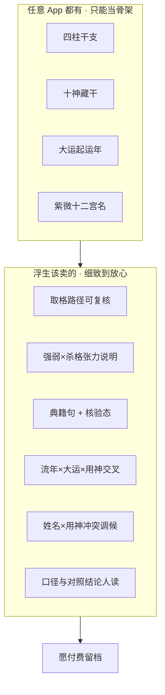

# 浮生 PDF 付费价值改进方案（v2.6 → v2.7）

| 字段 | 内容 |
|------|------|
| **样例** | `刘博 · 1990_07_17 (1).pdf`（v2.6 · 10 页） |
| **付费盲测自评** | **6.8/10** — 可信可用，未到「值这个价」 |
| **前序** | [质量总方案](./PDF-REPORT-QUALITY-REMEDIATION-PLAN-2026-08-10.md) · [精装骨架](./PDF-ARCHIVE-PREMIUM-LAYOUT-2026-08-10.md) |
| **管线** | `services/fusheng_report_service.py` · `services/pdf_exporter.py` |
| **目标分** | 盲测 **≥ 8.0/10**；且 **「被骗感」题 ≤1/3 人选是**（见 §0.1） |
| **仍不做** | 改 `strength.py` · 风水 App · 假 NPS · 恐吓续费 · 完整六卷书册（M13 另册） |

---

## 0.05 美工底线：宋式册页感（反「毫无美感」）

> 用户原话意译：**现在 PDF 档案毫无美感；宋式美学的感觉呢？**

仓库已有宋式决策真源：[docs/design/SONG-AESTHETICS-REFERENCES.md](../design/SONG-AESTHETICS-REFERENCES.md) · 预览样张 [pdf-template-preview.html](../design/pdf-template-preview.html)。  
**问题不在没定义宋式，而在 `fusheng_report_service` 导出 HTML 几乎没落地**：暖纸底 + 金线框有一点，整体仍是 **现代表格公文**（Helvetica 感表体、等宽单元格、卡片三块、无版心/无行界/无册页节奏）。

### 现状为何「不宋」

| 宋式应有 | v2.6 PDF 实际 |
|----------|----------------|
| 雅淡简韵、纸墨为主 | 表线密、金线装饰薄、像后台打印 |
| 宋刻本版框 / 版心 / 行界 | 无版心页码题名；表无「界画」感 |
| 标题有碑帖/宋体显示层 | 字号层次弱；封面仍偏空 |
| 留白 = 删组件后仍成立 | 下半页空白 = 没填内容，不是韵味留白 |
| 实用与审美并重 | 实用（表）有了，审美册感几乎无 |
| 禁云纹底、禁 glow、禁紫渐变 | 未犯大忌，但也未建立「册」的气质 |

### PDF 宋式落地规格（v2.7 美工轨 · 与内容轨并行）

真源色（勿另起炉灶）：

- 纸 `--brand-paper #f5f0e6` · 表面 `#fffaf5` · 墨 `#1a1410` · 雾 `#6b5d4f`  
- 铜金 `#b8894d` 仅作 **界线/版心点缀**，不作大面积铺色  
- 朱砂 `#8b3a2a` 极少用（化忌/慎点标签）

| 元件 | 规格 |
|------|------|
| **版框** | 每页外框双线或单线+内线（仿刻本版框）；边距稳定 12–14mm |
| **版心** | 页脚居中小字：`浮生 · 命理个人档案` · 页码 · 姓名缩略；禁技术文件名 |
| **标题** | 显示层走 PDF 宋体栈（已有 `pdf_song_font_face`）；字级：册名 > 章名 > 节名，章名下用 **细金线** 非粗 HTML hr |
| **封面** | 上：印鉴式「浮」+ 册名；中：姓名/生辰如题签；下：命局一行如栏记；**勿**大块空白当「高级」——空白要被版框与题签结构吃掉 |
| **满盘表** | 直线界（界画感）；日柱浅底；表头纸色；干支色保留但降低饱和；表外「读盘图例」用双行小注体例 |
| **议题卡** | 素面、细边、无阴影多层；标题一行 + 正文，忌 Dashboard 三等分 KPI 卡片堆叠感 |
| **禁止** | 圆角大卡片墙、紫色/霓虹、拟物云纹底、重投影、英文装饰过度（FUSHENG 可极小） |

### 验收（美工）

1. 与 `pdf-template-preview.html` 并排：气质同属「纸墨册页」，而非「Excel 导出」  
2. 封面 5 秒测试：去掉导航后仍像 **浮生册**，不像通用报表  
3. 盲测附加题：是否觉得「有点书卷/宋刻本味道」≥2/3 答有一点或明显  

**任务号：** **I0A**（美工轨，可与第一刀内容并行）— 改 `fusheng_report_service` 样式层，对齐 `SONG-AESTHETICS-REFERENCES` §刻本要素。

---

## 0.1 付费底线：钱没白花（反「被骗感」）

> 用户原话意译：**现在这套东西让人觉得被骗了；我们要让人觉得钱没有白花。**

这不是文案问题，是 **价值收据** 问题。付完钱打开 PDF，若只有「任意 App 也能截的表 + 半页空白 + 后台百分比」，理智上盘没错，情绪上仍会判：**被割韭菜**。

### 被骗感从哪来（对照现状）

| 用户内心独白 | 我们实际给了什么 | 结果 |
|--------------|------------------|------|
| 「我买的是解读」 | 导出了盘面骨架 | 像付费下载免费功能 |
| 「为什么和免费 App 一样」 | 十神/大运起始年到处都有 | 无差异 → 后悔 |
| 「桃花/买房/今年怎样」 | 紫微只有宫位表 | 题答不了 → 被骗 |
| 「半页都是白的」 | 空白率高 | 像半成品 |
| 「专业」却看不懂 / 像工程师笔记 | 术语无图例；可信度百分比墙 | 不信任或烦躁 |

### 「钱没白花」最低收据（v2.7 必须能勾）

付费用户翻完后，应能指着 PDF 说出至少 **4 句别处不好抄的话**：

1. **定格/张力**：为何是此格局、与强弱如何自洽  
2. **本年**：今年干支年对我是什么、宜对照哪步大运  
3. **当前十年**：大运叙事里至少一句「对我这类事」  
4. **紫微议题**：桃花 / 田宅 / 慎点 至少各有「本命依据 + 窗口级提示」  

缺任一项 → **不得宣称付费档案已达标**；只算排盘导出。

### 盲测必问题（比分数优先）

| # | 问题 | 过线 |
|---|------|------|
| Q1 | 会不会觉得钱花得不值 / 有被骗感？ | **≤1/3** 答「会」 |
| Q2 | 有没有看到免费 App 不太会这样写给你的段落？ | **≥2/3** 答「有」 |
| Q3 | 桃花或买房或「今年怎样」是否有被认真回答？ | **≥2/3** 答「有一点/有」 |

Q1 不过线 → 即使版式好看也算 **发布失败**。

---

## 〇、一句话

v2.6 已过 **盘面正确**；用户感受却是 **付费被骗**——因为收据只有骨架。  
v2.7 唯一北极星：**打开 PDF 觉得钱没白花**（反被骗感）。手段仍是两仗：① 阅读感 ② **§0.6 细读清单进正文**（不是再堆通用表）。

---

## 0.5 商品 vs 护城河（新增）

### 任意 App 级（骨架，保留但不当卖点）

- 四柱、十神、藏干、纳音、空亡名单  
- 大运起始年列表  
- 紫微宫位主星表  
- 「喜用金水」一类标签句  

> 这些必须有，但用户说得对：**只靠这些不值钱**。

### 浮生该加厚的「细致 / 让人放心」（P0 内容护城河）

| 护城河块 | 用户为什么放心 | 数据已有？ | PDF 落点 |
|----------|----------------|------------|----------|
| **取格路径** | 看见「如何定成七杀格」可复核，不是黑盒贴标签 | 解读草案已有路径句 | 满盘下或档案「定格说明」置顶，**删重复总评** |
| **张力句** | 极弱 × 杀格为何不矛盾 | `interpret` 已有 | 档案/满盘人话必出，禁止吞掉 |
| **流年对本命** | 2026 丙午对我是何十神、宜对照哪步大运 | 满盘流年列 + dayun | 表下「本年专页」80–120 字，**不写九紫离火**（风水边界） |
| **大运叙事摘录** | 当前十年「事业/财/情」有分段，不是只有干支 | `narrative_sections` | 大运页当前步卡（截断有据） |
| **典籍短引 + 核验态** | 「有出处」且标明已核/软提示，不像瞎编 | `classic_refs` / explain | 每节最多 2 条；**移出百分比墙** |
| **姓名×用神** | 人格五行与忌神冲突时的调候，不是五格计算器 | 姓名交叉已有 | 姓名页加厚 1 段「为何与命局相关」 |
| **关系可读化** | 午未合/三会半见 → 对人话影响 | relations | 档案或解读「关系要点」列表 |
| **口径条（人读）** | 真太阳/子时/年界写清，减少「为什么和别的 App 不同」纠纷 | meta 已有 | 档案保留；可信度只留结论 |

### 明确不靠这些充细致（避免假深度）

- 九紫离火 / 风水年运默认文案（边界：不做风水 App）  
- 假评分、假用户评价、恐吓续费  
- 把引擎 `52% 启发式` 百分比墙当「专业感」  
- 神煞灰名单全表、无解释的术语堆砌  

---

## 0.6 细致交付总清单（用户点名 + 可继续加深）

> **状态说明**  
> - **缺交付**：引擎/站内多已有能力，付费 PDF 未打包（本期要补）  
> - **半有**：有字段/表，缺人话或议题形态  
> - **边界外**：默认不做或另开 SKU  
> - **已有骨架**：通用排盘层，不当付费卖点  

### A. 你已点名的细读（必须进文档与排期）

| # | 细读点 | 用户原意 | 正确交付形态 | 状态 |
|---|--------|----------|--------------|------|
| A1 | 满盘各行「是什么意思」 | 主星/天干/地支/藏干/星运/自坐/空亡/纳音/神煞看不懂 | 表上或表下 **读盘图例**（短注，非教科书） | ✅ 已交付 |
| A2 | 「今年是什么年、对我有何影响」 | 如 2026；要有说法 | **丙午流年** + 相对日主十神 + 对照当前大运；人话 80–120 字 | ✅ 已交付 |
| A3 | 大运「起始年」列 | 误以为是逐年年表 | 表头改为「大运起始年」+ 说明：每行约管十年；今年落在「当前步」 | ✅ 已交付 |
| A4 | 九紫离火年等 | 民俗/飞星年运 | **默认不上** PDF 主路径；可另开风水年运 SKU | 边界外（维持） |
| A5 | 别像任意 App | 干支十神大运到处都有 | 必须叠 **论证链**（见 B/C），骨架只作底 | ✅ 已交付（定格/张力/议题） |
| A6 | 紫微：何时桃花 | 感情活跃窗口 | 议题卡：本命桃花星落宫 + 大限/流年是否引动 + 宜缓边界 | ✅ 已交付 |
| A7 | 紫微：何时买房/家宅 | 田宅时机 | 议题卡：田宅宫结构 + 大限/流年窗口 + 宜稳/宜谨慎 | ✅ 已交付 |
| A8 | 紫微：何时可能不顺 | 慎点而非恐吓 | 议题卡：化忌/空宫/煞曜主题 + 大限窗口；只给宜暂缓级 | ✅ 已交付 |
| A9 | 为何我们没有 | 站内能点、PDF 没打包 | 见 §〇；排期 I01/I01c/ZW，不当「引擎不会」 | ✅ 已归档并交付 |

### B. 八字侧——还可继续细致做的（建议全列进 v2.7/v2.8）

| # | 细读点 | 交付要点 | 状态 |
|---|--------|----------|------|
| B1 | **取格路径** | 月令→透干→定格七杀格，可复核 | ✅ 满盘「定格说明」置顶 |
| B2 | **强弱 × 格局张力** | 极弱与杀格并存时的取用口径 | ✅ 「口径张力」块 |
| B3 | **用神落地** | 居家/行业/节奏三词，接忌神边界 | ✅ 档案页用神落地句 |
| B4 | **干支关系人话** | 合冲刑害 →「对人/对事」短列表，非电报体 | ✅ 关系短列表 |
| B5 | **神煞吉/慎分列 + 去重** | 旁证口径；禁凶煞桶装贵人 | ✅ 极性已修 + 满盘分色 |
| B6 | **当前大运叙事** | core + 事业/财 各一句（截断有据） | ✅ 满盘+大运页卡 |
| B7 | **换运节点** | 距下一运多久、下一运干支、宜提前准备什么 | ⏸ v2.8（API 有 hint） |
| B8 | **流年关键年（近 3～5 年）** | 非整表灌水：挑与用神/冲合相关的年各 1 句 | ⏸ v2.8 |
| B9 | **流月/流日（可选）** | 仅「导出当日」一句对照；不膨胀成日历 | ⏸ 可选 |
| B10 | **姓名 × 命局交叉** | 人格五行 vs 用神/忌神；宜后天调候 | ✅ 姓名页加厚 |
| B11 | **典籍短引 + 核验态** | 每题最多 2 条；已核/软提示分明 | ✅ 降级校勘附录 |
| B12 | **双轨/对照结论人读** | 「与开源对照主星一致」类；禁内部码 | ✅ 对照结论三行 |
| B13 | **时辰边界/交节提示** | 近边界时显式提醒「差几分钟可能换柱」 | 半有（risk_flags；维持） |
| B14 | **空亡怎么用** | 图例 +「本盘空亡落在哪些人事域旁证」 | ✅ 图例已含；人事域旁证 ⏸ |
| B15 | **十神力量感** | 不止标签：何柱最有力、何神偏弱（简述） | ⏸ v2.8 |
| B16 | **子女/婚姻/财官域（八字）** | 按用神+十神给「结构倾向」卡，时机回扣大运流年 | ⏸ v2.8（紫微议题已覆盖同类题） |

### C. 紫微侧——议题化细读（对标你截的本命盘）

| # | 议题 | 本命看什么 | 时机看什么 | 状态 |
|---|------|------------|------------|------|
| C1 | **桃花 / 感情** | 夫妻宫；红鸾/天喜/天姚/咸池等落宫 | 大限走夫妻/福德/财帛等；流年引动 | ✅ PDF 议题卡 |
| C2 | **田宅 / 置业** | 田宅宫主星与四化 | 大限/流年叠田宅；化忌冲田宅 → 宜谨慎 | ✅ PDF 议题卡 |
| C3 | **官禄 / 事业** | 官禄宫 + 命宫三方 | 大限走官禄/迁移；化禄权科忌 | ✅ 结构短卡 |
| C4 | **财帛 / 理财** | 财帛宫 + 与田宅互参 | 大限/流年引动财帛 | ✅ 结构短卡 |
| C5 | **疾厄 / 身心节奏** | 疾厄宫；化忌落点（**禁医疗恐吓**） | 窗口级「宜规律/宜体检提醒」软提示即可 | ✅ 并入慎点卡（软） |
| C6 | **迁移 / 变动** | 迁移宫 | 大限迁移、流年动象 | ⏸ v2.8 全宫域 |
| C7 | **父母 / 贵人长辈** | 父母宫（含借对宫） | 大限引动 | ⏸ v2.8 |
| C8 | **交友 / 合作** | 交友宫；巨门等口舌留意 | 大限/流年 | ⏸ v2.8 |
| C9 | **子女 / 晚辈项目** | 子女宫 | 大限窗口 | ⏸ v2.8 |
| C10 | **福德 / 心态资源** | 福德宫 | 与桃花/压力互参 | ⏸ v2.8（桃花卡已互参） |
| C11 | **当前大限一句话** | — | 正在哪一宫、主题域、四化 | ✅ 解读要点运限 |
| C12 | **本年流年叠宫** | — | 流年天干四化入哪宫、对人话 | 半有（八字本年桥已强；紫微叠宫 ⏸） |
| C13 | **命宫一句话（保留）** | 气质总述 | — | ✅ 已有 |
| C14 | **方盘缩略（可选）** | 12 宫极简星名矩阵 | 不替代议题卡 | ⏸ 可选 |
| C15 | **飞星盘人话讲解** | 见下节 §0.6-C15 | 表可保留给进阶；**正文必须有讲解** | ✅ PDF 三分钟读法 + 站内默认展开 |

**紫微方法论口径（写进每张议题卡脚注）：**  
立太极 → 三方四正 → 四化 → 再叠大限/流年；只给 **宜推动 / 宜暂缓**；不写绝对吉日、不恐吓续费。

#### C15 飞星盘：用户看不懂 = 付费伤害（已点名）

**结论：普通付费用户看不懂现在这张飞星表；能看懂的是本来就会排盘的人。**  
只丢「化禄/化权/化科/化忌 + 入宫汇总 + 飞化冲宫」而没有讲解，会加重 **被骗感**（像买了天书）。

| 层 | 应该长什么样 | 禁止 |
|----|----------------|------|
| **图例（必有）** | 化禄≈顺遂/财气线索；化权≈权柄/主导；化科≈名气/贵人文书；化忌≈纠结/损耗线索（皆旁证） | 写成「必发财/必破财」 |
| **怎么读（必有）** | 3 步：① 先看关心的宫（夫妻/田宅/财帛…）② 看谁飞入、谁被冲 ③ 再叠大限/流年问时机 | 假设用户懂「宫干己化权」 |
| **议题摘要（必有）** | 从飞星表抽出 3～5 条人话，例如：「财帛受多路化禄汇入 → 财气主题活跃，宜稳健理财」；「夫妻宫受化忌冲 → 感情沟通宜慢、忌硬碰」 | 只重复「武曲(财帛宫)」技术串 |
| **进阶表（可折）** | 现有 12×四化表 + 入宫汇总可收进「进阶对照」 | 进阶表当唯一交付 |

**为何现在没有讲解（归档）：**  
引擎/页能算出飞星矩阵后，产品停在「把结果摊开」；未做「译成人生议题」。不是不能加，是 **没当成付费可读性的硬需求**。  

**落点：** 站内飞星页折叠「怎么读」默认展开 + 顶部议题摘要；PDF 紫微节在议题卡之后附「飞星三分钟读法」与 3～5 条摘要，裸表降级附录。  
**任务号：** 并入 **I01c / ZW**，清单号 **C15**。

### D. 全册体验细读（让人觉得「值」）

| # | 细读点 | 说明 | 状态 |
|---|--------|------|------|
| D1 | 空白填满 | 表下人话 / 导读 / 焦点卡 | ✅ 已交付 |
| D2 | 本册怎么读 | 3 步导读 | ✅ 已交付 |
| D3 | 封面微目录 | 身份 + 页职预告 | ✅ 已交付 |
| D4 | 总结：本年焦点 + 回看索引 | 接流年与议题 | ✅ 已交付 |
| D5 | 可信度后台收纳 | 三行结论 + 校勘附录 | ✅ 已交付 |
| D6 | 解读去复读 | 删与档案重复的综合段；宫位限流 | ✅ 解读要点裁剪 |
| D7 | 与站内六卷对齐的「节选感」 | PDF 点名引用卷一格局/卷三运限，不必整书 | ✅ 回看索引点名 |
| D8 | 下载旁说明 | 「本 PDF 含：满盘+议题卡+大运叙事…」 | ✅ ReportView 下载说明 |

### E. 排期归并（对照上表）

| 批次 | 覆盖清单号 | 目标 |
|------|------------|------|
| **第一刀** | A1–A3, A5–A8, B1–B3, B6, C1–C4, C11, C15, D1, D4, D5 | 不再像任意 App；桃花/田宅/慎点/本年/图例/飞星人话进 PDF |
| **第二刀** | A 余量, B4–B5, B7–B8, B10–B14, C5–C10, C12, D2–D3, D6–D7 | 议题全宫域 + 换运/近流年 + 体验 |
| **可选/边界** | A4, B9, B15–B16, C14, D8 | 飞星年运另册；流日不膨胀；前端文案 |

### F. 为什么现在没有（归档结论，避免再争论「会不会算」）

1. 前序冲刺优先 **信任硬伤 + 通用盘面骨架**，细读议题未进 PDF 打包清单。  
2. **能力在站内/引擎，付费导出层未产品化**（表有、题没有）。  
3. 畏惧绝对断语，矫枉过正，连「宜推动/宜暂缓」窗口卡也未做。  
4. **不是引擎不能看桃花/田宅/大限**，是 **交付形态没做成付费档案的卖点**。

---

## 0.7 全站「有数据、无讲解」体检（同类问题一次列清）

> 审计日：2026-08-10。标准：付费用户是否会像看飞星裸表一样懵 → 产生被骗感。  
> 模式：**裸表 / 怎么读默认折叠 / 缺议题摘要 / 缺表下行人话 / 百分比墙当主角**。

### P0（必须先补讲解或改默认展开）

| # | 表面 | 缺什么 |
|---|------|--------|
| G01 | **PDF 八字满盘** | ✅ 读盘图例 + 定格/本年/大运人话 |
| G02 | **PDF 大运表** | ✅ 起始年语义 + 当前步叙事卡 |
| G03 | **PDF 紫微宫表** | ✅ 议题卡 + 飞星三分钟读法 |
| G04 | **PDF 引擎可信度** | ✅ 三行结论 + 校勘附录 |
| G05 | **PDF 整体** | ✅ 四句收据齐（定格/本年/十年/议题） |
| G06 | **站内飞星盘** `ZiweiFlyingTab` | ✅ 「怎么读」默认展开 |
| G07 | **报告卷五事理域** | ✅ 关键域默认展开（cite 仍可折） |

### P1（高摩擦，专家感过重）

| # | 表面 | 缺什么 |
|---|------|--------|
| G08 | 站内八字盘面骨架 `BaziReferenceTable` | 只有列顺序说明，无逐行 tip |
| G09 | 站内八字大运一览（深读） | 十神/用神进退图例；叙事非默认 |
| G10 | 报告卷三大运表 | 表在叙事前；叙事失败时只剩裸表 |
| G11 | 紫微时间轴大运列表 | 四化串无禄权科忌图例/每限一句人话 |
| G12 | 报告卷四宫位表 | 无夫妻/财帛/田宅议题卡 |
| G13 | 姓名五格（站内+PDF） | 无「五格怎么读」；姓名×用神偏薄 |
| G14 | `EngineTrustPanel` 分层% | % 仍是主视觉，非附录 |
| G15 | 刑冲合害 / 四柱细目 | 无「合≠必吉、冲≠必灾」图例 |
| G16 | 神煞名单条 | 无极性/怎么用旁证 |
| G17 | 报告「专业表」模式 | 易掉进纯表、少白话书框架 |
| G18 | 紫微主题宫 checklist | 仅深读可见；缺田宅/买房域 |
| G19 | 飞星「入宫/冲宫」汇总块 | 无「这宫在纠结什么」合成句 |
| G20 | 合盘维度分/% 表 | 分值压过散文（存在部分怎么读） |

### P2（次要 / 进阶）

| # | 表面 | 缺什么 |
|---|------|--------|
| G21 | 双轨对照表 | 缺「何时该在意」 |
| G22 | 紫微算法口径设置 | 进阶项，防内部码泄漏即可 |
| G23 | 相似分类表 | 缺「相似≠同命」 |
| G24 | 典籍引用表 | 缺「怎么用引用读盘」一句 |
| G25 | 合盘附录（默认折） | 可接受，注意别丢关键 |
| G26 | 七政调试页 | 非 C 端主路径 |
| G27 | PDF 口径条过密 | 放人读摘要之后 |

### 已经做得够好（不要重复造轮子，要「默认看见」）

- 紫微怎么读四步、四化桥、十四主星角色、方盘图例  
- 大限怎么读、八字入门/旺衰/用神导读、六亲怎么读  
- 择日怎么读、合盘怎么读、报告读法导览、宫论结构化  
- 大运叙事卡（站内）、婚恋桃花读法基建（卷内文）、飞星 guide **文案已有但默认折叠**  
- Trust 部分 note 已汉化  

### 统一补法（所有 G 项共用）

1. 付费主表面的「怎么读」→ **默认展开**  
2. 密表必有 **行/列图例**  
3. 表下必有 **1～3 句对本命/本年**  
4. 人生题 → **议题卡**（桃花/田宅/财官…），不是只增列  
5. 置信% / 飞星大表 / 双轨细表 → **附录或折叠**，正文先人话  
6. 复用已有 `*ReadingGuide.ts` / `flyingStarGuide.ts`，优先改默认与摘要，少重写  

### 与排期映射

| 批次 | 覆盖 |
|------|------|
| 第一刀 | G01–G07（含飞星默认展开+摘要、PDF 收据、卷五别埋） |
| 第二刀 | G08–G20 |
| 打磨 | G21–G27 |

---

## 1. 付费痛点 → 改进 ID

| ID | 付费原话（意译） | 根因 | 优先级 |
|----|------------------|------|--------|
| **CM** | 这些任意 App 都有，不放心掏钱 | 只交付骨架，缺论证链与交叉 | **P0** |
| **WS** | 半页空白像没填满就导出 | 页职有内容预算，无「下半页填充块」 | **P0** |
| **NL** | 满盘有表、没有「对我意味着什么」 | 表后缺 120–180 字白话桥 | **P0** |
| **BG** | 可信度像工程师后台 | 百分比长文抢戏 | **P0** |
| **CL** | 总结三句话 + 大片空 | 3+1 正确但版式未做满 | **P0** |
| **CV** | 封面有框仍空 | 构图只占上半，缺次要身份条 | P1 |
| **AR** | 基础档案下半空 | 摘要短了却未下接「下一页导读」/关系要点 | P1 |
| **EX** | 解读草案术数堆砌 | 与精装气质分裂；宜裁剪+分栏 | P1 |
| **DY** | 大运只有表 | 当前步缺 1 段叙事摘录 | P1 |
| **LG** | 主星/星运/空亡看不懂 | 缺读盘图例 | P0（随满盘） |
| **ZW** | 紫微想看桃花/买房/何时不顺 | PDF 只有宫表，缺「议题→本命结构→大限窗口」 | **P0**（付费差异化） |

---

## 2. 产品原则（写进验收）

1. **空白有罪**：任一内容页，正文区垂直占用应 ≥ **55%**（封面除外 ≥ 45%）；测法见 §6  
2. **表必有桥**：凡出现「满盘/大运/紫微宫表」，表下必须有 **人话块**（非复读总评）  
3. **后台后置**：引擎百分比、分层置信 → **附录小字或折叠为 3 行**；正文只留「可信任结论」  
4. **一页一职仍成立，但职要填满**：短内容用「导读 / 要点卡 / 页脚条」补构图，禁止裸空白  
5. **付费句式**：少「引擎/启发式/对照轨」堆叠；多「对你这一步 / 宜注意 / 回看哪一页」

---

## 3. 页级改造规格

### 3.1 封面（CV）— P1

| 现状 | 目标 |
|------|------|
| 金框 + 上半构图，下半空 | 框内 **三段式**：品牌区 / 身份区 / 底部「本册目录」4～5 行微目录 |

- 微目录示例：`基础档案 · 八字满盘 · 大运 · 紫微 · 行动建议`  
- 不增加营销口号、不写假评分  

### 3.2 基础档案（AR）— P1

| 块 | 规格 |
|----|------|
| 已有 | 口径条 + 三卡 + 压缩摘要（保留） |
| **新增下半** | 「本册怎么读」3 步（看满盘 → 看当前大运 → 看行动建议） |
| **可选** | 干支关系 2～4 条短列表（来自 `relations_summary`，无则跳过） |
| 禁止 | 再贴一整段 `bazi_summary` 复读 |

### 3.3 八字满盘（NL + WS）— **P0 核心**

表结构 **保持 v2.6 六列满盘**，改的是页下半：

| 块 | 字数 | 内容来源 |
|----|------|----------|
| A. 当前大运白话 | 80–120 | `dayun` 当前步 `narrative_sections.core` 首句，或拼「干支+十神+宜守/宜进」模板 |
| B. 流年对照一句 | 40–60 | 流年干支 + 与日主十神关系 + 「宜对照大运页」 |
| C. 用神落地三词 | 一行 | 居家/行业/节奏（从用神五行映射，已有 lifestyle 可截短） |

验收：刘博盘该页 **目视下半不再大片空白**；不出现与档案页重复的【命局总评】全文。

### 3.4 大运时间轴（DY）— P1

- 保留表 +「当前步」  
- 表下增加 **当前步叙事卡**（`narrative_sections.core` ≤ 150 字 + career/wealth 各 1 句可选）  
- 无 narrative 时用模板，不留空  

### 3.5 引擎可信度（BG）— **P0**

**正文只保留 3 行：**

1. 对照结论（如：主星一致 14/14 · 校验双轨一致）  
2. 置信度人读（中等）+ 一句边界（文化研究参考）  
3. 关键口径（年界/日界/时辰精度）— 已在档案出现则可更短  

**细则（百分比分层、典籍长引、引擎提示）** → 移入同页底部 `
` 不可用时用 **「校勘附录」小字区**（字号 9–10px），或拆到解读页脚。  
禁止：半页百分比墙作为主阅读。

### 3.6 解读草案（EX）— P1

| 改法 | 说明 |
|------|------|
| 八字解读 | 只保留格局 + 关系；**综合解读若与档案摘要重复则删** |
| 紫微宫位 | 命宫 + 官禄/财帛/夫妻 **最多 4 宫**详写，其余表格式一行 |
| 运限 | 当前大限 + 流年一句，历史大限缩为表 |

目标：解读由「约 2 页灌水」→「约 1～1.5 页可读」。

### 3.7 综合总结（CL）— **P0**

3+1 **文案可保留**，版式必须做满：

| 块 | 内容 |
|----|------|
| 行动建议 | 现有 1–3（可微调用更具体动词） |
| **本年焦点卡** | 流年干支 + 一句宜/忌（接满盘流年列） |
| **回看索引** | 「盘面 → 第 X 页；大运 → 第 Y 页」 |
| 边界 | 现有免责，放页底条而非孤悬 |

---

## 4. 分期任务表

### 第一刀（1 天）— **先做 · 骨架→护城河 · 拉过 7.5**

| ID | 任务 | 落点 | 状态 |
|----|------|------|------|
| I0A | **宋式册页样式**：版框/版心/章名金线/封面题签结构；对齐 `SONG-AESTHETICS-REFERENCES`（§0.05） | `fusheng_report_service.py` CSS | ✅ |
| I01 | 满盘：读盘图例（LG）+ 表下三块——**定格/张力** · **本年丙午对我** · **当前大运白话**（CM+NL） | `fusheng_report_service.py` | ✅ |
| I02 | 可信度正文三行结论 + 细则降级「校勘附录」小字（BG） | 同上 | ✅ |
| I03 | 总结：本年焦点（流年交叉）+ 回看索引 + 底条（CL） | 同上 | ✅ |
| I04 | 空白率门禁 + 断言含「取格/定格」或「张力」类非空人话（防只剩空表） | verify 脚本 | ✅ |
| I01b | 大运页：当前步 `narrative_sections` 摘录卡（DY，可与 I01 同批） | 同上 | ✅ |
| I01c | 紫微页：人生议题卡（桃花/田宅/官财慎点）——本命结构 + 当前大限窗口，禁绝对日期（ZW） | 同上 · 复用 `ziwei_domain_checklist` / dayun | ✅ |

### 第二刀（1–2 天）— **冲 8.0**

| ID | 任务 | 状态 |
|----|------|------|
| I05 | 封面微目录 + 身份区垂直再平衡 | ✅ |
| I06 | 基础档案「本册怎么读」+ 关系短列表 | ✅ |
| I07 | 大运页当前步叙事卡 | ✅ |
| I08 | 解读裁剪（去复读综合段、宫位限流） | ✅ |

### 第三刀（可选）

| ID | 任务 | 状态 |
|----|------|------|
| I09 | 与站内报告页「下载说明」同步（页构成一句话） | ✅ |
| I10 | M13 六卷书册 SKU（不阻塞本方案） | ⏸ |

---

## 5. 文案与数据规则

- **人话块禁止**整段粘贴 `full_summary` / 档案摘要  
- 大运叙事优先 `narrative_sections.core`；过长取首句 + 截断至 120 字  
- 流年列无导出年（与满盘「流年·YYYY」一致）  
- 用神落地映射复用现有 lifestyle/五行方向表，**不新造恐吓健康断言**  
- 可信度小字区可保留技术细节，但标题改为「校勘附录（选读）」

---

## 6. 验收标准

### 6.1 自动化（刘博金盘）

| # | 标准 |
|---|------|
| 1 | 满盘页含「当前大运」或等效人话标题，且非空 |
| 2 | 「引擎可信度」页正文区不含连续 4 个以上 `=%` 百分比墙（细则仅小字区） |
| 3 | 总结页含「回看」或「本年」类焦点块 |
| 4 | 既有禁词门禁仍 pass（未知默认 / main_match / L0 / iztro / 凶煞天乙） |
| 5 | **空白率**：封面外主要页 `content_bbox_height / page_height ≥ 0.55`（脚本） |

### 6.2 人工盲测（必须）

| # | 问题 | 过线 |
|---|------|------|
| A | 翻完是否觉得「像买到自己的盘」 | ≥2/3 是 |
| B | 是否还会吐槽「半页空白」 | ≥2/3 否 |
| C | 是否愿意把 PDF 转给亲友同价购买 | ≥2/3 是或「可以考虑」 |

自评目标：**8.0+**；未过线不得标 v2.7 完成。

---

## 7. 建议执行顺序

1. **只做第一刀 I01–I04**，重导刘博 PDF，自己再打一次付费分  
2. 分 ≥7.5 再开第二刀；仍 <7.5 先复盘空白率与人话是否真落版  
3. 第二刀后做 3 人盲测，过线再谈 M13 书册  

---

## 8. 变更记录

| 日期 | 说明 |
|------|------|
| 2026-08-10 | 初版：基于 v2.6 付费自评 6.8/10 起草；核心矛盾从「缺字段」转为「空白 + 无人话 + 后台抢戏」 |
| 2026-08-10 | 增补 §0.5：**商品骨架 vs 护城河**；回应「任意 App 都有」——v2.7 必交付取格路径/张力/流年交叉/典籍核验态/大运叙事，而非再堆通用表 |
| 2026-08-10 | 增补 **§0.6 细致交付总清单**：收录用户点名项（图例/流年影响/大运起始年语义/紫微桃花·田宅·慎点）+ 八字/紫微/全册可加深全表 + 排期归并 +「为何没有」归档 |
| 2026-08-10 | 增补 **§0.1 反被骗感**：钱没白花最低收据 4 句 + 盲测 Q1 优先于分数；北极星改为「打开 PDF 觉得钱没白花」 |
| 2026-08-10 | **C15 飞星盘人话**：确认裸表用户看不懂；规定图例+三步读法+议题摘要；进阶表可折；并入第一刀 |
| 2026-08-10 | 增补 **§0.7 全站体检**：同类「有数据无讲解」G01–G27（P0/P1/P2）+ 已够好清单 + 统一补法；飞星默认折叠、卷五默认折叠、PDF 裸表并列 P0 |
| 2026-08-10 | 增补 **§0.05 宋式美工**：指出 PDF 未落地仓库宋式真源；规定版框/版心/题签/界画表；任务 **I0A** 与内容第一刀并行 |
| 2026-08-10 | **v2.7 落地**：I0A–I09 全部 ✅；`fusheng_report_paid_bridges.py` + 宋式 sheet；G01–G07 ✅；verify 刘博样例 pass；I10/M13 与 G08+ / B7–B8 / C6–C9 仍 ⏸ |
