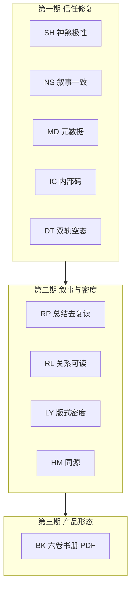

# 浮生 PDF 报告质量总方案（跨层）（2026-08-10）

| 字段 | 内容 |
|------|------|
| **样例真源** | 用户导出：`刘博 · 1990/07/17`（v2.5 · 12 页 · 徐州 · 1990-07-17 12:25） |
| **评审结论** | 交付可用约 **7.0/10**；信任硬伤 + 版式半成品感为主因 |
| **关联** | [PDF 章节映射](./PDF-REPORT-CHAPTER-MAPPING.md) · [T123 book layout](./T123-case-pdf-book-layout-2026-08-02.md) · [T160 默认 layout](./T160-case-pdf-default-decision-2026-08-04.md) |
| **管线** | `POST /api/v1/fusheng/report/pdf` · `services/fusheng_report_service.py` · `services/pdf_exporter.py` |
| **站内同源** | `frontend` 报告页 / `buildEngineTrustDisplay` / life volumes |
| **战略判断** | **先修信任与元数据噪音**，再提叙事与版式密度；六卷书册 PDF 为二期 |
| **仍不做** | 改 `strength.py` 权重 · 风水 App · 报告大动效 · 伪造成真 NPS · 恐吓续费 |

---

## 〇、一句话

样例 PDF 证明 **盘面主链路可导出**；剩余分差来自 **神煞吉凶错位**、**强弱叙事打架**、**内部码/未知默认噪音**、**空表与留白半成品感**。本方案按 **产品 → 内容 → Trust 展示 → PDF/FE 渲染 → 质量门禁** 分层改造，分期落地。

---

## 1. 样例问题清单 → 方案 ID

| ID | 问题（样例证据） | 层级 | 优先级 | 出口 |
|----|------------------|------|--------|------|
| **SH** | 「凶煞有天乙贵人、天乙贵人」吉凶颠倒且重复 | 内容 | **P0** | 神煞极性表 + 模板 + 去重 |
| **NS** | 「极弱/从弱」与后文「偏弱」并存无解释；七杀×强弱张力未说清 | 内容 | **P0** | 叙事编排器（强弱→取格→取用） |
| **MD** | 封面 `T12:25:00`；精确到分仍露「未知默认：日中 12:30」 | PDF/档案 | **P0** | 人读时间；精确时隐藏未知默认 |
| **IC** | 可信度页 `main_match`、`L0` 等内部码 | Trust/PDF | **P0** | 统一汉化出口；禁直出 status |
| **DT** | 双轨附录大量「—」 | PDF | **P0** | 空态一句说明，有内容才出表 |
| **RP** | 第 2 页摘要与第 11 页总结高度复读 | 内容 | P1 | 总结改为「3 建议 + 1 边界」 |
| **RL** | 关系摘要「合；合；三会半见」电报体 | 内容 | P1 | 列表/短句可读化 |
| **LY** | 八字总览大留白；空批注占整页 | 版式 | P1 | 补密度；无批注不输出页 |
| **HM** | FE/PDF 摘要不同源风险 | FE+PDF | P1 | 共用 builder |
| **BK** | 档案式导出 ≠ 人生六卷书感 | 产品 | P2 | book layout 二期 SKU |

---

## 2. 目标与成功标准

### 2.1 交付目标

付费用户拿到的 PDF / 报告页应满足：

1. 盘面事实正确、口径可解释  
2. 吉凶标签不胡说（尤其神煞）  
3. 排版像书，不像半空表格  
4. 全文中文、无内部码  
5. 不重复灌水，每节有独立价值  

### 2.2 样例验收（刘博盘）

| # | 标准 | 状态 |
|---|------|------|
| 1 | 神煞吉凶分类正确，天乙不进凶煞桶，列表无重复 | ✅ |
| 2 | 精确时辰全文不含「未知默认」 | ✅ |
| 3 | 封面时间为人读格式（含地名），无 ISO `T` | ✅ |
| 4 | PDF 全文不含 `main_match` / `L0` / `solar_next` / `iztro` | ✅ |
| 5 | 双轨无内容时不渲染空表，改为一句说明 | ✅ |
| 6 | 总结页与基础摘要最长公共子串比例 &lt; 40% | ✅（LCS≈7%） |
| 7 | 无批注时不输出「人工批注区」空页 | ✅ |
| 8 | 人工盲测：3 人中 ≥2 人觉得「像成品」 | ☐（待人工） |

---

## 3. 产品层（What）

### 3.1 PDF 产品形态

| 方案 | 定位 | 页结构 | 时机 |
|------|------|--------|------|
| **A. 档案精装（默认）** | 现有 v2.5 增强 | 封面 / 摘要 / 八字 / 大运 / 紫微 / 姓名 / 解读 / 校勘（按需） | **本期** |
| **B. 六卷书册** | 对齐站内人生六卷 | 卷首 + 卷一～六节选 + 校勘跋 | 二期 SKU |

**决策：** 先做 **A**；B 对齐 `FUSHENG_CASE_PDF_LAYOUT=book` / T123，不阻塞本期。

### 3.2 页预算（针对 12 页水分）

| 页 | 现状 | 目标 |
|----|------|------|
| 封面 | 过空 + ISO 时间 | 品牌 + 姓名 + 人读生辰地 + 一行命局 |
| 基础档案 | 信息全但有错误句 | 口径条 + 一页摘要卡（格局/用神/紫微命宫） |
| 八字总览 | 大留白 | 四柱表 + 五行/用神一行 |
| 大运 | 可用 | 保留，标「当前步」 |
| 紫微 | 表可用 | 「命宫一句话」置顶 |
| 姓名 | 可用 | 保留与用神交叉 |
| 双轨附录 | 空表 | 有内容才出表，否则一句 |
| 可信度 | 内部码多 | 人读三行；明细可附录小字 |
| 解读 | 电报体/重复 | 分节：格局 / 关系 / 宫位 / 运限 |
| 综合总结 | 复读 | **仅**「3 条行动建议 + 1 条边界」 |
| 批注 | 空页 | 默认不输出；有批注才加页 |

### 3.3 免责与付费边界

- 页脚统一：文化研究与自我认知参考；不构成医疗、法律或投资建议  
- 可信度禁止吓人话术；「解读受限」改为「校勘说明：部分条目为对照/启发式」  
- 正文不写 Pass→全书恐吓续费  

---

## 4. 内容层（Copy / Narrative）

### 4.1 SH — 神煞分类总修（P0）

**根因：** 模板把「命中神煞」一律套「凶煞…需化解」句式。  

**改法：**

1. 建立极性表 `SHENSHA_POLARITY`：`auspicious`（吉）/ `caution`（慎）/ `neutral`（中性）  
2. 模板：  
   - 吉：`命中吉神有…，可作旁证，不作必然好运断言。`  
   - 慎：`慎神有…，宜对照宫位与大运，不作必然凶断。`  
3. 展示前 **去重**  
4. 单测：天乙、天德、天喜等不得进入凶/慎恐吓桶（按表归类）

**落点（预期）：** `services/life_volume_service.py` / 神煞文案 builder / `fusheng_report_service` 摘要段（以代码检索 `凶煞有` 为准）。

### 4.2 NS — 强弱 × 格局叙事一致性（P0）

**编排顺序（固定）：**

1. 日主强弱结论（唯一强度用词）  
2. 取格名称 + 取用关键（制杀 / 从弱 / 扶抑…）  
3. 若格局与强弱存在张力：加一句「口径说明」，不硬圆  
4. 禁止同文档无解释地混用「极弱」与「偏弱」

### 4.3 RP / RL — 去复读与关系可读（P1）

- 总结页：**禁止**整段粘贴命局总评；改为 3 条可执行建议 + 1 条边界  
- 关系摘要：由 `合；合；` 改为「柱对 + 关系类型」短列表（最多 N 条）  
- 同书同条典籍软提示合并，每节最多 2 条  

### 4.4 姓名交叉（保持）

保留「人格五行 vs 用神/忌神」；冲突用语「宜后天调候」，不恐吓。

---

## 5. 引擎 / Trust 展示层

> 不改算力权重；只改**用户可见映射**与空态。

### 5.1 IC — 标签汉化单一出口（P0）

| 内部码 | 展示 |
|--------|------|
| `main_match` / `ok` | 主星一致 |
| `life_palace_mismatch` | 命宫不一致 |
| `L0` / `L1`… | 人读层级或**隐藏**（优先隐藏吓人码） |
| `modern_convention` | 现代约定 |
| `solar_next` / `forward` / `current` | 公历次日换日 / 农历日+1安星 / 当日子时 |

**规则：** PDF、报告页、看板禁止直出内部 `status` 字符串。  
**落点：** `buildEngineTrustDisplay` · `missing_field_labels.format_crosscheck_status_label` · `fusheng_report_service` 可信度 HTML。

### 5.2 MD — 元数据展示策略（P0）

| 字段 | 精确到分 | 未知时辰 |
|------|----------|----------|
| 出生时间 | `1990年7月17日 12:25`（徐州） | `时辰未知（按日中推算）` |
| 未知默认 | **不显示** | 显示 |

### 5.3 DT — 双轨附录空态（P0）

无古籍对照 / 无 ZIP 档案时：

> 本命暂无古籍双轨样例；引擎主盘格局为〔格局名〕。

有内容才渲染表格。

---

## 6. PDF 管线层

**主文件：** `services/fusheng_report_service.py` · `services/pdf_exporter.py` · `routers/fusheng_report.py`

| ID | 任务 | 优先级 |
|----|------|--------|
| M03 | 封面人读时间 + 命局一行（格局 · 强弱 · 用神） | P0 |
| M04 | 精确时辰抑制「未知默认」 | P0 |
| M05 | 可信度页禁内部码；三行人读摘要 | P0 |
| M06 | 双轨空态 | P0 |
| M07 | 无批注不输出批注页 | P1 |
| M10 | 八字页补密度（五行/用神） | P1 |
| — | 保持 Windows sync Playwright 回退 | 已具备则维持 |

**回归产物建议：**

- `output/pdf/regression-liubo.pdf`  
- `docs/reports/fusheng-report-pdf-sample-check-latest.json`  
- 脚本：`scripts/verify_fusheng_report_pdf_sample.py`（新建）

---

## 7. 前端报告页（与 PDF 同源）

| ID | 任务 | 优先级 |
|----|------|--------|
| M11 | 命局总评 / 神煞句与 PDF 共用 builder | P1 |
| — | 姓名 5xx：重试 + 中文错误（已部分落地） | 维持 |
| — | 模块失败：标明「姓名节跳过，不影响八字/紫微」 | P1 |
| — | 「下载 PDF」旁说明页内容构成 | P2 |

---

## 8. 数据与档案层

- 关注重点为空：隐藏该行（优于「未填写」噪音）  
- case 标签 `sn:` / `gn:` 与姓名节一致性：回归断言  
- 固定金盘：  
  1. **刘博** 1990-07-17 12:25 徐州（精装空双轨）  
  2. **立春前晚子** 边界盘（双轨非空，可选）

---

## 9. 质量门禁

| ID | 门禁 | 方式 |
|----|------|------|
| Q1 | 神煞极性 | 单测：天乙∉凶煞恐吓句 |
| Q2 | 元数据 | 精确时辰 PDF 不得含「未知默认」 |
| Q3 | 内部码 | PDF 全文正则禁 `main_match\|L0\|solar_next\|iztro` |
| Q4 | 去重 | 总结 vs 摘要复读比例阈值 |
| Q5 | 样例导出 | verify 脚本 → JSON latest |
| Q6 | 视觉 | 每版抽检封面/摘要/八字/可信度 PNG |

---

## 10. 分期与任务表

### 第一期 · 信任修复（1–2 天）— **先做**

| ID | 层 | 任务 | 状态 |
|----|----|------|------|
| M01 | 内容 | SH 神煞极性表 + 模板 + 去重 | ✅ |
| M02 | 内容 | NS 强弱/格局叙事编排 | ✅ |
| M03 | PDF | 封面人读时间 + 命局一行 | ✅ |
| M04 | PDF | 精确时辰隐藏未知默认 | ✅ |
| M05 | Trust | 禁 `main_match` / `L0` 等直出 | ✅ |
| M06 | PDF | 双轨空态文案 | ✅ |
| M12 | QA | 刘博回归脚本 + 禁词单测 | ✅ |

**验收：** 重导刘博 PDF，SH/MD/IC/DT 硬伤消失。  
**产物：** `output/pdf/regression-liubo.pdf` · `docs/reports/fusheng-report-pdf-sample-check-latest.json` · `scripts/verify_fusheng_report_pdf_sample.py`

### 第二期 · 叙事与密度（3–5 天）

| ID | 任务 | 状态 |
|----|------|------|
| M08 | 关系摘要列表化 | ✅ |
| M09 | 总结去复读（3+1） | ✅ |
| M07 | 删默认空批注页 | ✅ |
| M10 | 八字页密度 | ✅ |
| M11 | FE/PDF 摘要同源 | ✅（`bazi_summary`/`full_summary` 同源 `interpret_bazi`） |

**验收：** 盲测「像成品」提升；页数可降至约 8–10 且更满。

### 第三期 · 产品形态（1–2 周，可选）

| ID | 任务 | 状态 |
|----|------|------|
| M13 | 六卷书册 PDF（book layout） | ⏸ 本期不做（见 §11） |
| — | 封面品牌在现有 token 内强化 | ⏸ 随 M13 |
| — | 批注真正可写回 | ⏸ 随 M13 |

---

## 11. 明确不做

- 不改 `strength.py` 身强身弱权重  
- 不做风水 App / 报告正文大动效  
- 不在 PDF 写假评分、假用户评价、恐吓续费  
- 不把对照库英文品牌名写回用户可见文案  
- 本期不做完整六卷书排版（归 P2）

---

## 12. 建议执行顺序

1. ~~本周只打第一期（M01–M06 + M12）~~ ✅  
2. ~~重导刘博 PDF，对照本文件 §2.2 打勾~~ ✅（自动化项已过；§2.2#8 待人工盲测）  
3. ~~再开第二期叙事与版式~~ ✅（M07–M11 已落地）  
4. 站内六卷稳定后上第三期书册 PDF（M13，未开始）  

---

## 13. 变更记录

| 日期 | 说明 |
|------|------|
| 2026-08-10 | 初版：基于刘博样例 PDF 评审起草跨层总方案 |
| 2026-08-10 | **落地 M01–M12**：神煞极性/去重、强弱叙事、封面人读时间、未知默认隐藏、内部码汉化、双轨空态、关系列表、总结 3+1、空批注不落页、八字密度、回归脚本；M13 仍延期 |
| 2026-08-10 | **版式加刀**：双轨空态并入基础档案（不单独成页）；八字总览补十神/藏干/纳音/自坐；基础档案去「综合收束」与用神复读 |
| 2026-08-10 | **精装双轨落地**：全册纸感骨架（封面金框/纸底、档案三卡）+ 八字满盘对齐站内六列（流年/大运/四柱 × 主星干支藏干星运自坐空亡纳音神煞亮项）；见 [PDF-ARCHIVE-PREMIUM-LAYOUT](./PDF-ARCHIVE-PREMIUM-LAYOUT-2026-08-10.md) |
